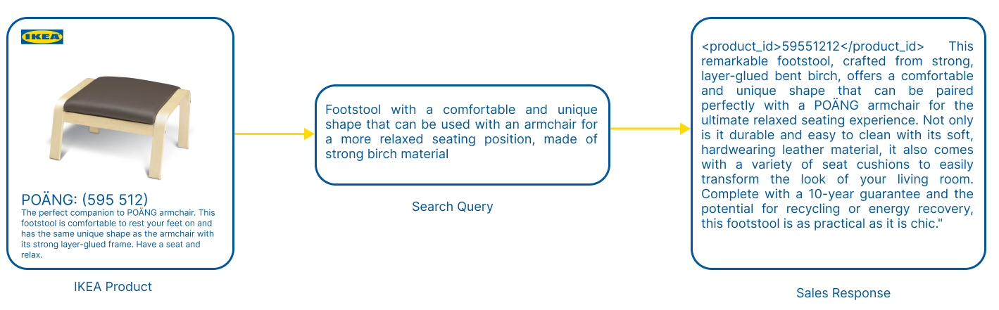
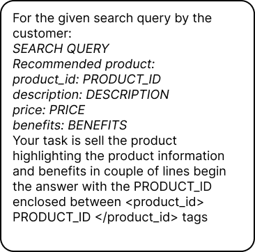
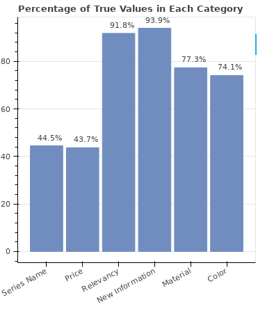

# 通过销售实践，为大型语言模型注入产品知识，助力情境化推荐。

发布时间：2024年07月30日

`LLM应用` `电子商务`

> Learn by Selling: Equipping Large Language Models with Product Knowledge for Context-Driven Recommendations

# 摘要

> 随着大型语言模型的迅速发展，上下文驱动的商品推荐等应用迎来了新的机遇。然而，这些模型在推荐场景中的表现，关键在于其对商品库存的深入理解。本文创新性地训练模型处理含商品ID的合成查询，以增强其商品知识。我们深入分析了这一方法，评估其效能，阐述其优势，并指出其局限。同时，本文还探讨了该方法的改进空间及未来发展方向，全面揭示了LLM在商品推荐领域的潜力与挑战。

> The rapid evolution of large language models (LLMs) has opened up new possibilities for applications such as context-driven product recommendations. However, the effectiveness of these models in this context is heavily reliant on their comprehensive understanding of the product inventory. This paper presents a novel approach to equipping LLMs with product knowledge by training them to respond contextually to synthetic search queries that include product IDs. We delve into an extensive analysis of this method, evaluating its effectiveness, outlining its benefits, and highlighting its constraints. The paper also discusses the potential improvements and future directions for this approach, providing a comprehensive understanding of the role of LLMs in product recommendations.

[Arxiv](https://arxiv.org/abs/2407.20856)