# MMTrail：一款集语言与音乐描述于一体的多模态预告片视频数据集

发布时间：2024年07月30日

`LLM应用`

> MMTrail: A Multimodal Trailer Video Dataset with Language and Music Descriptions

# 摘要

> 大规模多模态数据集对于推动大型视频-语言模型的发展至关重要。然而，现有数据集往往忽视音频的潜在价值，导致注释单一，缺乏全面性。为此，我们推出了MMTrail数据集，包含丰富多样的预告片视频，结合视觉与音频，旨在深化多模态研究。预告片内容广泛，从电影到新闻，再到游戏，且背景音乐与画面紧密配合。我们构建了一个系统化的字幕框架，确保注释的多样性与精确性。通过实验，我们验证了数据集的高质量与训练效果，为未来的多模态模型研究奠定了坚实基础。

> Massive multi-modality datasets play a significant role in facilitating the success of large video-language models. However, current video-language datasets primarily provide text descriptions for visual frames, considering audio to be weakly related information. They usually overlook exploring the potential of inherent audio-visual correlation, leading to monotonous annotation within each modality instead of comprehensive and precise descriptions. Such ignorance results in the difficulty of multiple cross-modality studies. To fulfill this gap, we present MMTrail, a large-scale multi-modality video-language dataset incorporating more than 20M trailer clips with visual captions, and 2M high-quality clips with multimodal captions. Trailers preview full-length video works and integrate context, visual frames, and background music. In particular, the trailer has two main advantages: (1) the topics are diverse, and the content characters are of various types, e.g., film, news, and gaming. (2) the corresponding background music is custom-designed, making it more coherent with the visual context. Upon these insights, we propose a systemic captioning framework, achieving various modality annotations with more than 27.1k hours of trailer videos. Here, to ensure the caption retains music perspective while preserving the authority of visual context, we leverage the advanced LLM to merge all annotations adaptively. In this fashion, our MMtrail dataset potentially paves the path for fine-grained large multimodal-language model training. In experiments, we provide evaluation metrics and benchmark results on our dataset, demonstrating the high quality of our annotation and its effectiveness for model training.

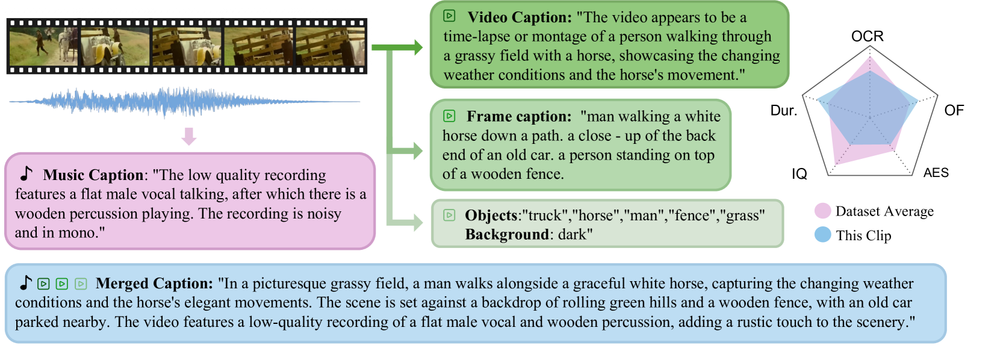

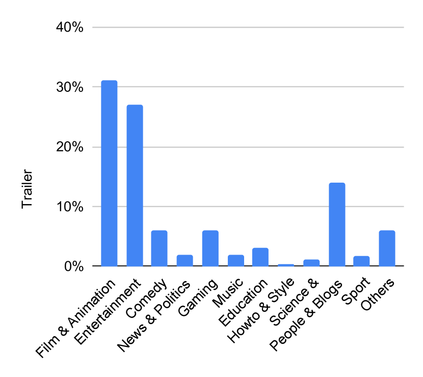

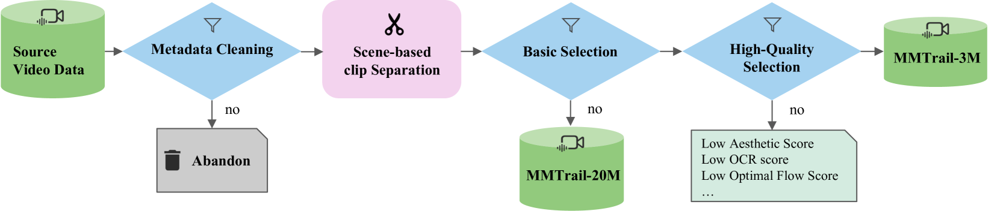

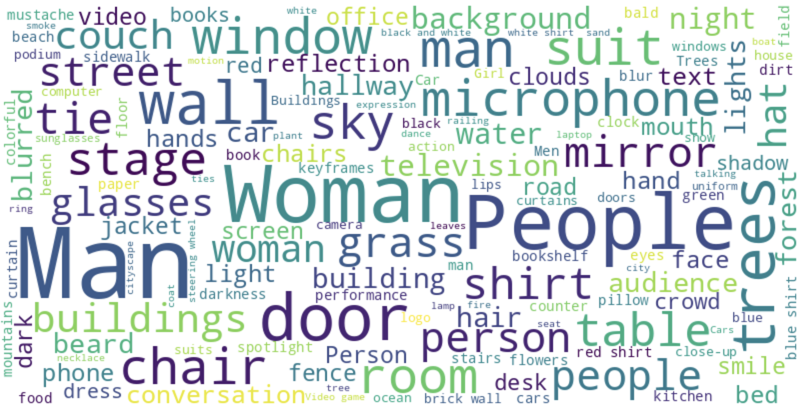

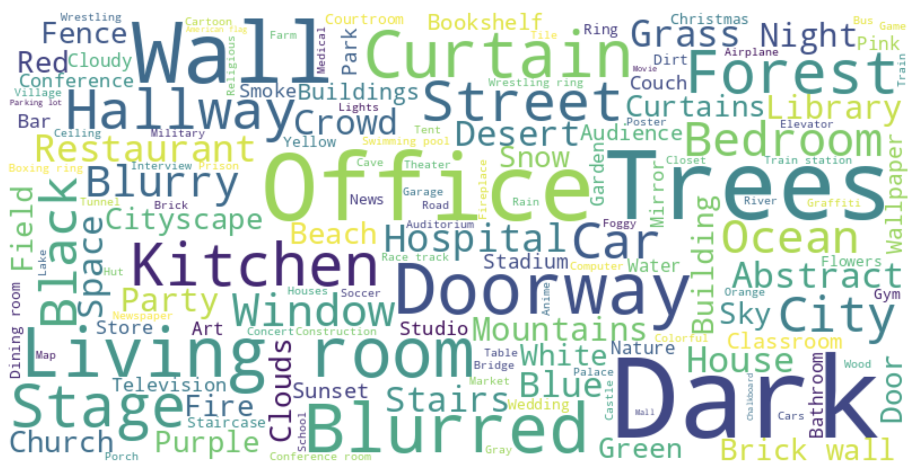

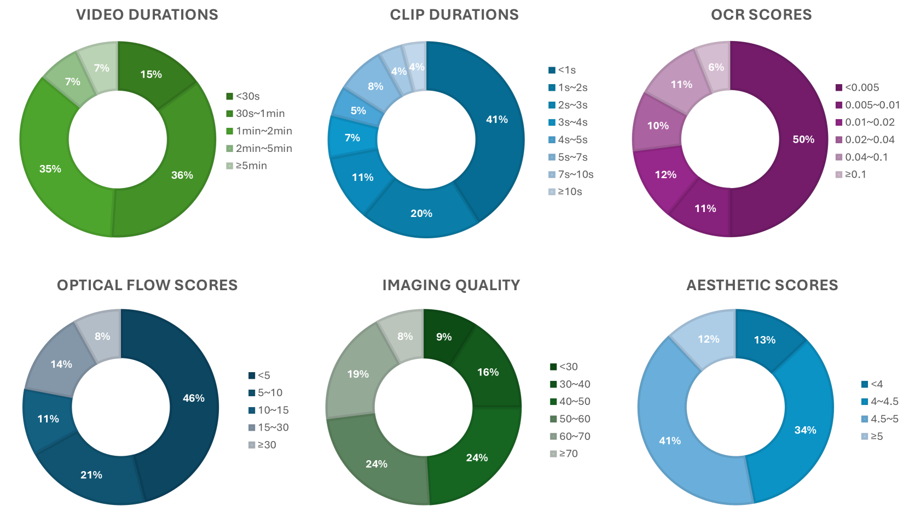

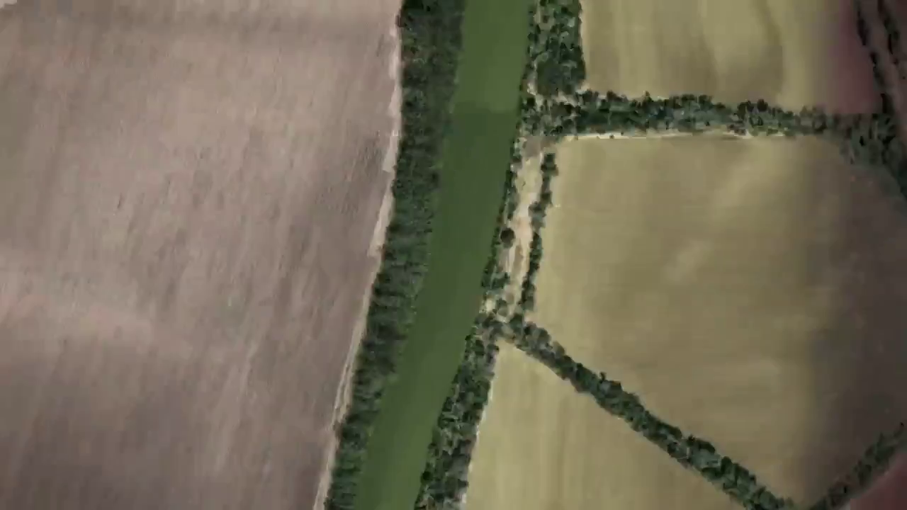

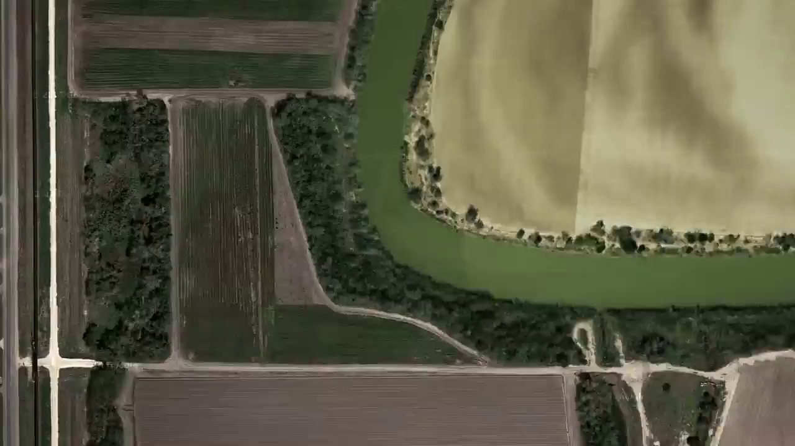

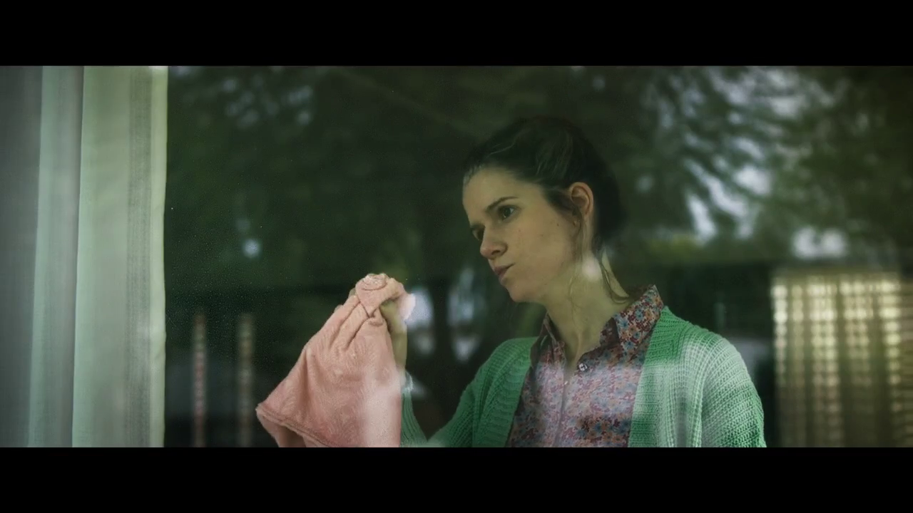

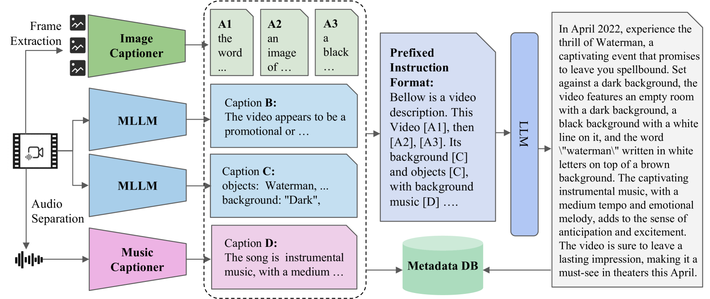

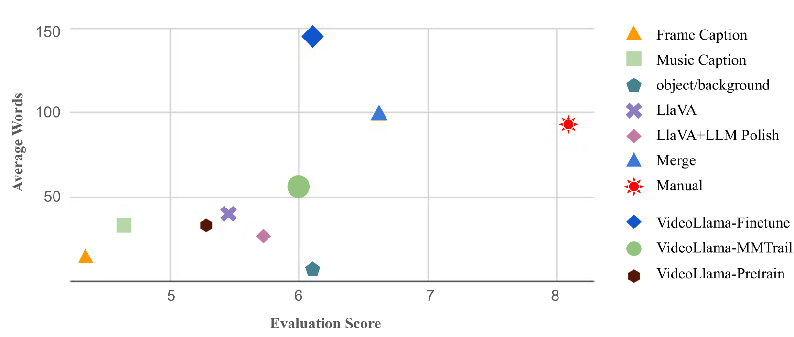

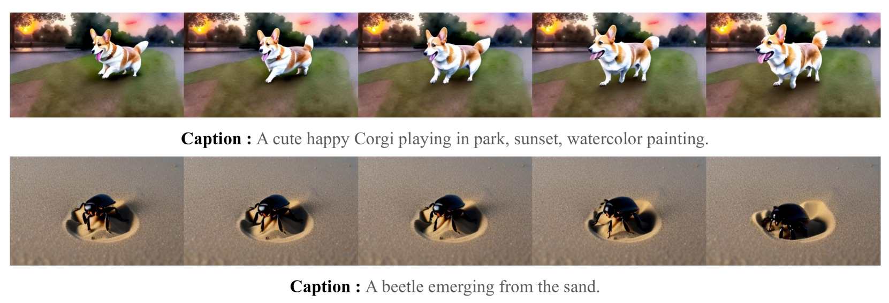

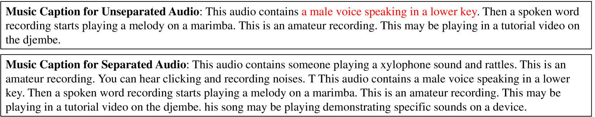

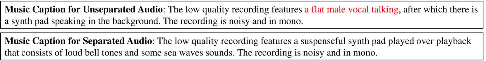

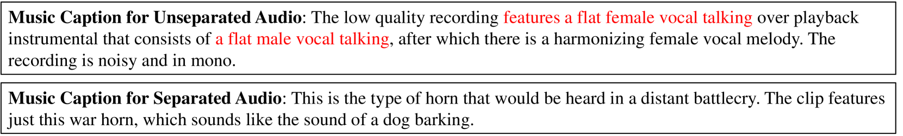

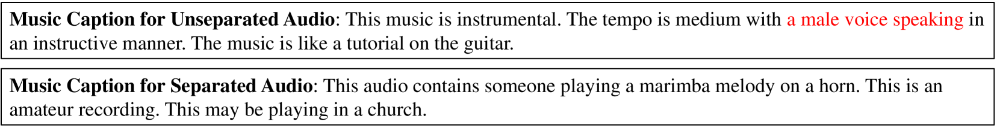

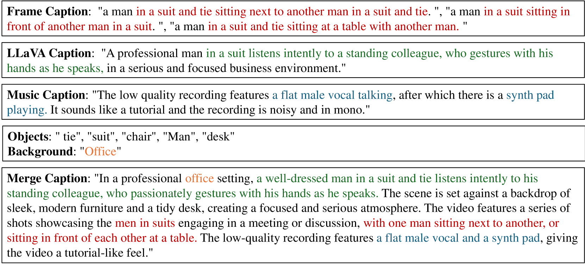

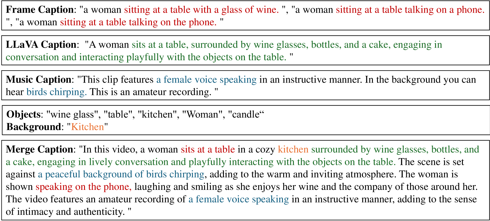

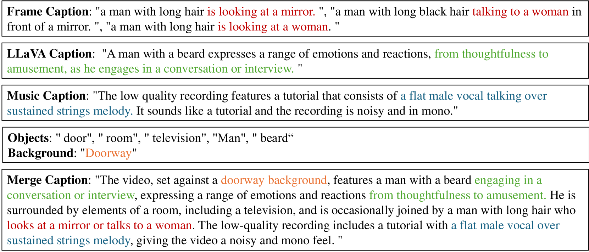

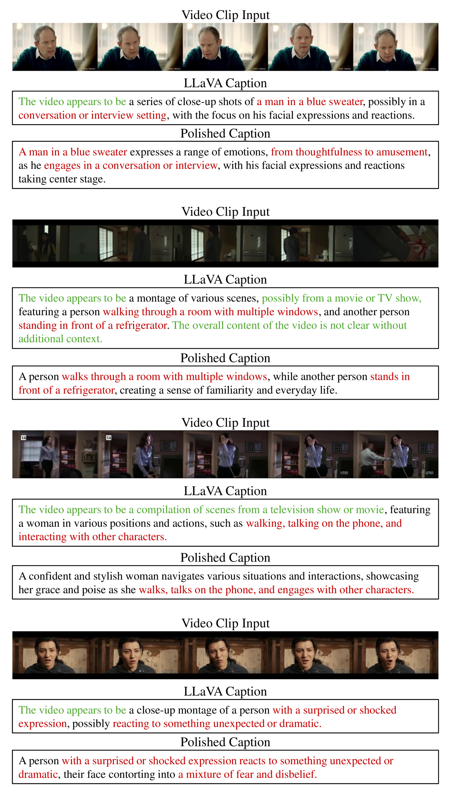

[Arxiv](https://arxiv.org/abs/2407.20962)