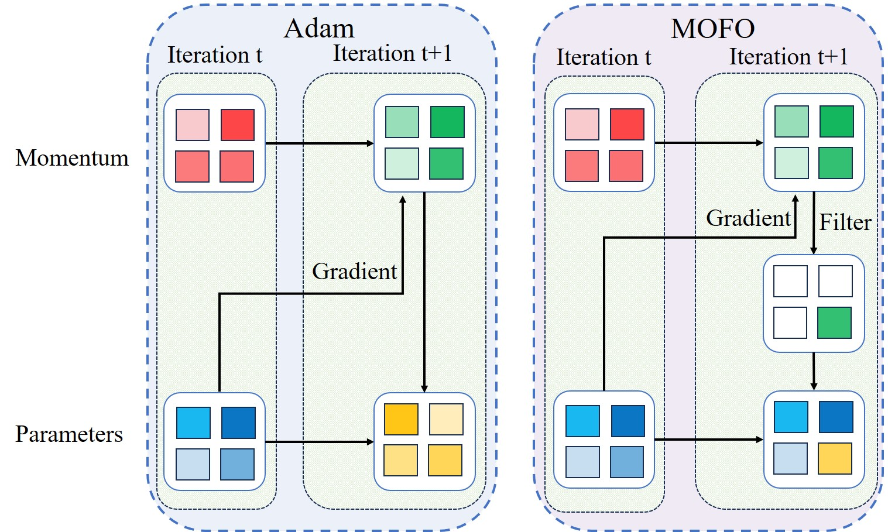

# MoFO：一种动量过滤优化器，旨在减轻 LLM 微调过程中的遗忘问题。

发布时间：2024年07月30日

`LLM理论` `人工智能` `机器学习`

> MoFO: Momentum-Filtered Optimizer for Mitigating Forgetting in LLM Fine-Tuning

# 摘要

> 近期，大型语言模型（LLM）在众多任务中展现出非凡能力。这些模型通常先在大规模语料库上预训练，再针对特定任务进行微调。然而，微调过程中，模型可能遗忘预训练阶段的知识，导致整体能力下降。为此，我们提出了一种新型微调算法——动量过滤优化器（MoFO），其核心在于迭代更新动量最大的参数，以保持模型接近预训练状态，同时实现高效微调。MoFO 的优势在于：无需预训练数据，适用于预训练数据不可用的情况，如开源 LLM 的检查点微调；且不改变原始损失函数，避免影响微调任务的性能。通过严谨的收敛分析和广泛实验，MoFO 在减轻遗忘和提升微调性能方面表现卓越，超越了现有方法。

> Recently, large language models (LLMs) have demonstrated remarkable capabilities in a wide range of tasks. Typically, an LLM is pre-trained on large corpora and subsequently fine-tuned on task-specific datasets. However, during finetuning, LLMs may forget the knowledge acquired in the pretraining stage, leading to a decline in general capabilities. To address this issue, we propose a new fine-tuning algorithm termed Momentum-Filtered Optimizer (MoFO). The key idea of MoFO is to iteratively select and update the model parameters with the largest momentum magnitudes. Compared to full-parameter training, MoFO achieves similar fine-tuning performance while keeping parameters closer to the pre-trained model, thereby mitigating knowledge forgetting. Unlike most existing methods for forgetting mitigation, MoFO combines the following two advantages. First, MoFO does not require access to pre-training data. This makes MoFO particularly suitable for fine-tuning scenarios where pre-training data is unavailable, such as fine-tuning checkpoint-only open-source LLMs. Second, MoFO does not alter the original loss function. This could avoid impairing the model performance on the fine-tuning tasks. We validate MoFO through rigorous convergence analysis and extensive experiments, demonstrating its superiority over existing methods in mitigating forgetting and enhancing fine-tuning performance.

[Arxiv](https://arxiv.org/abs/2407.20999)