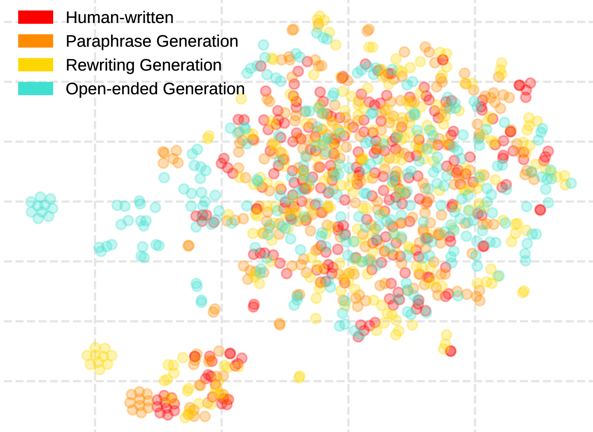

# 利用监督对比学习，本研究提出了一种领域泛化方法，用于识别机器生成虚假信息中的模型归属。

发布时间：2024年07月30日

`LLM应用` `网络安全` `人工智能`

> Model Attribution in Machine-Generated Disinformation: A Domain Generalization Approach with Supervised Contrastive Learning

# 摘要

> 机器生成的虚假信息的模型归属是一个重大挑战，因为它有助于理解其来源并减轻其传播。现代大型语言模型（LLM）生成的虚假信息具有类似人类的品质，而多样化的提示方法使得准确来源归属变得复杂。在本文中，我们将模型归属视为一个领域泛化问题，每种提示方法代表一个独特的领域。我们认为，一个有效的归属模型必须对特定领域的特征不变，并能在所有场景中识别原始模型。为此，我们引入了一种基于监督对比学习的新方法，旨在增强模型对提示变化的鲁棒性，并专注于区分不同的源LLM。通过涉及三种常见提示方法和三种先进LLM的严格实验，我们的结果显示了在模型归属任务中的方法的有效性，实现了在多样化和未见数据集上的最先进性能。

> Model attribution for machine-generated disinformation poses a significant challenge in understanding its origins and mitigating its spread. This task is especially challenging because modern large language models (LLMs) produce disinformation with human-like quality. Additionally, the diversity in prompting methods used to generate disinformation complicates accurate source attribution. These methods introduce domain-specific features that can mask the fundamental characteristics of the models. In this paper, we introduce the concept of model attribution as a domain generalization problem, where each prompting method represents a unique domain. We argue that an effective attribution model must be invariant to these domain-specific features. It should also be proficient in identifying the originating models across all scenarios, reflecting real-world detection challenges. To address this, we introduce a novel approach based on Supervised Contrastive Learning. This method is designed to enhance the model's robustness to variations in prompts and focuses on distinguishing between different source LLMs. We evaluate our model through rigorous experiments involving three common prompting methods: ``open-ended'', ``rewriting'', and ``paraphrasing'', and three advanced LLMs: ``llama 2'', ``chatgpt'', and ``vicuna''. Our results demonstrate the effectiveness of our approach in model attribution tasks, achieving state-of-the-art performance across diverse and unseen datasets.

[Arxiv](https://arxiv.org/abs/2407.21264)