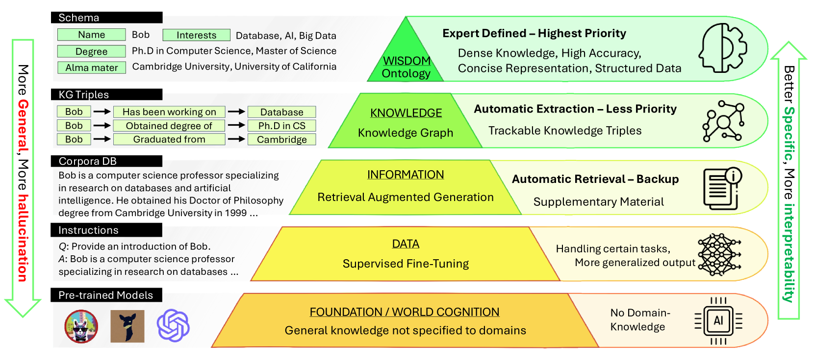
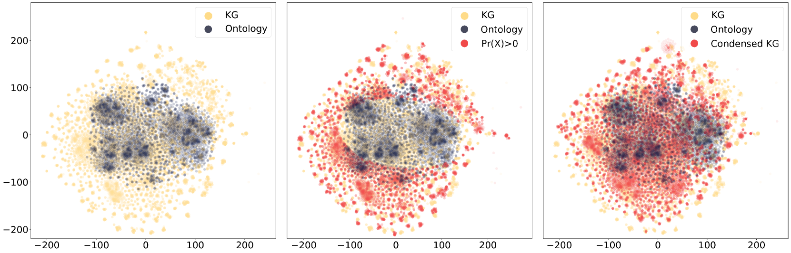

# 借助知识金字塔实现多层次查询

发布时间：2024年07月30日

`RAG`

> Multi-Level Querying using A Knowledge Pyramid

# 摘要

> 本文针对现有RAG方法在提高召回率的同时，需要提升精确度的问题。我们提出了一种多层知识金字塔方法，旨在平衡精确度和召回率。该金字塔包含本体论、知识图谱和原始文本三个层次，通过跨层技术实现全面知识覆盖和动态更新。为确保知识图谱的紧凑性，我们采用了跨层过滤方法。我们的PolyRAG方法采用瀑布式检索，从金字塔顶层逐步深入，直至找到确信答案。我们还引入了学术和金融领域的知识检索基准。实验证明，该方法超越了19种最先进技术，显著提升了GPT-4的性能，F1增益高达395%。

> This paper addresses the need for improved precision in existing Retrieval-Augmented Generation (RAG) methods that primarily focus on enhancing recall. We propose a multi-layer knowledge pyramid approach within the RAG framework to achieve a better balance between precision and recall. The knowledge pyramid consists of three layers: Ontologies, Knowledge Graphs (KGs), and chunk-based raw text. We employ cross-layer augmentation techniques for comprehensive knowledge coverage and dynamic updates of the Ontology schema and instances. To ensure compactness, we utilize cross-layer filtering methods for knowledge condensation in KGs. Our approach, named PolyRAG, follows a waterfall model for retrieval, starting from the top of the pyramid and progressing down until a confident answer is obtained. We introduce two benchmarks for domain-specific knowledge retrieval, one in the academic domain and the other in the financial domain. The effectiveness of the methods has been validated through comprehensive experiments by outperforming 19 SOTA methods. An encouraging observation is that the proposed method has augmented the GPT-4, providing 395\% F1 gain by improving its performance from 0.1636 to 0.8109.

[Arxiv](https://arxiv.org/abs/2407.21276)