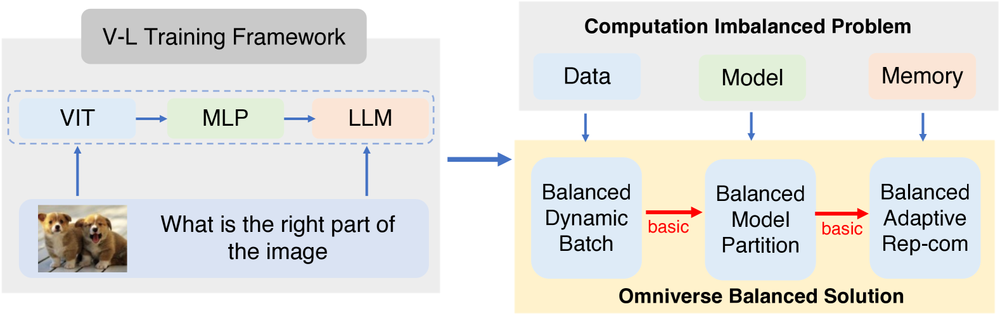

# OmniBal：借助全宇宙计算平衡技术，加速视觉-语言模型的指令调优过程

发布时间：2024年07月30日

`LLM应用` `人工智能` `计算机视觉`

> OmniBal: Towards Fast Instruct-tuning for Vision-Language Models via Omniverse Computation Balance

# 摘要

> 近期，视觉-语言指令调优模型因其对世界的全面理解而取得显著进展。我们发现，大规模三维并行训练在这些模型上会导致设备间计算负载不平衡。视觉与语言部分的异质性——数据分布与模型架构的显著差异——影响了分布式训练效率。为此，我们从数据、模型和内存三个角度重新平衡计算负载，构建了一个全方位的平衡训练框架。具体而言，我们对数据进行重新分组，形成平衡的小批次；采用基于搜索的方法优化模型分区；并自适应调整内存使用策略。实验表明，与现有开源代码相比，我们的方法大幅减少了GPU使用时间，提速近1.8倍，并在多种模型和数据集上展现了其有效性和通用性。相关代码将在GitHub上公开。

> Recently, vision-language instruct-tuning models have made significant progress due to their more comprehensive understanding of the world. In this work, we discovered that large-scale 3D parallel training on those models leads to an imbalanced computation load across different devices. The vision and language parts are inherently heterogeneous: their data distribution and model architecture differ significantly, which affects distributed training efficiency. We rebalanced the computational loads from data, model, and memory perspectives to address this issue, achieving more balanced computation across devices. These three components are not independent but are closely connected, forming an omniverse balanced training framework. Specifically, for the data, we grouped instances into new balanced mini-batches within and across devices. For the model, we employed a search-based method to achieve a more balanced partitioning. For memory optimization, we adaptively adjusted the re-computation strategy for each partition to utilize the available memory fully. We conducted extensive experiments to validate the effectiveness of our method. Compared with the open-source training code of InternVL-Chat, we significantly reduced GPU days, achieving about 1.8x speed-up. Our method's efficacy and generalizability were further demonstrated across various models and datasets. Codes will be released at https://github.com/ModelTC/OmniBal.

[Arxiv](https://arxiv.org/abs/2407.20761)