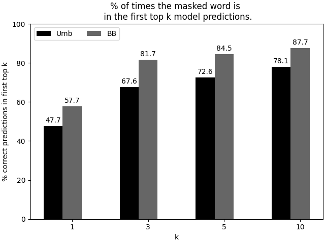

# 意大利跨领域研究：探索零-shot分类的提示编码器模型

发布时间：2024年07月30日

`LLM应用`

> Prompting Encoder Models for Zero-Shot Classification: A Cross-Domain Study in Italian

# 摘要

> 在专业领域和低资源语言中，有效利用语言模型面临标注数据有限的挑战。本文探讨了结合小规模、领域特定的编码器模型与提示技术，以提升意大利专业语境下的性能。我们专注于意大利的官僚和法律语言，测试了通用和进一步预训练的编码器模型，并在文档分类等任务中进行了评估。结果显示，尽管这些模型在一般知识上可能不够稳健，但在特定领域任务中表现出色，甚至在零-shot环境下也能适应。通过校准技术和领域内表达器的应用，编码器模型的效能得到显著提升。这些领域专业化的模型在资源稀缺的情况下尤为有效。我们的研究为意大利模型在专业环境中的应用提供了新视角，对数字时代的研究和工业应用具有重要意义。

> Addressing the challenge of limited annotated data in specialized fields and low-resource languages is crucial for the effective use of Language Models (LMs). While most Large Language Models (LLMs) are trained on general-purpose English corpora, there is a notable gap in models specifically tailored for Italian, particularly for technical and bureaucratic jargon. This paper explores the feasibility of employing smaller, domain-specific encoder LMs alongside prompting techniques to enhance performance in these specialized contexts. Our study concentrates on the Italian bureaucratic and legal language, experimenting with both general-purpose and further pre-trained encoder-only models. We evaluated the models on downstream tasks such as document classification and entity typing and conducted intrinsic evaluations using Pseudo-Log-Likelihood. The results indicate that while further pre-trained models may show diminished robustness in general knowledge, they exhibit superior adaptability for domain-specific tasks, even in a zero-shot setting. Furthermore, the application of calibration techniques and in-domain verbalizers significantly enhances the efficacy of encoder models. These domain-specialized models prove to be particularly advantageous in scenarios where in-domain resources or expertise are scarce. In conclusion, our findings offer new insights into the use of Italian models in specialized contexts, which may have a significant impact on both research and industrial applications in the digital transformation era.

[Arxiv](https://arxiv.org/abs/2407.20654)