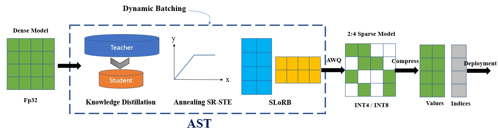
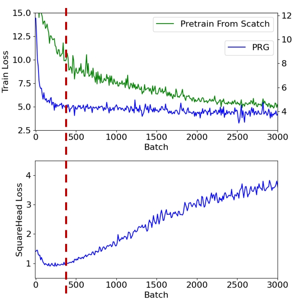
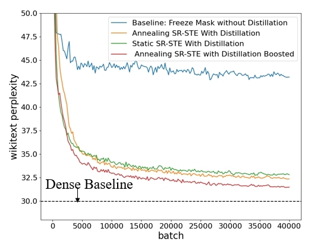
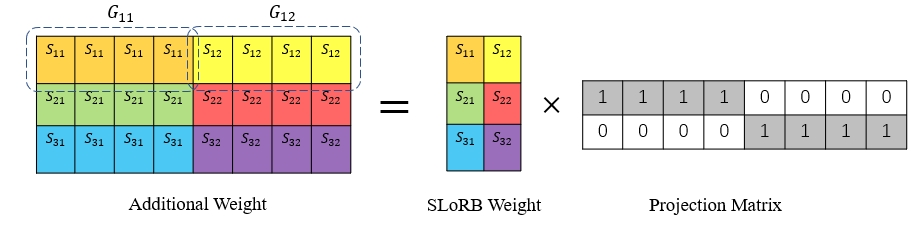
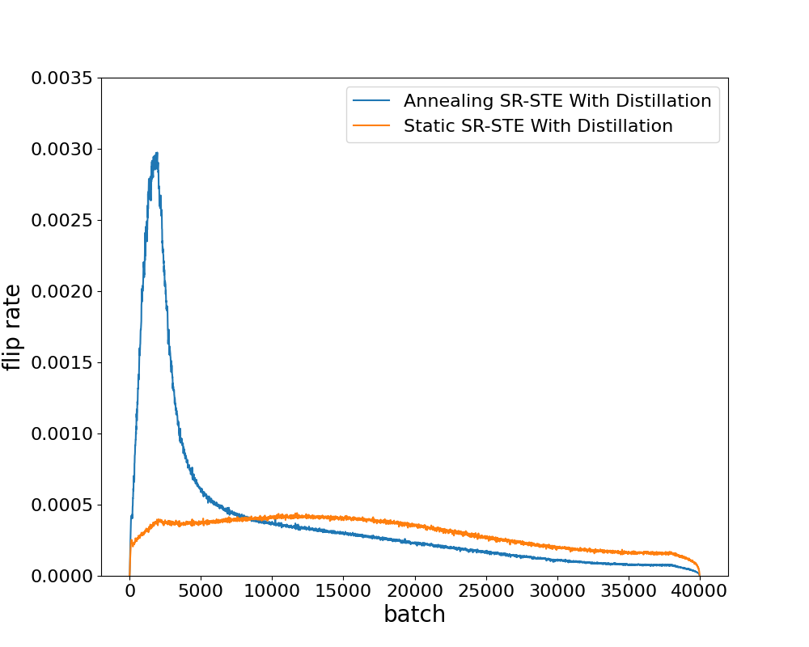
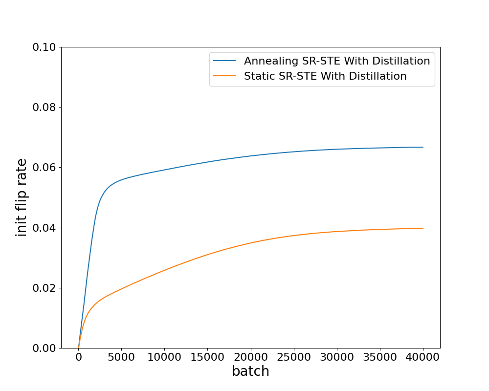

# 通过半结构化自适应稀疏训练技术，实现对大型语言模型的精简优化。

发布时间：2024年07月30日

`LLM理论` `计算机科学` `人工智能`

> Pruning Large Language Models with Semi-Structural Adaptive Sparse Training

# 摘要

> 基于Transformer的LLMs在多项挑战任务中表现卓越，但其庞大的参数和内存需求限制了实际应用。近期研究尝试通过无需训练的修剪方法压缩LLMs，但修剪后的模型在复杂任务上性能大幅下降。为此，我们提出了自适应稀疏训练器（AST），一种新的半结构化稀疏模型训练流程。AST通过提取密集模型的知识，防止稀疏模型过拟合，并确保训练稳定。它还能在训练中自适应选择更优的掩码，进一步提升性能，仅需小幅增加内存占用。我们的方法显著缩小了密集与稀疏模型间的性能差距，同时计算成本有限。结合现有量化技术，AST能将语言模型压缩至密集FP32模型的16倍，性能损失极小。在Llama2-7B上，AST使用不到0.4%的预训练令牌，将密集与稀疏模型间的零-shot准确性差距降至1.12%，在多个零-shot任务中超越了现有最佳方法。

> Transformer-based Large Language Models (LLMs) have demonstrated remarkable success across various challenging tasks. However, the deployment of LLMs is hindered by their substantial parameter count and memory consumption. Recently, numerous studies have attempted to compress LLMs by pruning them using training-free methods. However, these pruned models often experience significant performance degradation on complex tasks. To address this issue, we propose a novel training pipeline for semi-structured sparse models, named Adaptive Sparse Trainer (AST). By distilling the knowledge stored in its dense counterpart, we prevent the sparse model from overfitting and ensure a stable training process. Moreover, AST allows the model to adaptively select better lottery tickets (e.g., masks) during training. Additionally, we discovered that adding extra well-initialized parameters can further enhance model performance with only a small increase in memory footprint. Our method significantly narrows the performance gap between dense and sparse models while maintaining limited computational cost. Furthermore, when combined with existing quantization methods, AST can compress language models by up to 16x compared to dense FP32 precision models with minimal performance loss. AST outperforms previous state-of-the-art methods by reducing the zero-shot accuracy gap between dense and semi-structured sparse models to 1.12% across multiple zero-shot tasks on Llama2-7B, using less than 0.4% of the pretraining tokens.

[Arxiv](https://arxiv.org/abs/2407.20584)