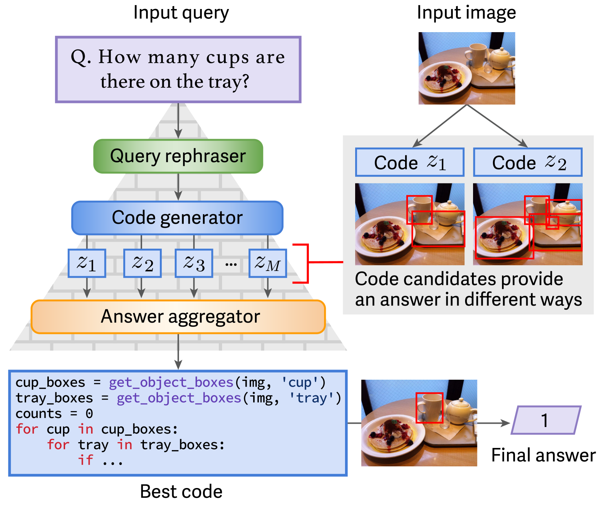
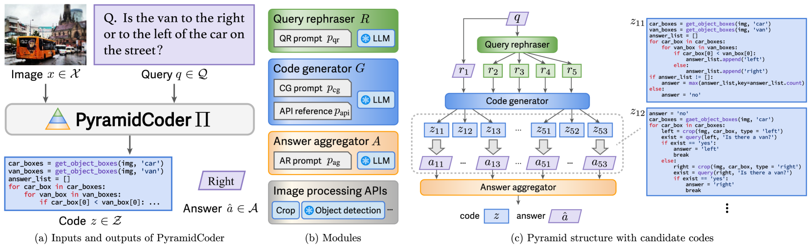
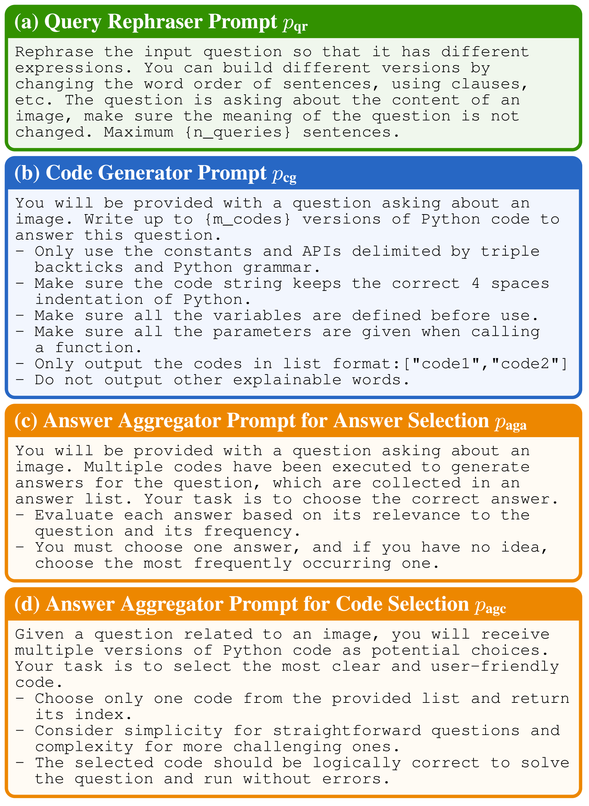
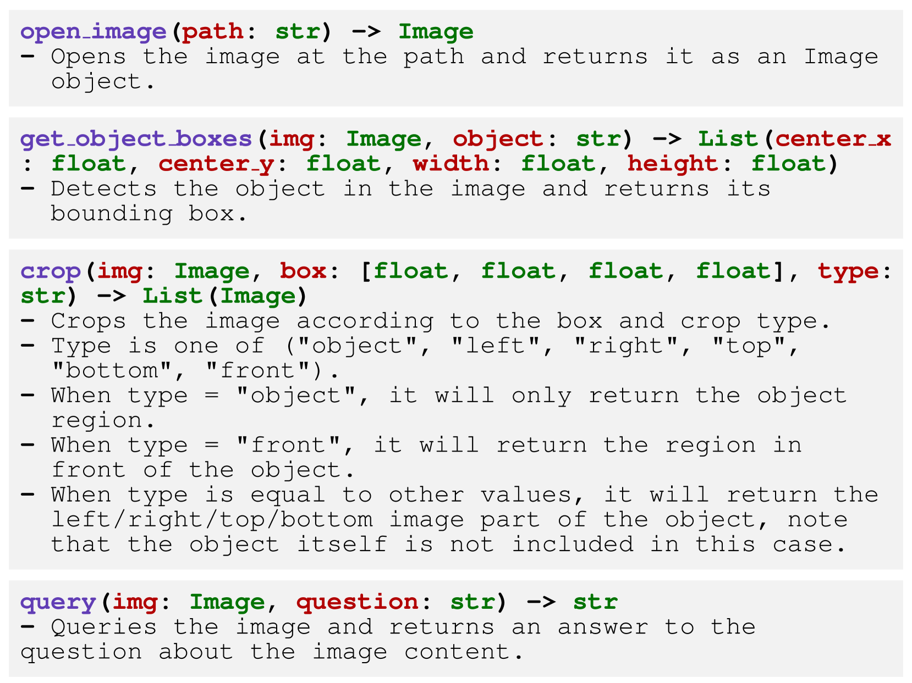
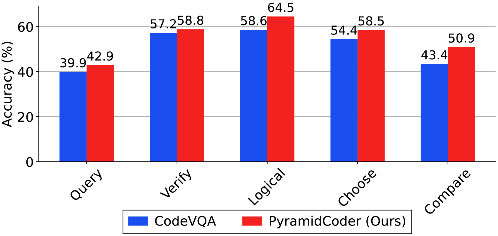
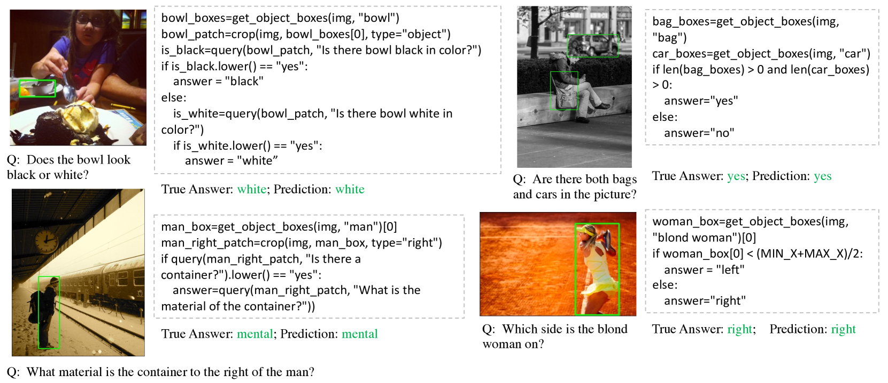

# 金字塔编码器：专为组合视觉问答设计的分层代码生成工具

发布时间：2024年07月30日

`LLM应用` `计算机视觉` `人工智能`

> Pyramid Coder: Hierarchical Code Generator for Compositional Visual Question Answering

# 摘要

> 视觉问答（VQA）任务要求根据视觉输入准确回答自然语言问题。近期，程序化VQA（PVQA）模型备受瞩目，它们利用大型语言模型（LLM）生成解决复杂视觉推理问题的可执行程序。然而，让LLM理解并应用图像处理模块生成相关代码仍是一大挑战。为此，我们提出了PyramidCoder框架，该框架通过三个层次——查询重述、代码生成和答案聚合，有效应对了这一难题。PyramidCoder采用单一冻结LLM和预定义提示，无需额外训练，灵活适应多种LLM架构。实验表明，与现有最佳模型相比，PyramidCoder在GQA、VQAv2和NLVR2数据集上的准确率分别提升了0.5%、1.4%和2.9%。

> Visual question answering (VQA) is the task of providing accurate answers to natural language questions based on visual input. Programmatic VQA (PVQA) models have been gaining attention recently. These use large language models (LLMs) to formulate executable programs that address questions requiring complex visual reasoning. However, there are challenges in enabling LLMs to comprehend the usage of image processing modules and generate relevant code. To overcome these challenges, this paper introduces PyramidCoder, a novel prompting framework for PVQA models. PyramidCoder consists of three hierarchical levels, each serving a distinct purpose: query rephrasing, code generation, and answer aggregation. Notably, PyramidCoder utilizes a single frozen LLM and pre-defined prompts at each level, eliminating the need for additional training and ensuring flexibility across various LLM architectures. Compared to the state-of-the-art PVQA model, our approach improves accuracy by at least 0.5% on the GQA dataset, 1.4% on the VQAv2 dataset, and 2.9% on the NLVR2 dataset.

[Arxiv](https://arxiv.org/abs/2407.20563)