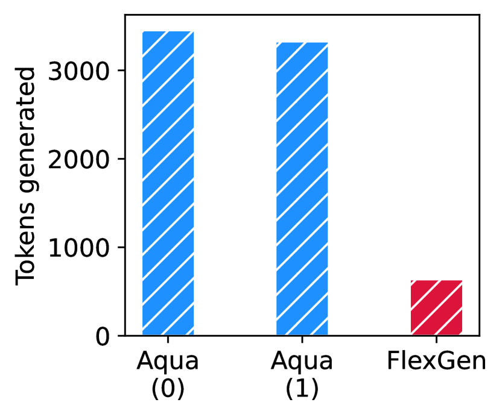
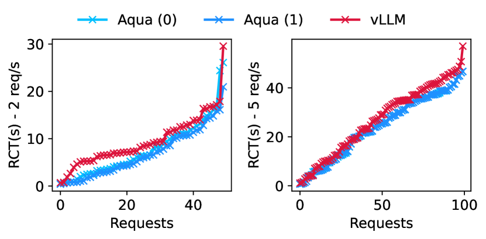

# 利用 AQUA 在多租户环境中实现高效的机器学习推理响应

发布时间：2024年07月30日

`LLM应用` `云计算` `人工智能`

> Responsive ML inference in multi-tenanted environments using AQUA

# 摘要

> 现代模型服务引擎采用批量推理方式，虽然提升了处理效率，但可能导致无法及时响应个别请求。我们提出，通过时间共享GPU资源来公平调度推理任务，而非批量处理，是确保及时响应的关键。然而，这种方式会增加频繁切换上下文到GPU内存的开销。当前技术支持在GPU和主机内存间切换上下文，但受限于PCIe带宽，效率较低。我们通过将上下文在同一服务器的不同GPU间高效转移，利用高带宽的GPU间互连，解决了这一问题。为此，我们开发了AQUA框架，实现了透明且高效的GPU内存管理，显著提升了大型语言模型推理的响应速度和处理能力。实验表明，AQUA在响应性和吞吐量方面均大幅领先现有技术。

> Here is the text without linebreaks: Modern model serving engines infer prompts on large language models in batches. While batch processing prompts leads to high inference throughput, it delays responding to requests that do not fit in a batch, potentially starving them. We propose that fair scheduling prompts for inference by time-sharing GPUs cycles, instead of batch processing them, is key to preventing prompt starvation and achieving responsive inference. However, time-shared prompt scheduling incurs the overhead of frequently paging dynamic context needed to infer a prompt back into GPU memory. Today, serving engines support paging inference context between GPU memory and the host DRAM. The overhead of transferring context from DRAM to GPU memory is high since it is lower-bounded by the limited PCIe bandwidth. We overcome this challenge by offloading inference context from a GPU to the memory of another GPU on the same server, connected via inter-GPU interconnects that support magnitudes higher bandwidth than PCIe. We achieve this by developing AQUA, a transparent and elastic GPU memory management framework for responsive LLM inference. We evaluate AQUA by hosting eight state-of-the-art large generative ML models of different modalities (e.g., text, audio, vision) on a server with 8 cutting-edge Nvidia A100 80G GPUs. Using representative inference workloads, we show that AQUA improves the responsiveness of LLM inference by 4X compared to the state-of-the-art and it improves LLM inference throughput over a single long prompt by 6X.

[Arxiv](https://arxiv.org/abs/2407.21255)