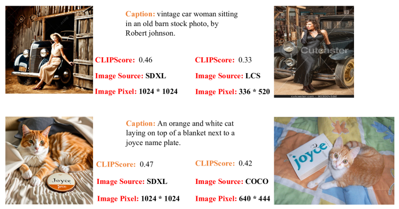
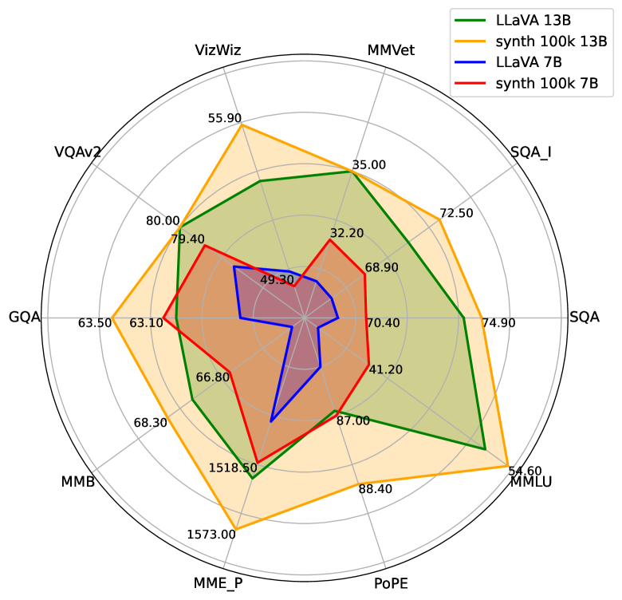
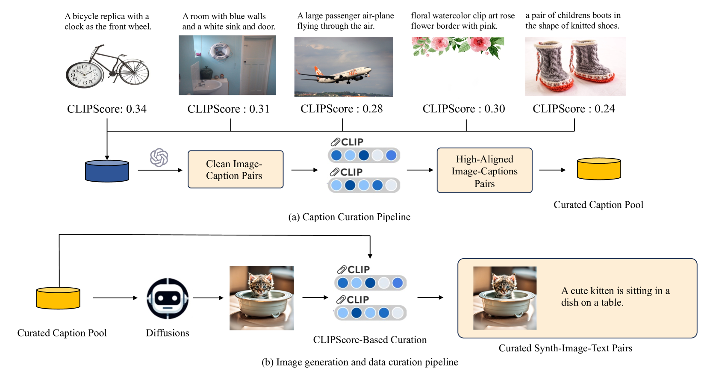
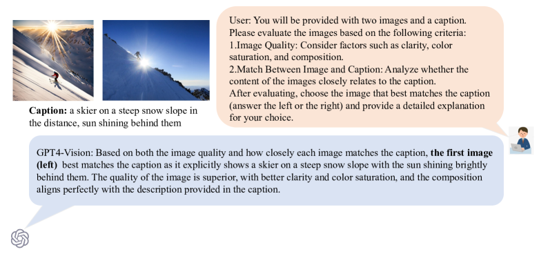
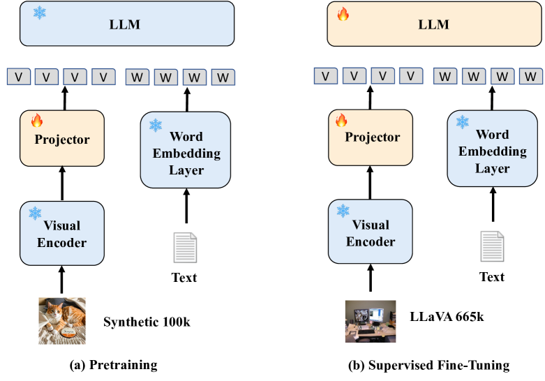
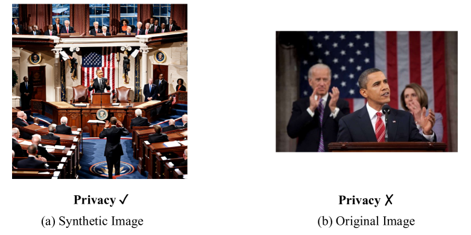
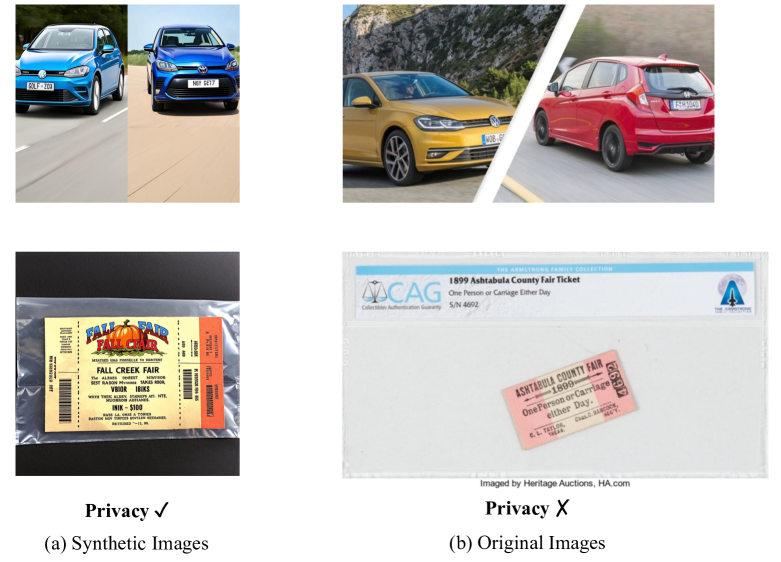

# SynthVLM：为视觉语言模型提供高效且高质量的合成数据

发布时间：2024年07月30日

`LLM应用` `图像处理` `人工智能`

> SynthVLM: High-Efficiency and High-Quality Synthetic Data for Vision Language Models

# 摘要

> 随着网络图像的流行，处理大规模图像数据集变得至关重要。视觉大型语言模型（VLLMs）因其卓越的视觉理解能力而受到关注，但其训练需要大量数据，带来效率、质量、隐私等多重挑战。为此，我们提出SynthVLM，一种创新的数据合成流程，通过高级扩散模型和高品质标题，自动生成高分辨率图像并精确匹配文本，助力VLLMs在视觉问答任务中达到顶尖性能，同时保持语言能力。SynthVLM不仅在性能上超越传统方法，还大幅减少计算负担，且完全基于生成数据，确保隐私安全，仅用少量数据即达顶尖水平。

> Recently, with the rise of web images, managing and understanding large-scale image datasets has become increasingly important. Vision Large Language Models (VLLMs) have recently emerged due to their robust vision-understanding capabilities. However, training these models requires vast amounts of data, posing challenges to efficiency, effectiveness, data quality, and privacy. In this paper, we introduce SynthVLM, a novel data synthesis pipeline for VLLMs. Unlike existing methods that generate captions from images, SynthVLM employs advanced diffusion models and high-quality captions to automatically generate and select high-resolution images from captions, creating precisely aligned image-text pairs. Leveraging these pairs, we achieve state-of-the-art (SoTA) performance on various vision question answering tasks, maintaining high alignment quality and preserving advanced language abilities. Moreover, SynthVLM surpasses traditional GPT-4 Vision-based caption generation methods in performance while significantly reducing computational overhead. Crucially, our method's reliance on purely generated data ensures the preservation of privacy, achieving SoTA performance with just 100k data points (only 18% of the official dataset size).

[Arxiv](https://arxiv.org/abs/2407.20756)