# 技术债务，一把双刃剑，既带来便利也引发问题，通过开发者间的讨论得以深入剖析其利弊。

发布时间：2024年07月30日

`LLM应用

解释：这篇论文虽然主要关注技术债务（TD）及其对软件可维护性的影响，但在分析过程中使用了自然语言处理技术，如主题建模和情感分析。这些技术是大型语言模型（LLM）的应用实例，因此将该论文归类为“LLM应用”是合适的。论文中并未直接探讨LLM的理论问题，也没有涉及Agent或RAG的相关内容。` `软件工程` `信息技术`

> The Dual-Edged Sword of Technical Debt: Benefits and Issues Analyzed Through Developer Discussions

# 摘要

> 技术债务（TD）长期影响软件可维护性，涉及为短期利益牺牲长期质量的妥协。本研究旨在从大量文章中汇总从业者对TD多方面的看法，通过灰色文献回顾和自然语言处理技术，如主题建模和情感分析，系统地分析了2,213篇论坛帖子和文章，揭示了八个主要主题和43个子主题。从业者的观点涵盖了正面和负面，主要挑战包括角色模糊和参与不足，而积极管理则促进协作并减轻TD对代码的影响。

> Background. Technical debt (TD) has long been one of the key factors influencing the maintainability of software products. It represents technical compromises that sacrifice long-term software quality for potential short-term benefits. Objective. This work is to collectively investigate the practitioners' opinions on the various perspectives of TD from a large collection of articles. We find the topics and latent details of each, where the sentiments of the detected opinions are also considered. Method. For such a purpose, we conducted a grey literature review on the articles systematically collected from three mainstream technology forums. Furthermore, we adopted natural language processing techniques like topic modeling and sentiment analysis to achieve a systematic and comprehensive understanding. However, we adopted ChatGPT to support the topic interpretation. Results. In this study, 2,213 forum posts and articles were collected, with eight main topics and 43 sub-topics identified. For each topic, we obtained the practitioners' collective positive and negative opinions. Conclusion. We identified 8 major topics in TD related to software development. Identified challenges by practitioners include unclear roles and a lack of engagement. On the other hand, active management supports collaboration and mitigates the impact of TD on the source code.

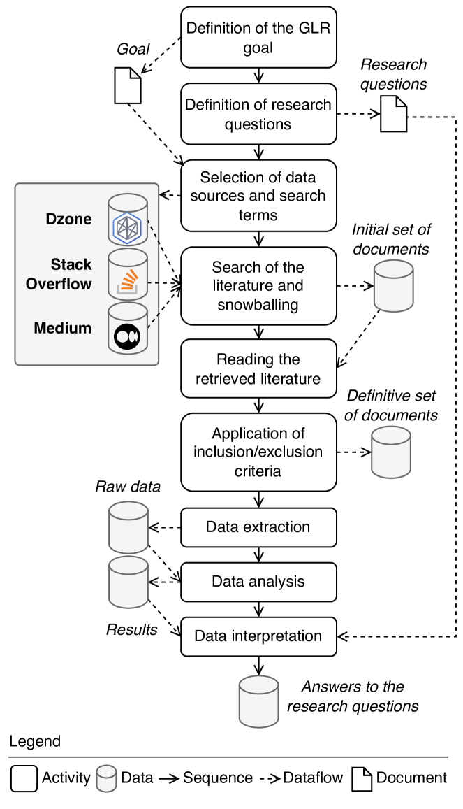

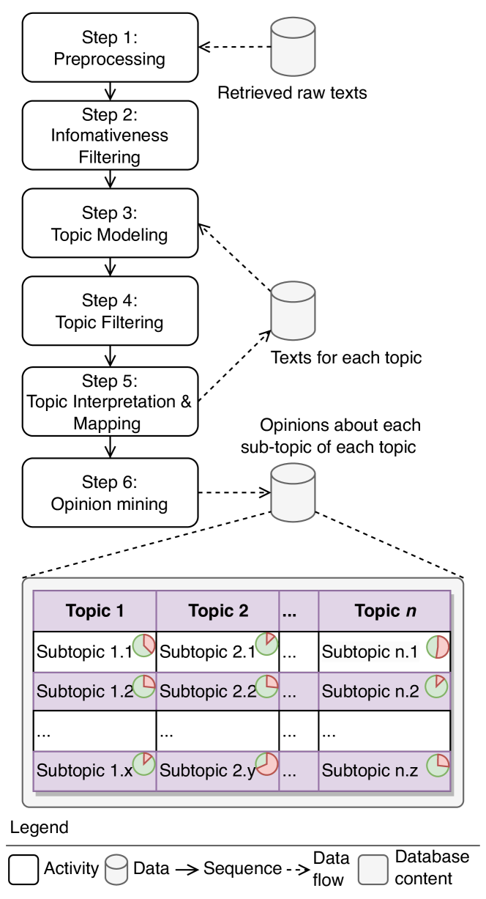

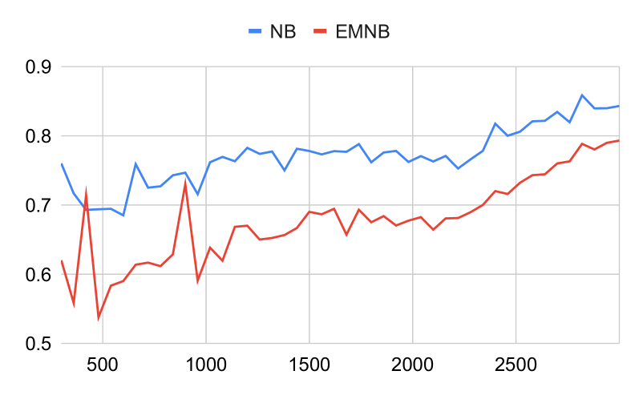

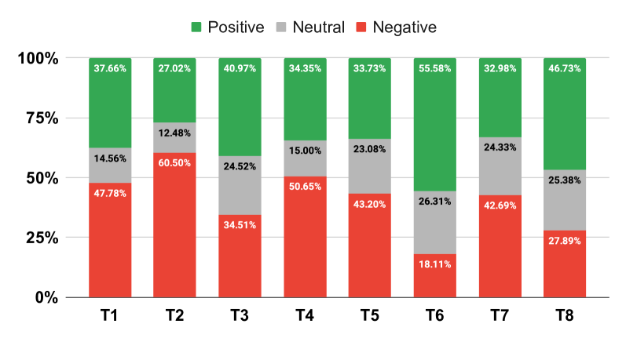

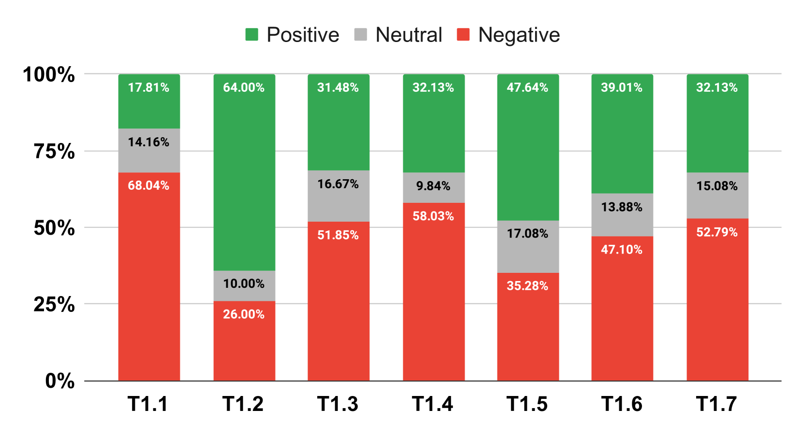

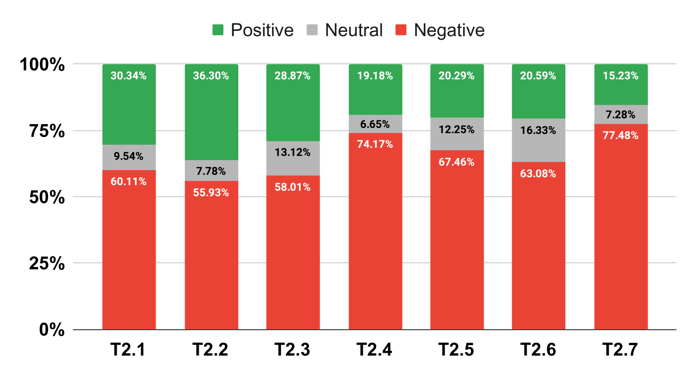

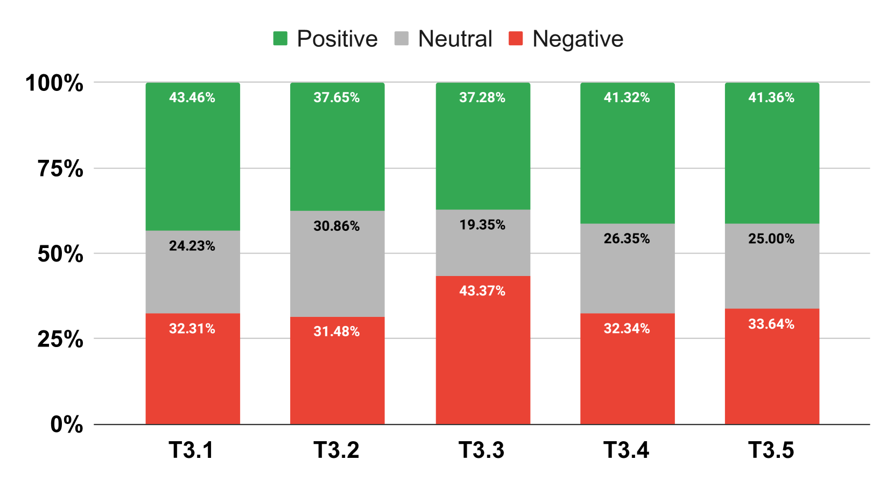

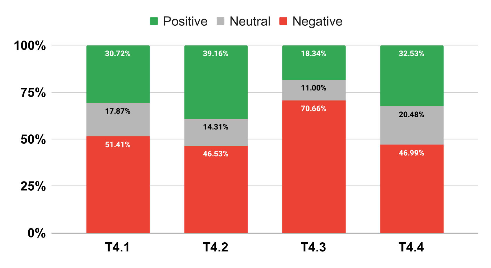

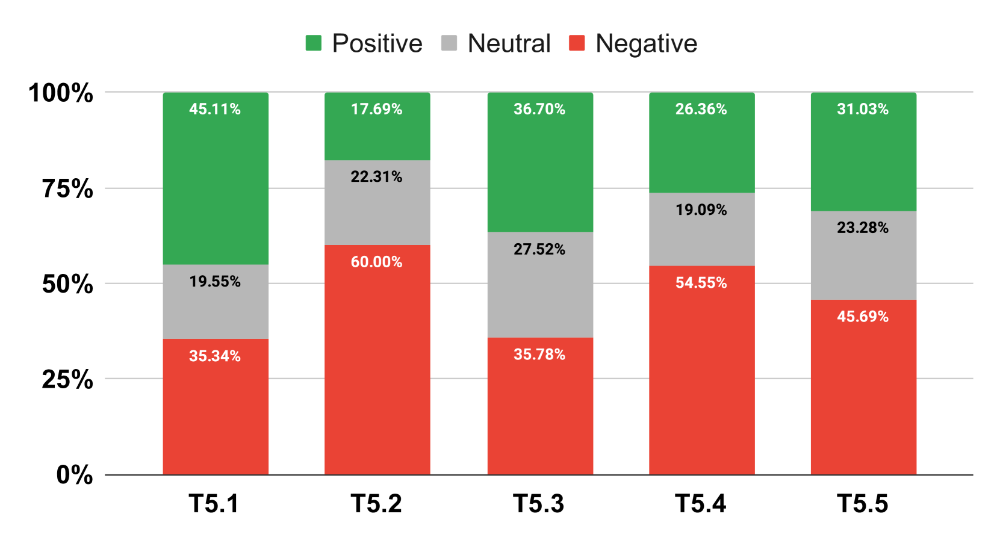

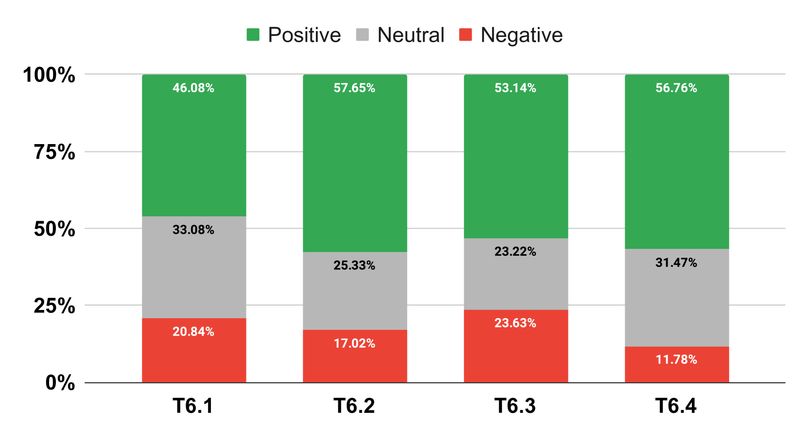

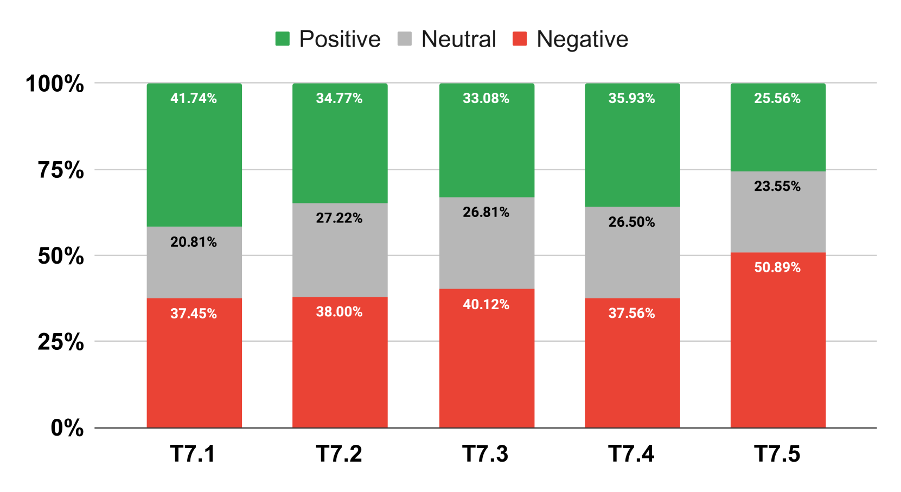

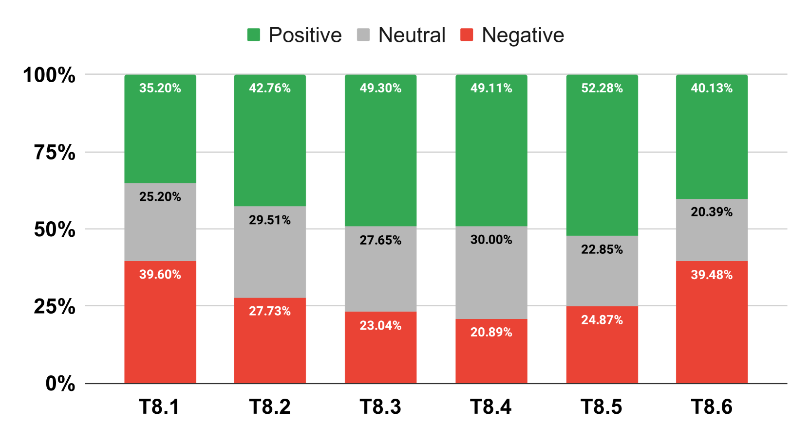

[Arxiv](https://arxiv.org/abs/2407.21007)