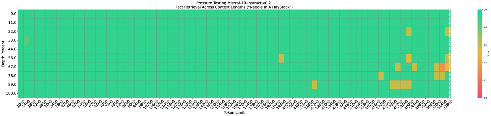

# ThinK：利用查询驱动修剪技术，打造更精简的关键缓存

发布时间：2024年07月30日

`LLM理论` `人工智能`

> ThinK: Thinner Key Cache by Query-Driven Pruning

# 摘要

> 大型语言模型（LLM）通过扩大模型规模和序列长度，在自然语言处理领域取得了突破性进展。然而，计算和内存成本的增加，尤其是处理长序列时的挑战，不容忽视。本文针对长上下文场景，探讨了推理中KV缓存内存的低效问题。我们发现，KV缓存的通道维度存在显著冗余，表现为注意力权重的不平衡分布和低秩结构。为此，我们设计了ThinK，一种依赖于查询的KV缓存剪枝方法，旨在精准剪枝同时减少注意力权重损失。实验表明，ThinK不仅保持了模型精度，还使内存成本降低了20%以上。在LLaMA3和Mistral模型上的广泛测试证实了ThinK的高效性，为LLM的高效部署开辟了新路径。此外，ThinK在扩展至值缓存剪枝方面也展现出潜力，有望进一步降低资源消耗。

> Large Language Models (LLMs) have revolutionized the field of natural language processing, achieving unprecedented performance across a variety of applications by leveraging increased model sizes and sequence lengths. However, the associated rise in computational and memory costs poses significant challenges, particularly in managing long sequences due to the quadratic complexity of the transformer attention mechanism. This paper focuses on the long-context scenario, addressing the inefficiencies in KV cache memory consumption during inference. Unlike existing approaches that optimize the memory based on the sequence lengths, we uncover that the channel dimension of the KV cache exhibits significant redundancy, characterized by unbalanced magnitude distribution and low-rank structure in attention weights. Based on these observations, we propose ThinK, a novel query-dependent KV cache pruning method designed to minimize attention weight loss while selectively pruning the least significant channels. Our approach not only maintains or enhances model accuracy but also achieves a reduction in memory costs by over 20% compared with vanilla KV cache eviction methods. Extensive evaluations on the LLaMA3 and Mistral models across various long-sequence datasets confirm the efficacy of ThinK, setting a new precedent for efficient LLM deployment without compromising performance. We also outline the potential of extending our method to value cache pruning, demonstrating ThinK's versatility and broad applicability in reducing both memory and computational overheads.

[Arxiv](https://arxiv.org/abs/2407.21018)