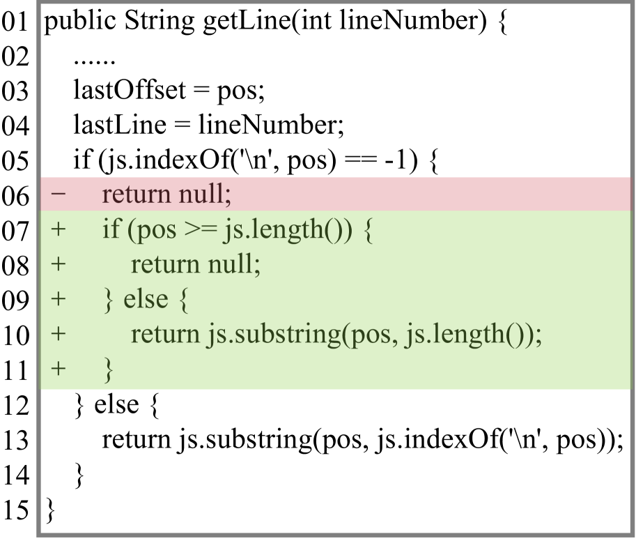
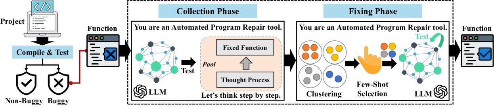
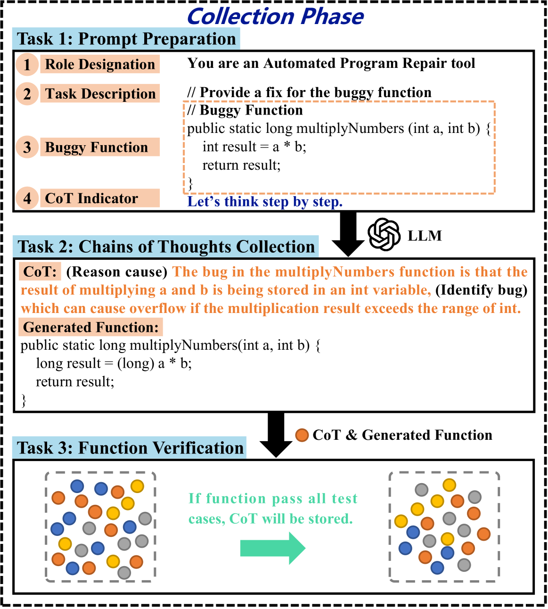
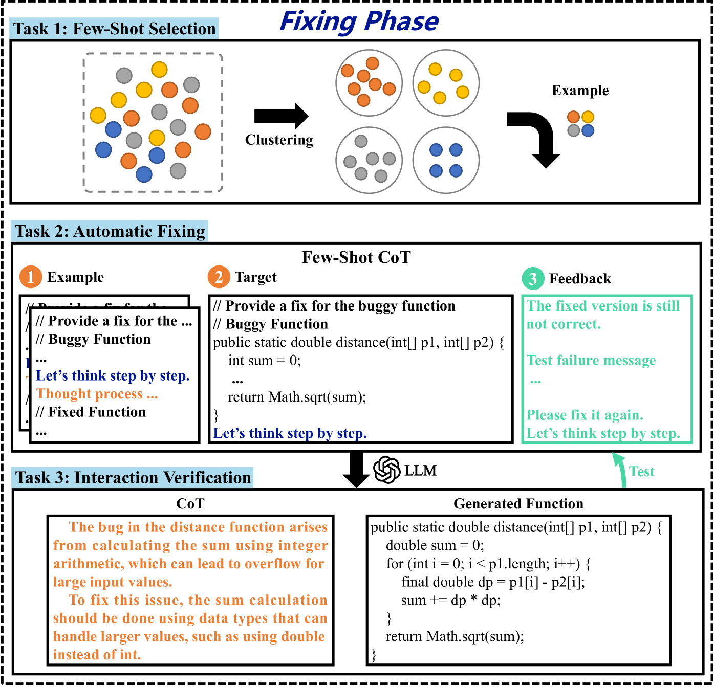
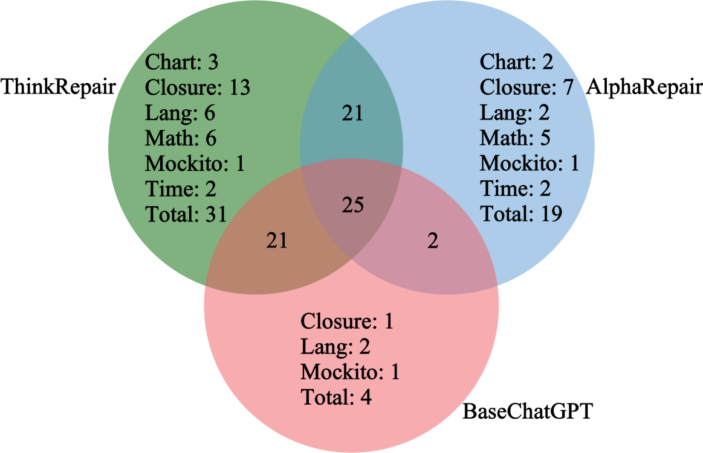
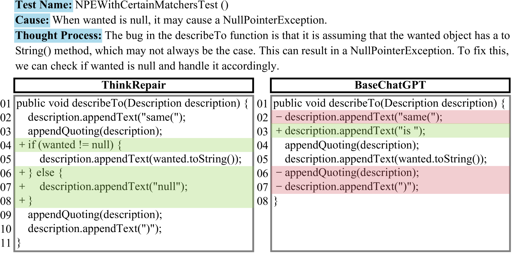
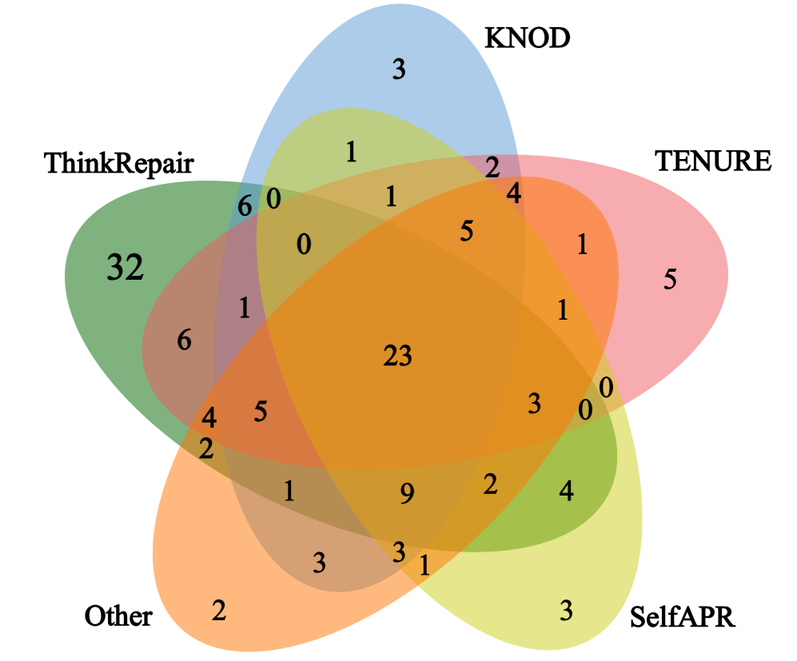
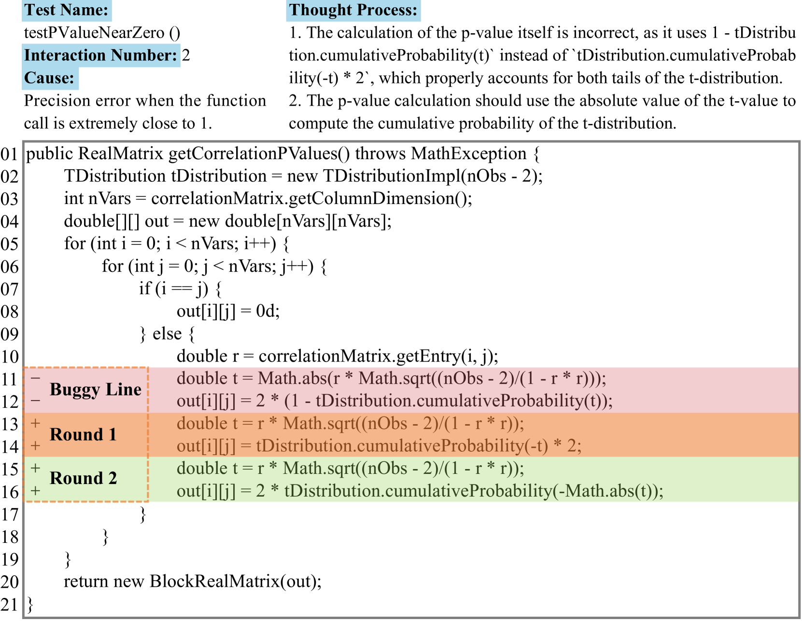
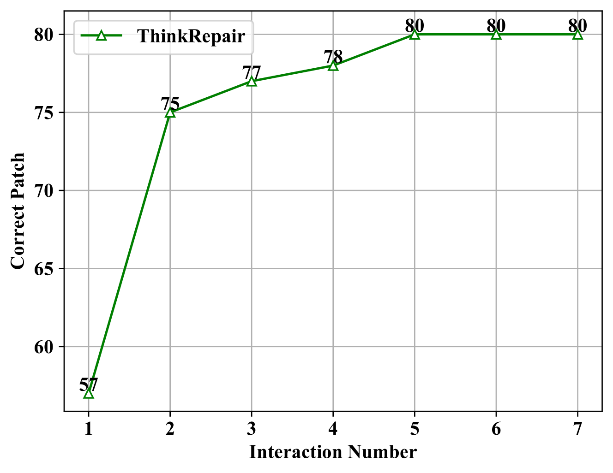

# ThinkRepair：一种自我指导的自动化程序修复技术

发布时间：2024年07月30日

`LLM应用` `软件开发` `自动化`

> ThinkRepair: Self-Directed Automated Program Repair

# 摘要

> 尽管自动化程序修复 (APR) 领域已有多项进展，但在处理需要深入逻辑分析的错误修复方面仍显不足。近期，借助提示工程的大型语言模型 (LLM) 在多任务处理中表现出色，包括错误修复。然而，高质量提示的构建成本高昂，影响了 LLM 的效能。为此，我们推出了 ThinkRepair，一种基于 LLM 的自主修复系统，分为自动知识收集和智能错误修复两大阶段。在 Defects4J 和 QuixBugs 数据集上的测试表明，ThinkRepair 在错误修复效率上显著领先，大幅提升了修复数量和质量，展现了其在 APR 领域的巨大潜力。

> Though many approaches have been proposed for Automated Program Repair (APR) and indeed achieved remarkable performance, they still have limitations in fixing bugs that require analyzing and reasoning about the logic of the buggy program. Recently, large language models (LLMs) instructed by prompt engineering have attracted much attention for their powerful ability to address many kinds of tasks including bug-fixing. However, the quality of the prompt will highly affect the ability of LLMs and manually constructing high-quality prompts is a costly endeavor.
  To address this limitation, we propose a self-directed LLM-based automated program repair, ThinkRepair, with two main phases: collection phase and fixing phase. The former phase automatically collects various chains of thoughts that constitute pre-fixed knowledge by instructing LLMs with the Chain-of-Thought (CoT) prompt. The latter phase targets fixing a bug by first selecting examples for few-shot learning and second automatically interacting with LLMs, optionally appending with feedback of testing information.
  Evaluations on two widely studied datasets (Defects4J and QuixBugs) by comparing ThinkRepair with 12 SOTA APRs indicate the priority of ThinkRepair in fixing bugs. Notably, ThinkRepair fixes 98 bugs and improves baselines by 27%-344.4% on Defects4J V1.2. On Defects4J V2.0, ThinkRepair fixes 12-65 more bugs than the SOTA APRs. Additionally, ThinkRepair also makes a considerable improvement on QuixBugs (31 for Java and 21 for Python at most).

[Arxiv](https://arxiv.org/abs/2407.20898)