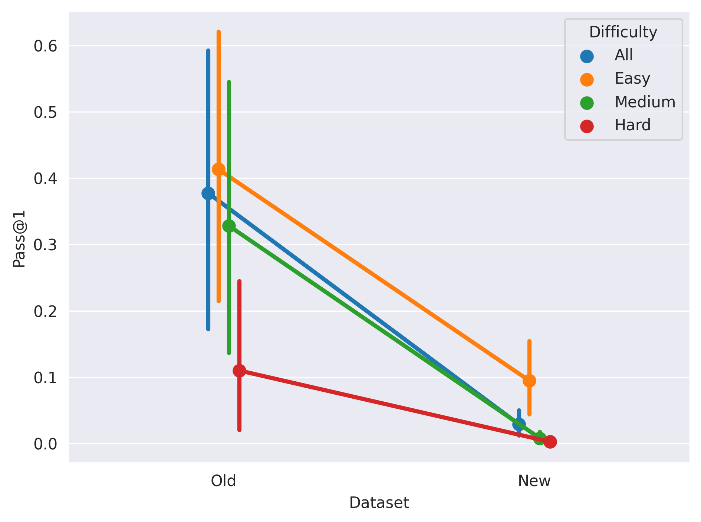
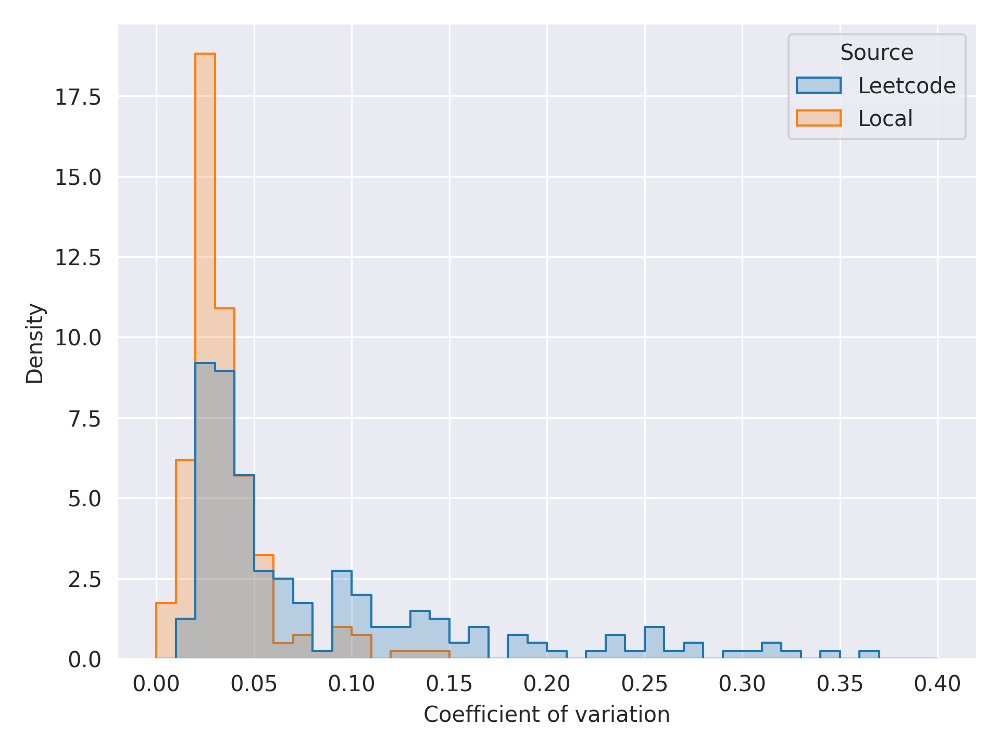
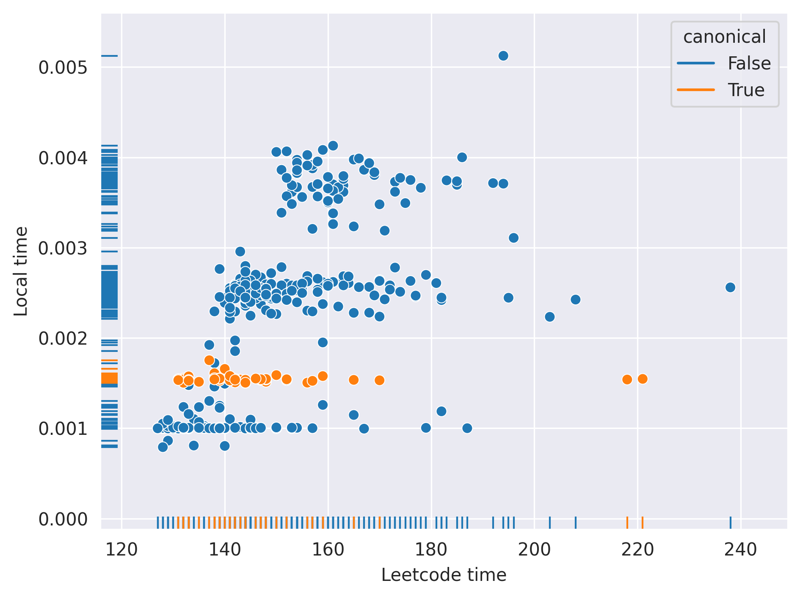
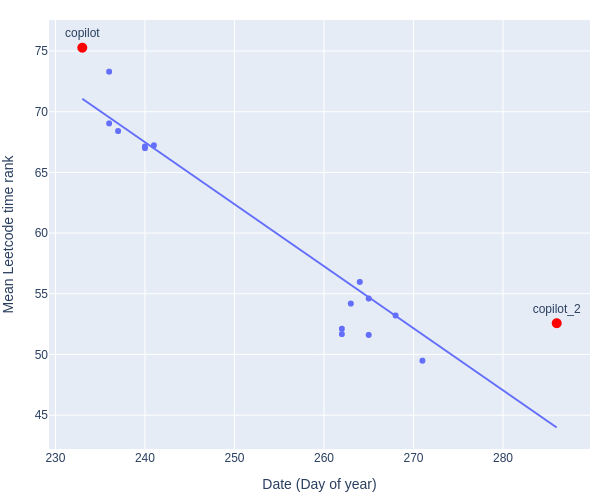
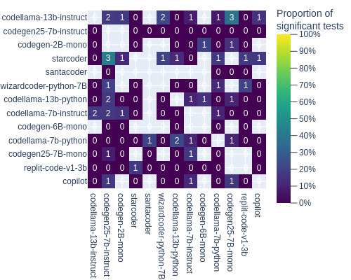
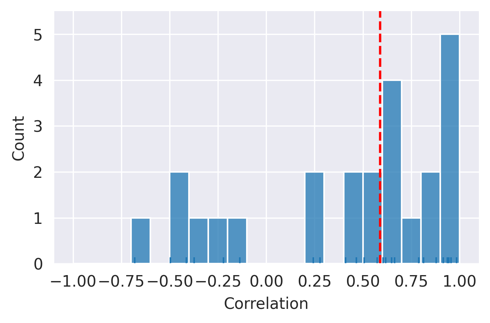
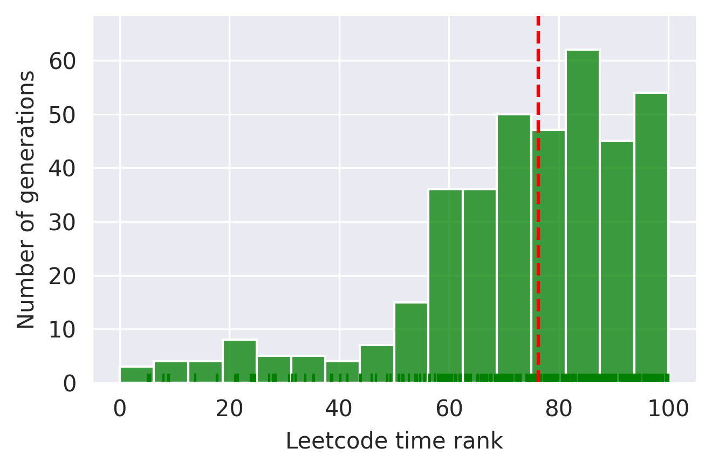

# 探究 LLM 生成代码在 Leetcode 的表现

发布时间：2024年07月31日

`LLM应用` `软件开发` `人工智能`

> A Performance Study of LLM-Generated Code on Leetcode

# 摘要

> 本研究通过 Leetcode 数据集，对比了18种大型语言模型（LLM）与人工编写的代码效率。研究发现，尽管模型参数各异，LLM 生成的代码性能却相当一致，且平均效率超越了人类编码。此外，我们探讨了 Leetcode 作为基准测试的适用性及其潜在的数据污染问题。这些发现不仅深化了对 LLM 代码生成能力的理解，也为未来技术优化指明了方向。

> This study evaluates the efficiency of code generation by Large Language Models (LLMs) and measures their performance against human-crafted solutions using a dataset from Leetcode. We compare 18 LLMs, considering factors such as model temperature and success rate, and their impact on code performance. This research introduces a novel method for measuring and comparing the speed of LLM-generated code, revealing that LLMs produce code with comparable performance, irrespective of the adopted LLM. We also find that LLMs are capable of generating code that is, on average, more efficient than the code written by humans. The paper further discusses the use of Leetcode as a benchmarking dataset, the limitations imposed by potential data contamination, and the platform's measurement reliability. We believe that our findings contribute to a better understanding of LLM capabilities in code generation and set the stage for future optimizations in the field.

[Arxiv](https://arxiv.org/abs/2407.21579)