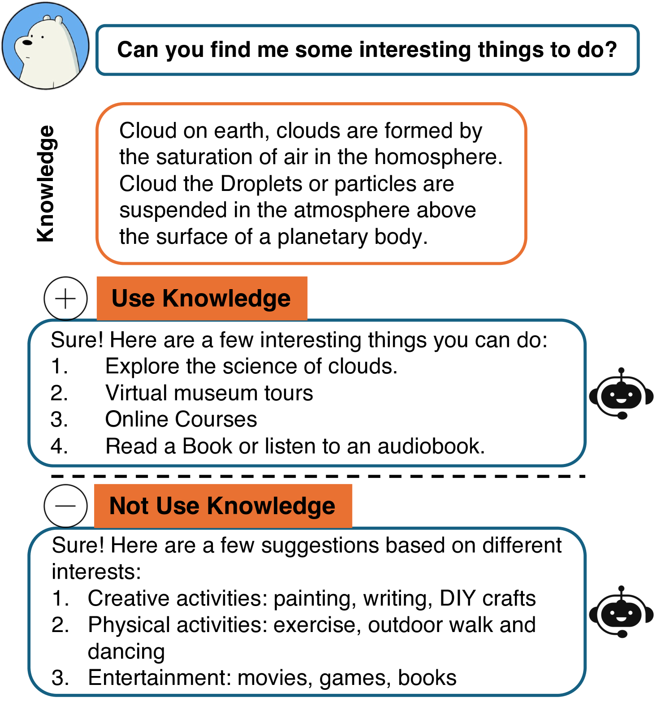
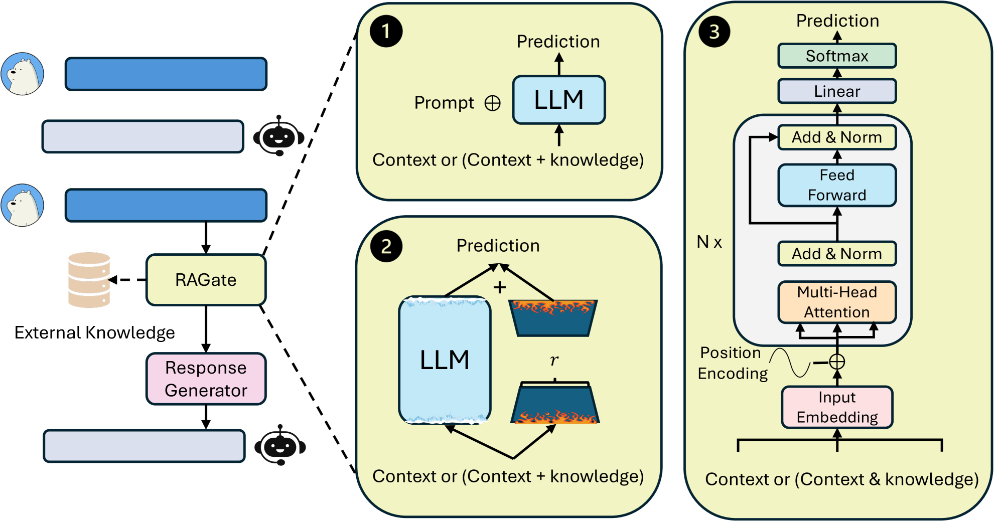
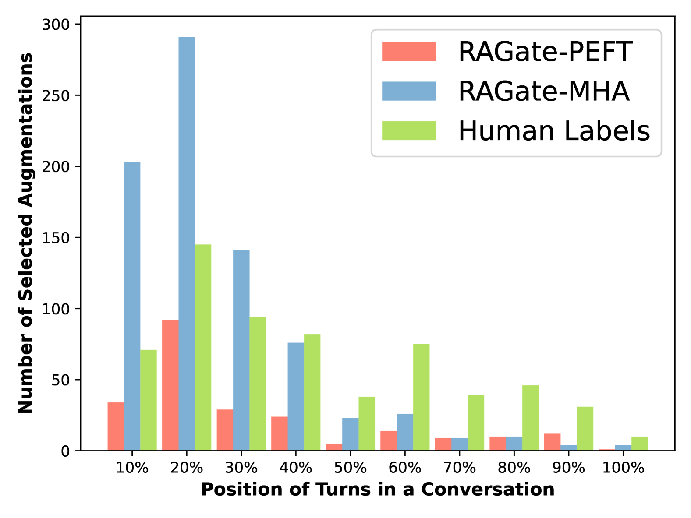
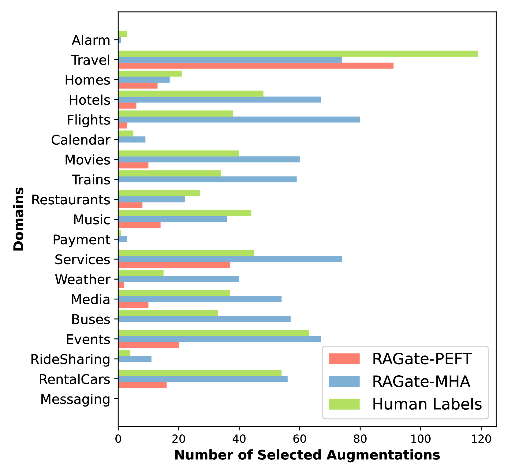

# 对话系统的自适应检索增强生成技术

发布时间：2024年07月31日

`RAG` `对话系统` `人工智能`

> Adaptive Retrieval-Augmented Generation for Conversational Systems

# 摘要

> 尽管大型语言模型在对话系统中的应用取得了成功，但研究表明，检索和增强外部知识对于提供信息性回复至关重要。然而，现有研究普遍假设对话系统始终需要RAG，这引发了一个研究问题。本研究旨在探讨每次系统响应是否都需要外部知识增强。我们通过人类判断开发了RAGate模型，该模型根据对话上下文预测是否需要RAG。实验表明，RAGate能有效提升基于RAG的对话系统，确保高质量响应和高生成信心，并揭示了生成信心与知识相关性的关联。

> Despite the success of integrating large language models into the development of conversational systems, many studies have shown the effectiveness of retrieving and augmenting external knowledge for informative responses. Hence, many existing studies commonly assume the always need for Retrieval Augmented Generation (RAG) in a conversational system without explicit control. This raises a research question about such a necessity. In this study, we propose to investigate the need for each turn of system response to be augmented with external knowledge. In particular, by leveraging human judgements on the binary choice of adaptive augmentation, we develop RAGate, a gating model, which models conversation context and relevant inputs to predict if a conversational system requires RAG for improved responses. We conduct extensive experiments on devising and applying RAGate to conversational models and well-rounded analyses of different conversational scenarios. Our experimental results and analysis indicate the effective application of RAGate in RAG-based conversational systems in identifying system responses for appropriate RAG with high-quality responses and a high generation confidence. This study also identifies the correlation between the generation's confidence level and the relevance of the augmented knowledge.

[Arxiv](https://arxiv.org/abs/2407.21712)