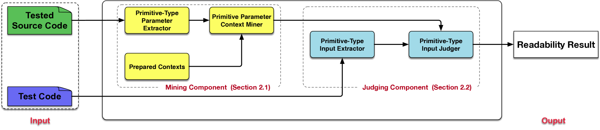
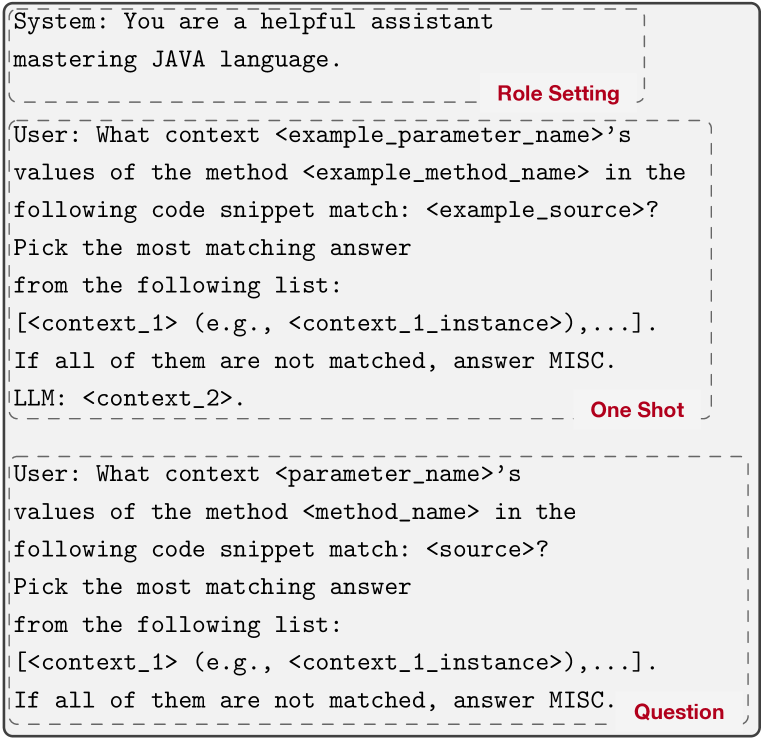
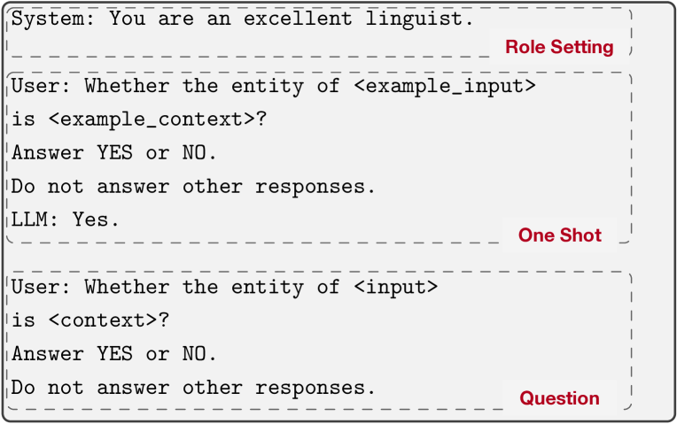
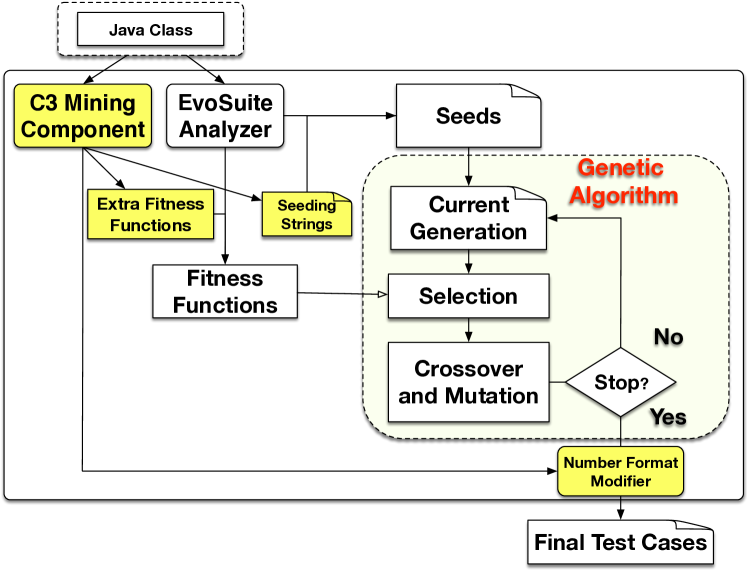
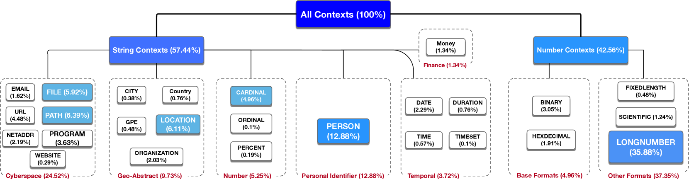
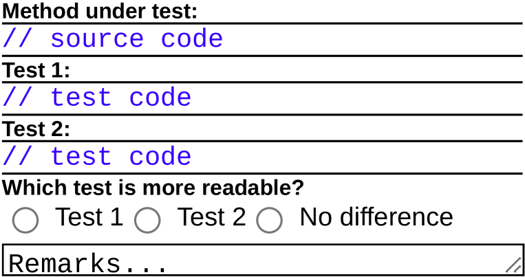
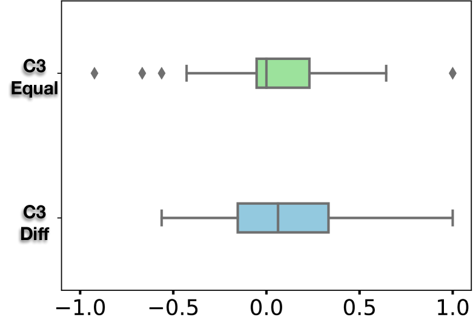

# 利用 LLM 评估单元测试中上下文感知输入的可读性

发布时间：2024年07月31日

`LLM应用` `软件开发` `自动化测试`

> An LLM-based Readability Measurement for Unit Tests' Context-aware Inputs

# 摘要

> 自动化测试技术生成的单元测试通常代码覆盖率更高，但测试的可读性对代码理解和维护至关重要。本文聚焦于测试输入的可读性，指出现有研究忽视了源代码对可读性的影响。为此，我们提出了C3（上下文一致性准则），利用大型语言模型从源代码中提取参数的可读性上下文，并检查测试输入是否与之匹配。此外，我们设计了EvoSuiteC3，利用C3提取的上下文辅助生成可读测试输入。实验结果显示，C3在挖掘可读性上下文方面表现优异，且EvoSuiteC3在生成可读字符串类型输入方面显著优于传统工具。

> Automated test techniques usually generate unit tests with higher code coverage than manual tests. However, the readability of automated tests is crucial for code comprehension and maintenance. The readability of unit tests involves many aspects. In this paper, we focus on test inputs. The central limitation of existing studies on input readability is that they focus on test codes alone without taking the tested source codes into consideration, making them either ignore different source codes' different readability requirements or require manual efforts to write readable inputs. However, we observe that the source codes specify the contexts that test inputs must satisfy. Based on such observation, we introduce the \underline{C}ontext \underline{C}onsistency \underline{C}riterion (a.k.a, C3), which is a readability measurement tool that leverages Large Language Models to extract primitive-type (including string-type) parameters' readability contexts from the source codes and checks whether test inputs are consistent with those contexts. We have also proposed EvoSuiteC3. It leverages C3's extracted contexts to help EvoSuite generate readable test inputs. We have evaluated C3's performance on $409$ \java{} classes and compared manual and automated tests' readability under C3 measurement. The results are two-fold. First, The Precision, Recall, and F1-Score of C3's mined readability contexts are \precision{}, \recall{}, and \fone{}, respectively. Second, under C3's measurement, the string-type input readability scores of EvoSuiteC3, ChatUniTest (an LLM-based test generation tool), manual tests, and two traditional tools (EvoSuite and Randoop) are $90\%$, $83\%$, $68\%$, $8\%$, and $8\%$, showing the traditional tools' inability in generating readable string-type inputs.

[Arxiv](https://arxiv.org/abs/2407.21369)