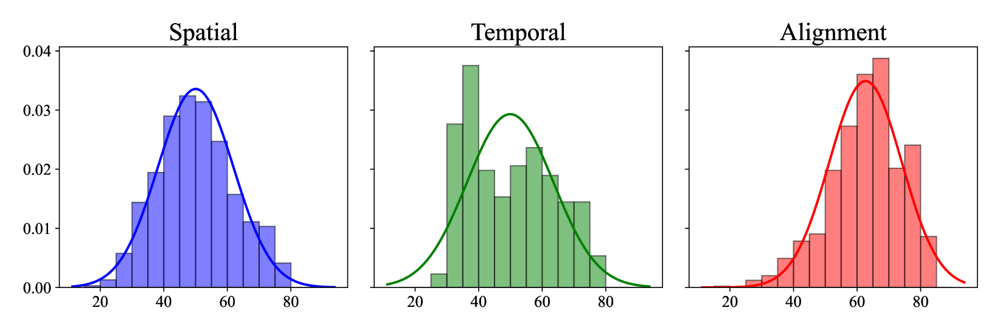

# AIGC 视频质量评估基准：集数据集与统一模型于一体

发布时间：2024年07月31日

`LLM应用` `视频技术` `人工智能`

> Benchmarking AIGC Video Quality Assessment: A Dataset and Unified Model

# 摘要

> 近年来，随着稳定扩散和大型语言模型技术的进步，AI驱动的视频生成技术备受瞩目。为了准确评估AI生成视频的感知质量并优化生成技术，业界对精准的视频质量评估（VQA）模型需求迫切。然而，由于AI生成视频中存在的高度复杂失真（如不自然的动作、不合理的物体等），其质量评估极具挑战。本文从主观和客观两个角度系统探讨了AIGC-VQA问题。主观评估方面，我们构建了包含2,808个AIGC视频的LGVQ数据集，这些视频由6种生成模型基于468个精选文本提示生成。与传统主观VQA实验不同，我们从空间、时间和文本到视频对齐三个维度评估视频感知质量，这对当前视频生成技术至关重要。客观评估方面，我们在LGVQ数据集上建立了评估基准，发现现有质量评估指标表现不佳。为此，我们提出了UGVQ模型，该模型综合利用视频的视觉、文本和运动特征及其提示信息，通过整合关键特征提升表达能力，全面准确地评估AIGC视频质量。我们期待这一基准能推动AIGC视频质量评估指标的发展。LGVQ数据集和UGVQ指标将向公众开放。

> In recent years, artificial intelligence (AI) driven video generation has garnered significant attention due to advancements in stable diffusion and large language model techniques. Thus, there is a great demand for accurate video quality assessment (VQA) models to measure the perceptual quality of AI-generated content (AIGC) videos as well as optimize video generation techniques. However, assessing the quality of AIGC videos is quite challenging due to the highly complex distortions they exhibit (e.g., unnatural action, irrational objects, etc.). Therefore, in this paper, we try to systemically investigate the AIGC-VQA problem from both subjective and objective quality assessment perspectives. For the subjective perspective, we construct a Large-scale Generated Vdeo Quality assessment (LGVQ) dataset, consisting of 2,808 AIGC videos generated by 6 video generation models using 468 carefully selected text prompts. Unlike previous subjective VQA experiments, we evaluate the perceptual quality of AIGC videos from three dimensions: spatial quality, temporal quality, and text-to-video alignment, which hold utmost importance for current video generation techniques. For the objective perspective, we establish a benchmark for evaluating existing quality assessment metrics on the LGVQ dataset, which reveals that current metrics perform poorly on the LGVQ dataset. Thus, we propose a Unify Generated Video Quality assessment (UGVQ) model to comprehensively and accurately evaluate the quality of AIGC videos across three aspects using a unified model, which uses visual, textual and motion features of video and corresponding prompt, and integrates key features to enhance feature expression. We hope that our benchmark can promote the development of quality evaluation metrics for AIGC videos. The LGVQ dataset and the UGVQ metric will be publicly released.

[Arxiv](https://arxiv.org/abs/2407.21408)