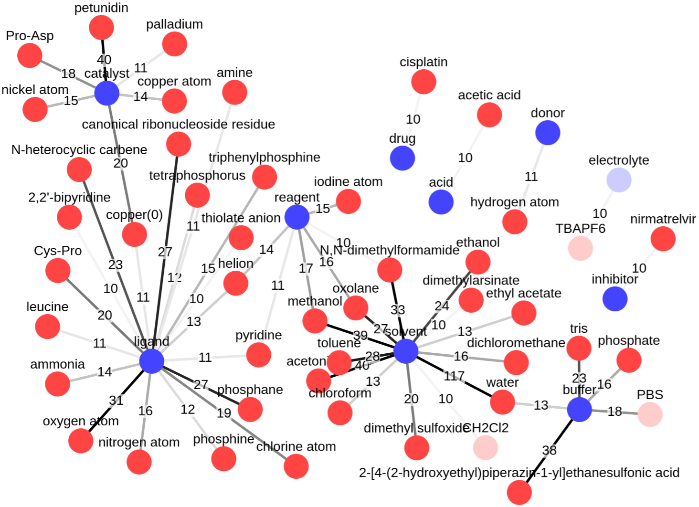

# CEAR 技术能够自动从科学文献中构建化学实体及其角色的知识图谱。

发布时间：2024年07月31日

`LLM应用` `知识图谱`

> CEAR: Automatic construction of a knowledge graph of chemical entities and roles from scientific literature

# 摘要

> 本体论，作为特定领域知识的正式表示，为复杂信息的组织与理解提供了结构化框架。然而，构建本体论既复杂又耗时。在化学领域，ChEBI本体论虽著名，却仅覆盖了该领域知识的一小部分，且未涉及科学文献。为此，我们提出一种方法：通过Chebi知识扩充注释文本，并微调大型语言模型（LLM）以识别科学文本中的化学实体及其角色。实验显示，结合本体论知识与LLM的语言理解力，我们能高效识别化学实体与角色。此外，从8000篇ChemRxiv文章中提取信息后，我们利用第二个LLM构建了化学实体与角色（CEAR）的知识图谱（KG），这不仅补充了ChEBI，还有助于其扩展。

> Ontologies are formal representations of knowledge in specific domains that provide a structured framework for organizing and understanding complex information. Creating ontologies, however, is a complex and time-consuming endeavor. ChEBI is a well-known ontology in the field of chemistry, which provides a comprehensive resource for defining chemical entities and their properties. However, it covers only a small fraction of the rapidly growing knowledge in chemistry and does not provide references to the scientific literature. To address this, we propose a methodology that involves augmenting existing annotated text corpora with knowledge from Chebi and fine-tuning a large language model (LLM) to recognize chemical entities and their roles in scientific text. Our experiments demonstrate the effectiveness of our approach. By combining ontological knowledge and the language understanding capabilities of LLMs, we achieve high precision and recall rates in identifying both the chemical entities and roles in scientific literature. Furthermore, we extract them from a set of 8,000 ChemRxiv articles, and apply a second LLM to create a knowledge graph (KG) of chemical entities and roles (CEAR), which provides complementary information to ChEBI, and can help to extend it.

[Arxiv](https://arxiv.org/abs/2407.21708)