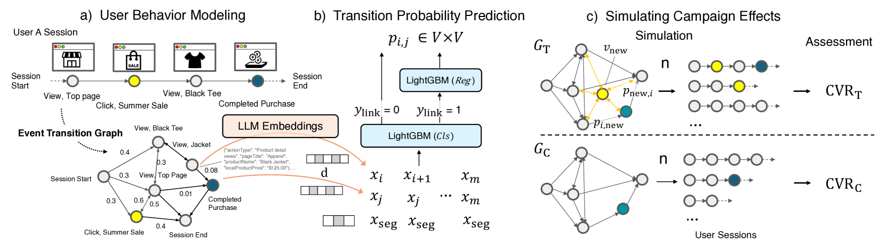
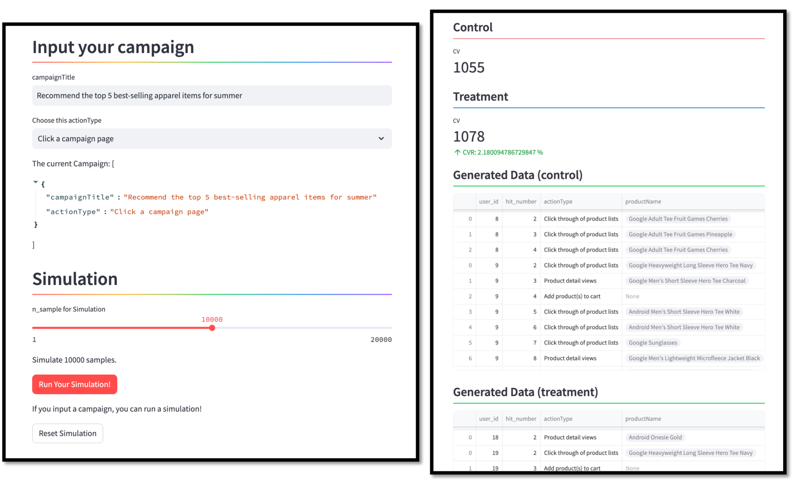

# CXSimulator：基于 LLM 嵌入的用户行为模拟工具，专为网络营销活动评估设计

发布时间：2024年07月31日

`LLM应用` `网络营销` `客户体验`

> CXSimulator: A User Behavior Simulation using LLM Embeddings for Web-Marketing Campaign Assessment

# 摘要

> 本文推出了一款创新的客户体验模拟器，该框架通过模拟用户行为，评估网络营销活动的效果。利用大型语言模型，我们将用户行为中的各种事件转化为语义向量，并训练模型预测事件间的转换，甚至能处理未见事件。在网络营销中，该模型模拟用户对新活动或产品的反应，无需昂贵的在线测试，提升营销洞察力。通过 Google 商品商店的公共数据集，我们的数值评估和用户研究验证了框架的有效性。

> This paper presents the Customer Experience (CX) Simulator, a novel framework designed to assess the effects of untested web-marketing campaigns through user behavior simulations. The proposed framework leverages large language models (LLMs) to represent various events in a user's behavioral history, such as viewing an item, applying a coupon, or purchasing an item, as semantic embedding vectors. We train a model to predict transitions between events from their LLM embeddings, which can even generalize to unseen events by learning from diverse training data. In web-marketing applications, we leverage this transition prediction model to simulate how users might react differently when new campaigns or products are presented to them. This allows us to eliminate the need for costly online testing and enhance the marketers' abilities to reveal insights. Our numerical evaluation and user study, utilizing BigQuery Public Datasets from the Google Merchandise Store, demonstrate the effectiveness of our framework.

[Arxiv](https://arxiv.org/abs/2407.21553)