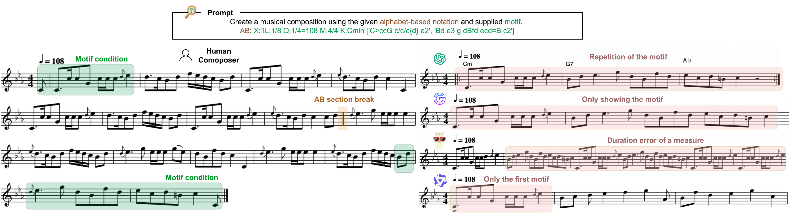
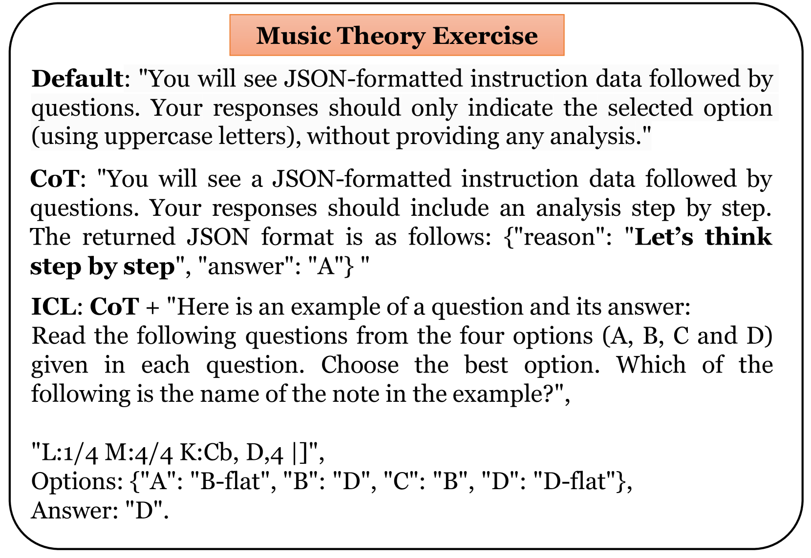
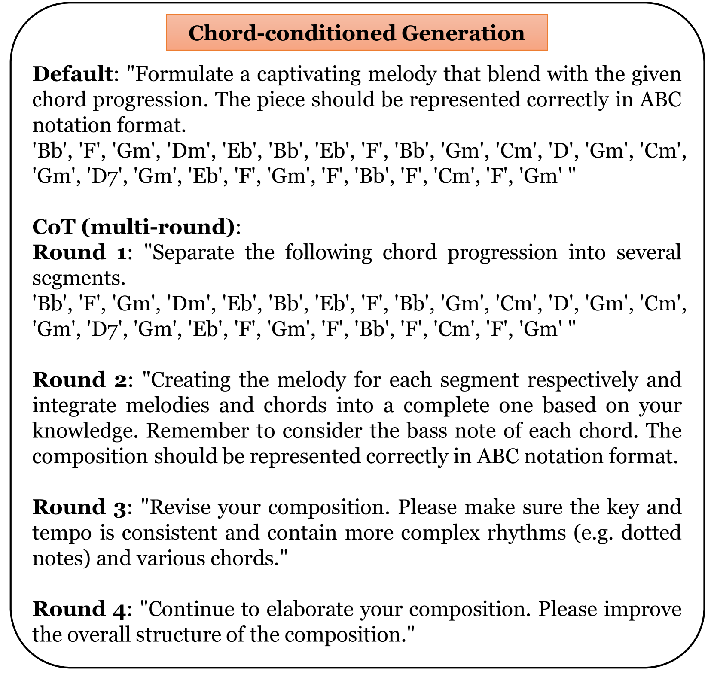
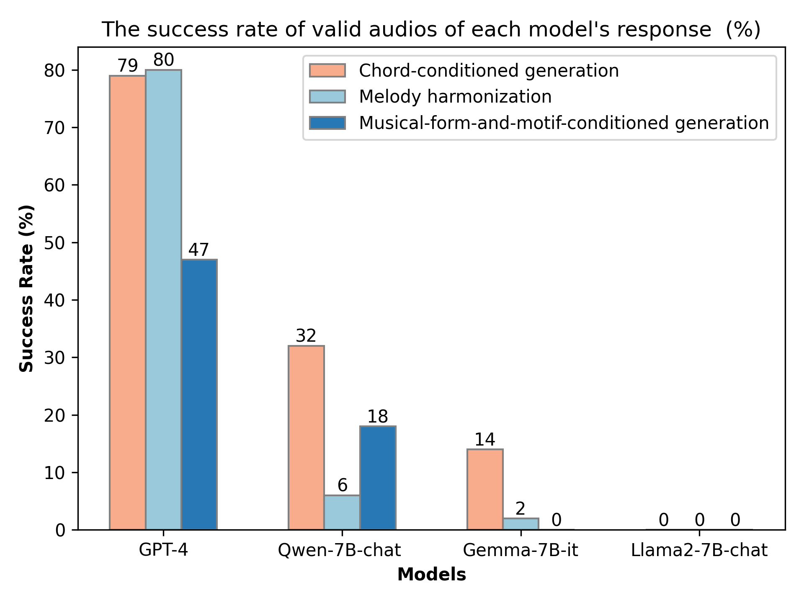

# 大型语言模型能否在音乐领域展现推理能力？本文旨在评估其在音乐理解和生成方面的能力。

发布时间：2024年07月31日

`LLM应用` `人工智能`

> Can LLMs "Reason" in Music? An Evaluation of LLMs' Capability of Music Understanding and Generation

# 摘要

> 符号音乐如同语言，可被离散符号编码。最新研究将GPT-4和Llama2等大型语言模型引入符号音乐领域，涵盖理解和生成。然而，关于这些模型在高级音乐理解和条件生成中的表现，尤其是多步骤推理方面的探讨甚少，这对人机交互共创至关重要。本研究深入探讨了LLMs在符号音乐处理中的能力与局限。我们发现，LLMs在歌曲级音乐多步骤推理中表现欠佳，且在复杂音乐任务中难以运用所学知识。通过分析LLMs的响应，我们清晰地揭示了其优劣。研究结果表明，LLMs并非天生具备高级音乐能力，未来研究需着重于连接音乐知识与推理，以优化音乐家的共创体验。

> Symbolic Music, akin to language, can be encoded in discrete symbols. Recent research has extended the application of large language models (LLMs) such as GPT-4 and Llama2 to the symbolic music domain including understanding and generation. Yet scant research explores the details of how these LLMs perform on advanced music understanding and conditioned generation, especially from the multi-step reasoning perspective, which is a critical aspect in the conditioned, editable, and interactive human-computer co-creation process. This study conducts a thorough investigation of LLMs' capability and limitations in symbolic music processing. We identify that current LLMs exhibit poor performance in song-level multi-step music reasoning, and typically fail to leverage learned music knowledge when addressing complex musical tasks. An analysis of LLMs' responses highlights distinctly their pros and cons. Our findings suggest achieving advanced musical capability is not intrinsically obtained by LLMs, and future research should focus more on bridging the gap between music knowledge and reasoning, to improve the co-creation experience for musicians.

[Arxiv](https://arxiv.org/abs/2407.21531)