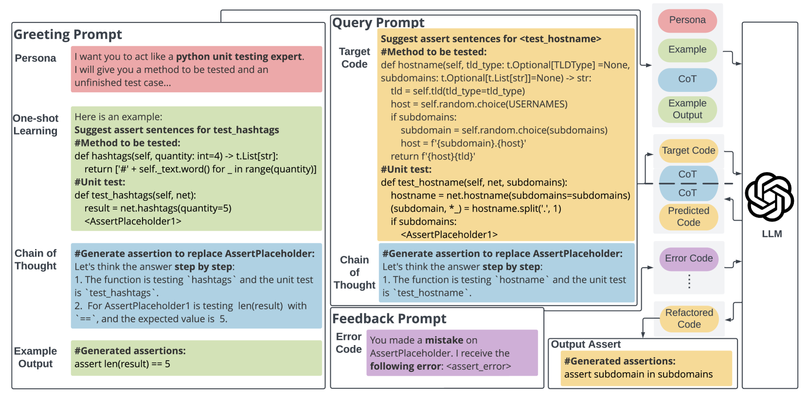

# 大型语言模型助力类似聊天的断言预测

发布时间：2024年07月31日

`LLM应用` `软件工程` `自动化测试`

> Chat-like Asserts Prediction with the Support of Large Language Model

# 摘要

> 单元测试是软件开发的关键环节，断言语句在其中扮演着确保代码按预期运行的角色。尽管自动化测试用例生成已有研究，但生成有意义的断言语句仍是一大挑战。特别是在Python这类动态类型语言中，相关研究较少。本文介绍了一种新颖的基于大型语言模型的方法——Chat-like执行基础断言预测（\tool），专门用于生成Python项目的有意义断言语句。\tool结合角色扮演、思维链和一次性学习技术，通过与LLM和Python解释器的交互，高效生成断言语句。我们还提供了一个从GitHub挖掘的Python断言语句数据集。评估结果显示，\tool在单个和整体断言语句生成上的准确率分别为64.7\%和62\%，优于现有方法。此外，我们分析了功能相似但未匹配的断言语句，并探讨了\tool在自动化Python单元测试生成中的潜在价值。研究表明，\tool有望通过更多实际应用场景，为软件工程社区带来实质性益处。

> Unit testing is an essential component of software testing, with the assert statements playing an important role in determining whether the tested function operates as expected. Although research has explored automated test case generation, generating meaningful assert statements remains an ongoing challenge. While several studies have investigated assert statement generation in Java, limited work addresses this task in popular dynamically-typed programming languages like Python. In this paper, we introduce Chat-like execution-based Asserts Prediction (\tool), a novel Large Language Model-based approach for generating meaningful assert statements for Python projects. \tool utilizes the persona, Chain-of-Thought, and one-shot learning techniques in the prompt design, and conducts rounds of communication with LLM and Python interpreter to generate meaningful assert statements. We also present a Python assert statement dataset mined from GitHub. Our evaluation demonstrates that \tool achieves 64.7\% accuracy for single assert statement generation and 62\% for overall assert statement generation, outperforming the existing approaches. We also analyze the mismatched assert statements, which may still share the same functionality and discuss the potential help \tool could offer to the automated Python unit test generation. The findings indicate that \tool has the potential to benefit the SE community through more practical usage scenarios.

[Arxiv](https://arxiv.org/abs/2407.21429)