# Chat2Layout：借助多模态 LLM 实现互动式 3D 家具布局

发布时间：2024年07月31日

`Agent` `室内设计` `家具制造`

> Chat2Layout: Interactive 3D Furniture Layout with a Multimodal LLM

# 摘要

> 自动家具布局一直是室内设计的便捷之选。借助多模态大型语言模型（MLLMs）的强大视觉推理能力，我们推出了Chat2Layout系统，该系统不仅将MLLMs的功能拓展至互动布局设计，还通过创新的视觉-问题学习范式，实现了与模型的无缝沟通，无需调整模型权重。我们的系统包含一种无需训练的视觉提示机制，结合视觉-文本提示技术和离线到在线搜索方法，自动筛选出关键信息，助力MLLMs生成合理布局。通过核心为MLLMs的代理系统，我们实现了双向互动，代理不仅能理解环境和用户需求，还能在虚拟空间中智能布置家具，并根据执行反馈进行优化。实验证明，我们的方法有效提升了语言互动下的复杂3D家具生成与布置效率。

> Automatic furniture layout is long desired for convenient interior design. Leveraging the remarkable visual reasoning capabilities of multimodal large language models (MLLMs), recent methods address layout generation in a static manner, lacking the feedback-driven refinement essential for interactive user engagement. We introduce Chat2Layout, a novel interactive furniture layout generation system that extends the functionality of MLLMs into the realm of interactive layout design. To achieve this, we establish a unified vision-question paradigm for in-context learning, enabling seamless communication with MLLMs to steer their behavior without altering model weights. Within this framework, we present a novel training-free visual prompting mechanism. This involves a visual-text prompting technique that assist MLLMs in reasoning about plausible layout plans, followed by an Offline-to-Online search (O2O-Search) method, which automatically identifies the minimal set of informative references to provide exemplars for visual-text prompting. By employing an agent system with MLLMs as the core controller, we enable bidirectional interaction. The agent not only comprehends the 3D environment and user requirements through linguistic and visual perception but also plans tasks and reasons about actions to generate and arrange furniture within the virtual space. Furthermore, the agent iteratively updates based on visual feedback from execution results. Experimental results demonstrate that our approach facilitates language-interactive generation and arrangement for diverse and complex 3D furniture.

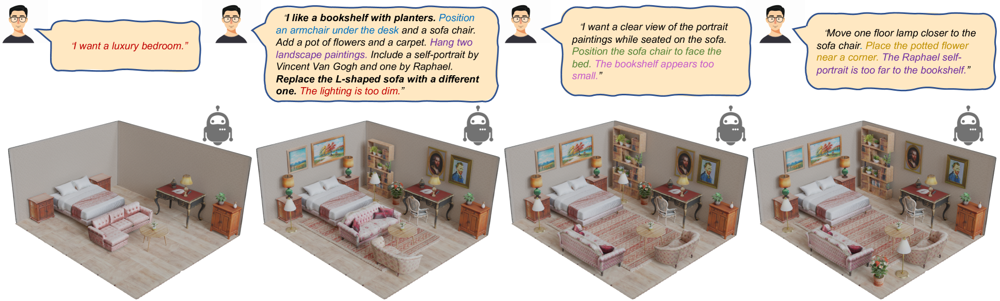

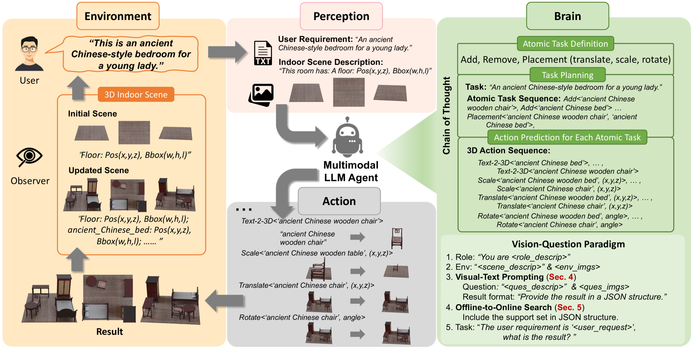

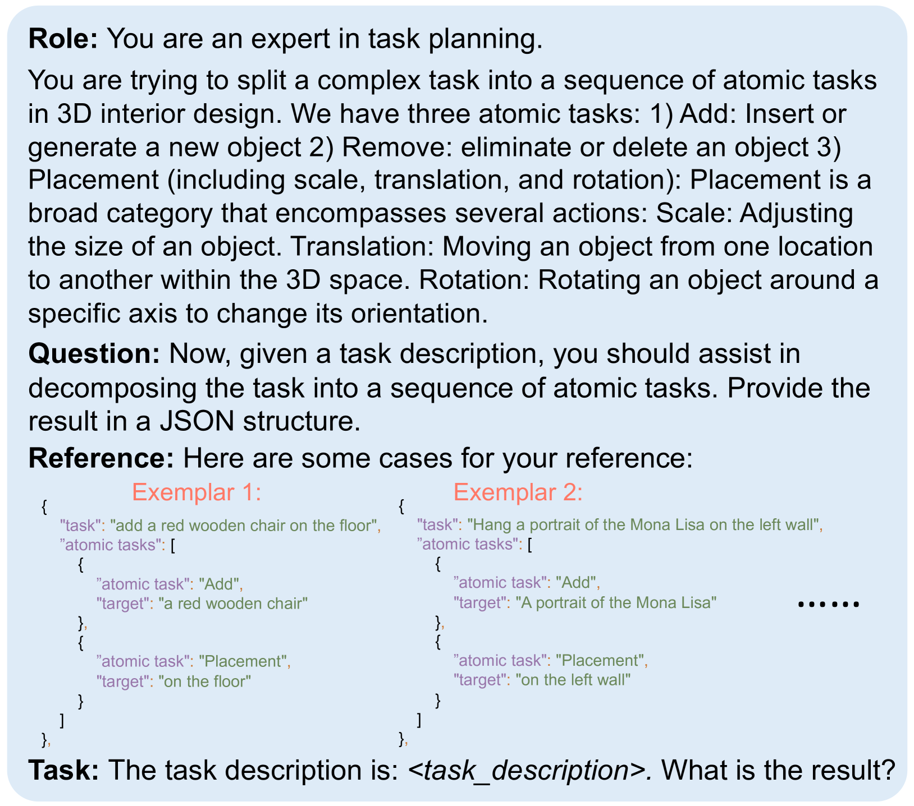

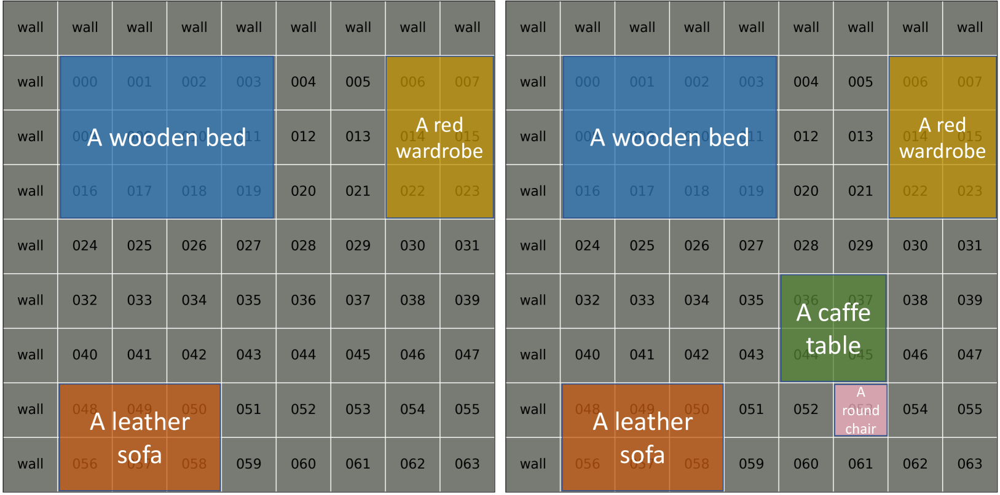

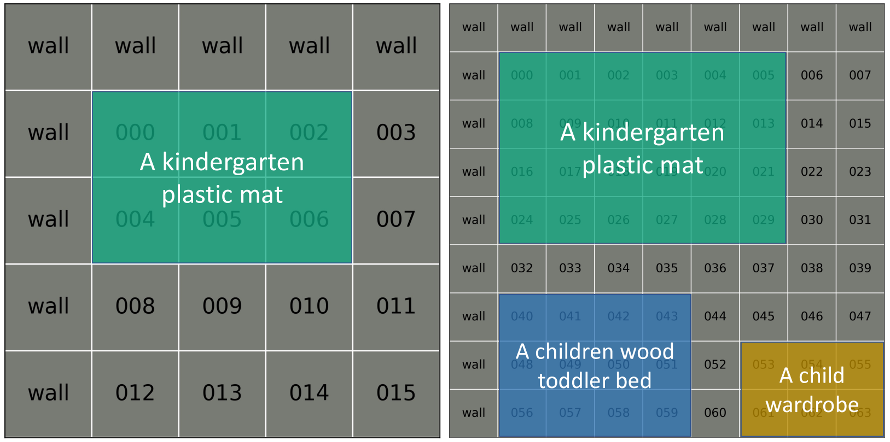

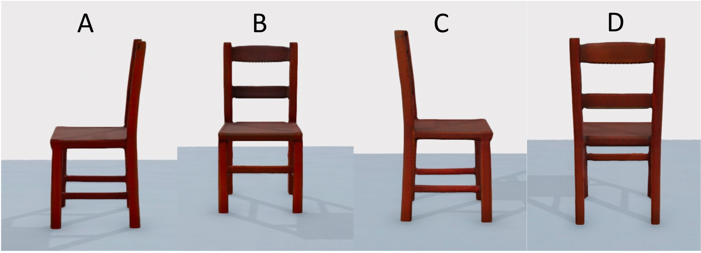

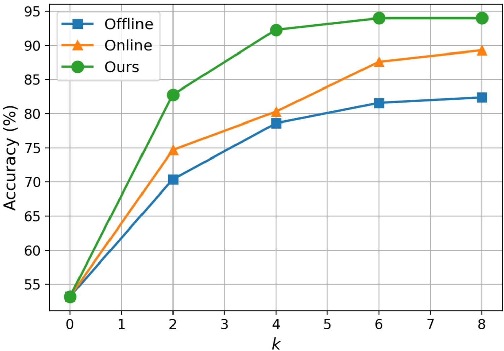

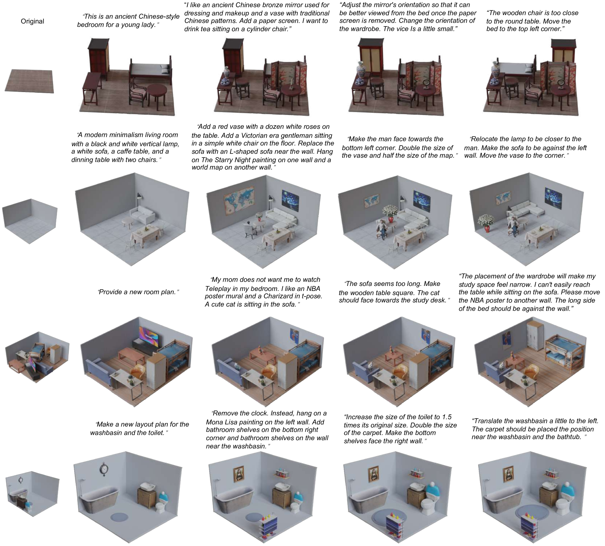

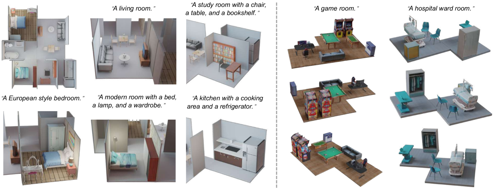

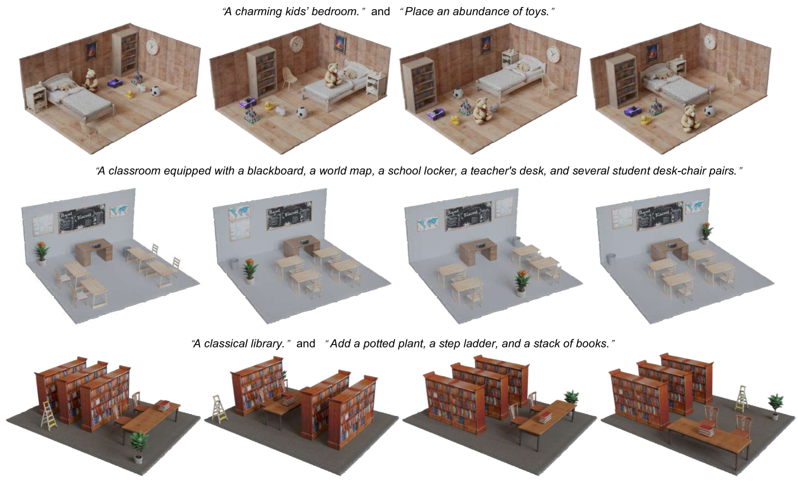

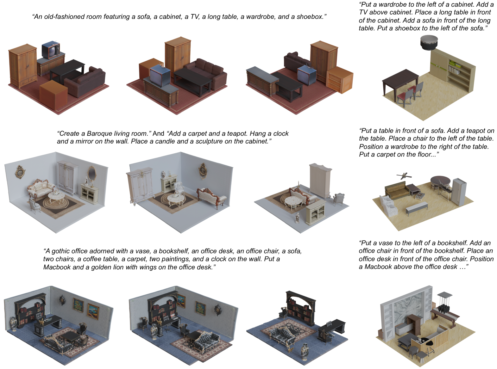

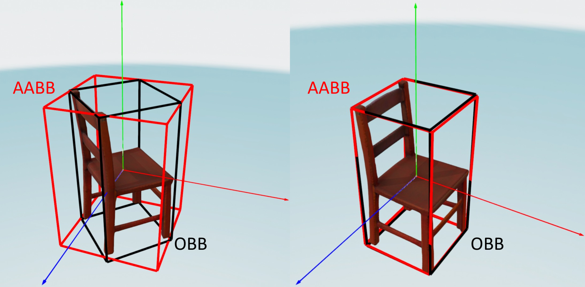

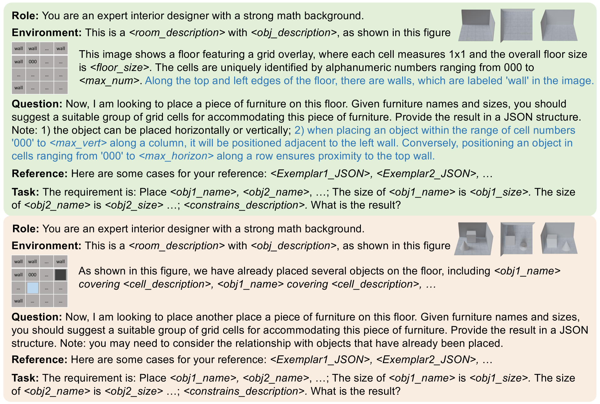

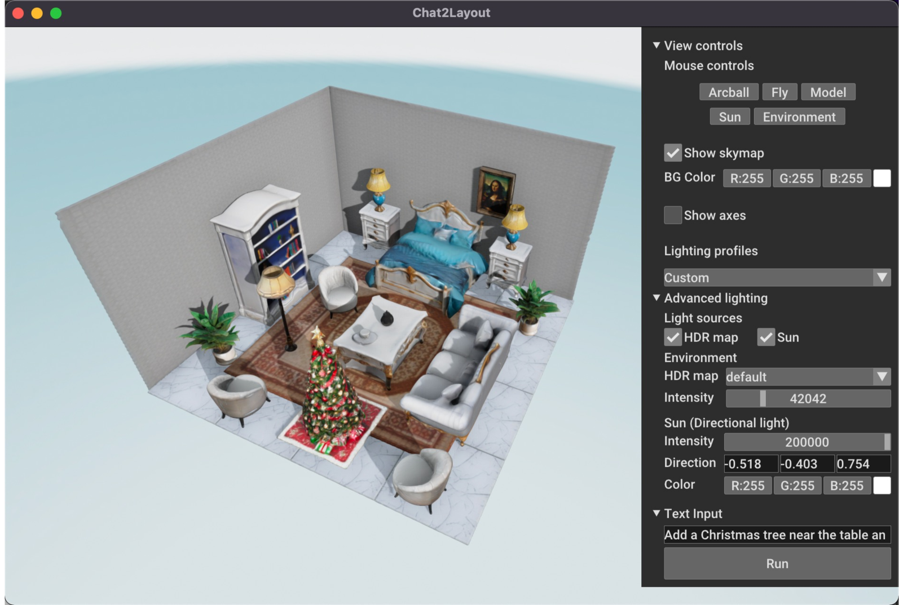

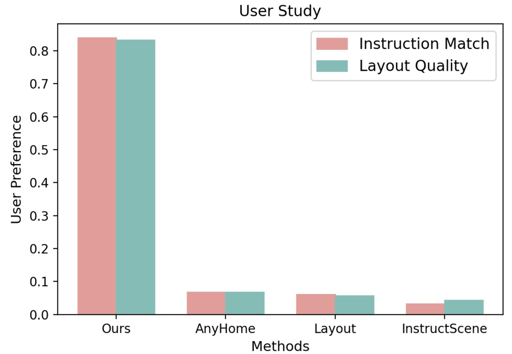

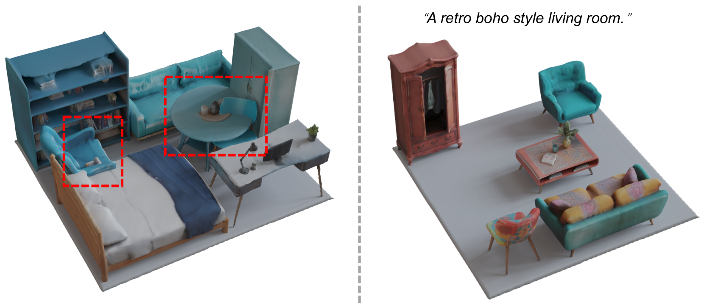

[Arxiv](https://arxiv.org/abs/2407.21333)