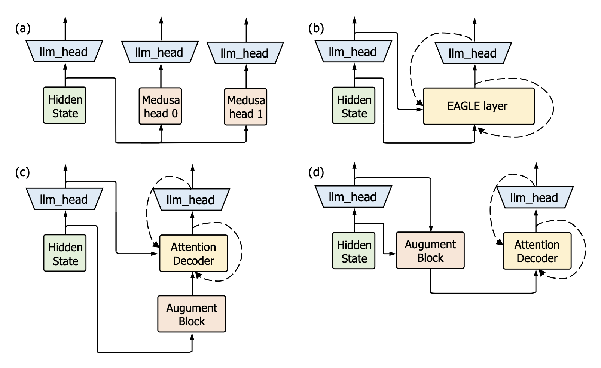
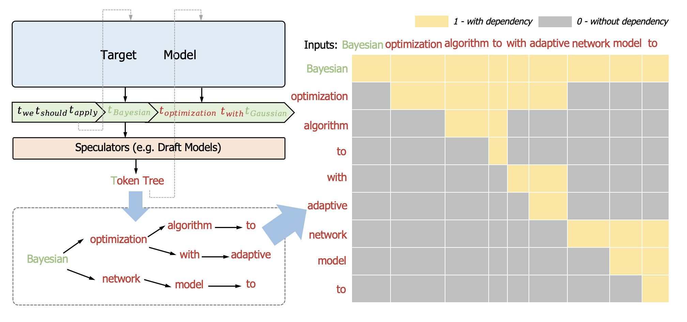
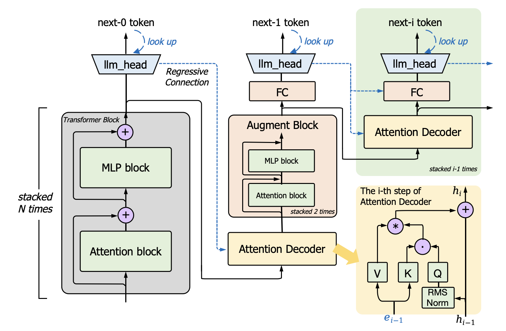
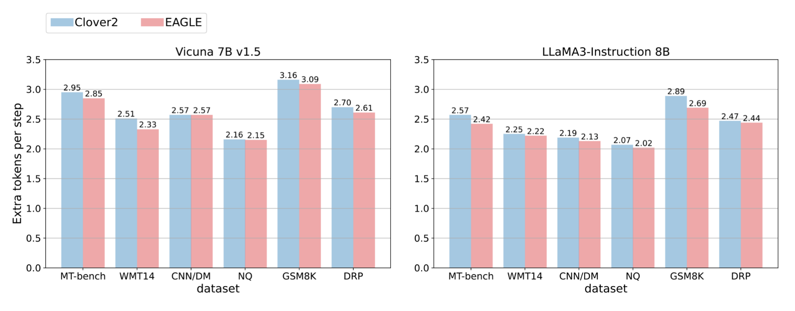
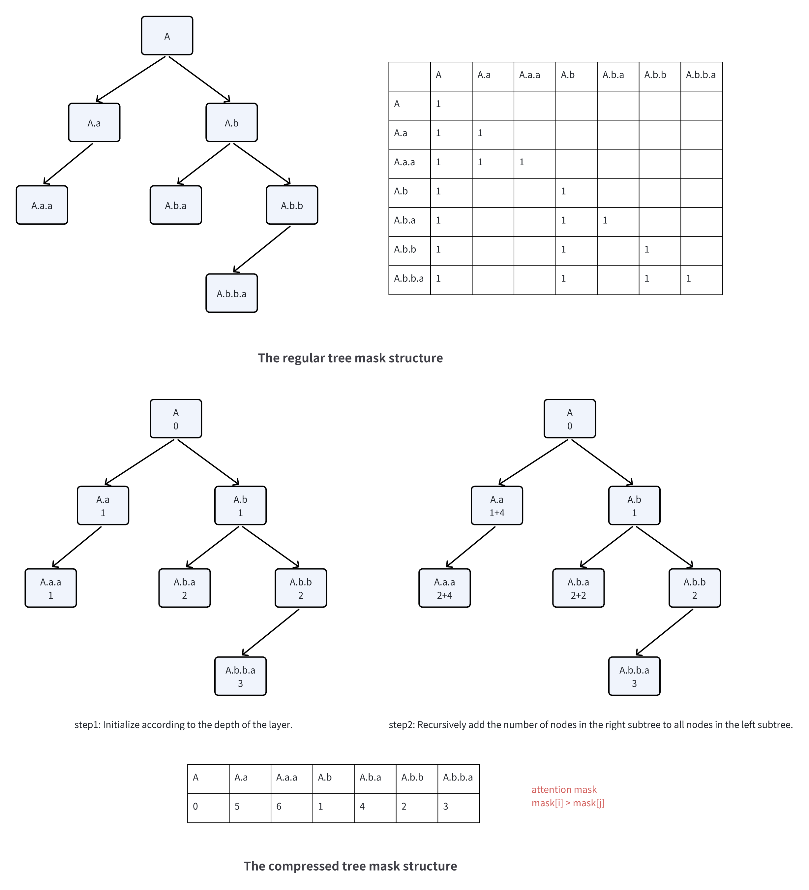

# Clover-2：精准助力轻量级推测解码的回归推断

发布时间：2024年07月31日

`LLM应用` `计算机科学` `人工智能`

> Clover-2: Accurate Inference for Regressive Lightweight Speculative Decoding

# 摘要

> 大型语言模型（LLM）常因自回归解码与现代GPU架构的不匹配而效率低下。近期，回归轻量级推测解码因其显著提升文本生成效率而备受瞩目。该方法采用轻量级回归草稿模型，如RNN或单层变换器解码器，通过顺序信息迭代预测潜在令牌。RNN草稿模型虽计算经济但准确性较低，而注意力解码器层则相反。本文推出Clover-2，作为基于RNN的Clover模型的升级版，旨在达到与注意力解码器层相当的准确性，同时保持低计算成本。Clover-2通过优化架构和知识蒸馏提升准确性与效率。实验基于Vicuna 7B和LLaMA3-Instruct 8B模型，结果显示Clover-2在多种架构中均超越现有方法，彰显其高效与稳健。

> Large Language Models (LLMs) frequently suffer from inefficiencies, largely attributable to the discord between the requirements of auto-regressive decoding and the architecture of contemporary GPUs. Recently, regressive lightweight speculative decoding has garnered attention for its notable efficiency improvements in text generation tasks. This approach utilizes a lightweight regressive draft model, like a Recurrent Neural Network (RNN) or a single transformer decoder layer, leveraging sequential information to iteratively predict potential tokens. Specifically, RNN draft models are computationally economical but tend to deliver lower accuracy, while attention decoder layer models exhibit the opposite traits. This paper presents Clover-2, an advanced iteration of Clover, an RNN-based draft model designed to achieve comparable accuracy to that of attention decoder layer models while maintaining minimal computational overhead. Clover-2 enhances the model architecture and incorporates knowledge distillation to increase Clover's accuracy and improve overall efficiency. We conducted experiments using the open-source Vicuna 7B and LLaMA3-Instruct 8B models. The results demonstrate that Clover-2 surpasses existing methods across various model architectures, showcasing its efficacy and robustness.

[Arxiv](https://arxiv.org/abs/2408.00264)