# ControlMLLM：一种无需训练的视觉提示学习方法，专为多模态大型语言模型设计。

发布时间：2024年07月31日

`LLM应用` `人工智能` `计算机视觉`

> ControlMLLM: Training-Free Visual Prompt Learning for Multimodal Large Language Models

# 摘要

> 本研究提出一种无需额外训练的方法，通过优化可学习视觉令牌，将视觉参照能力融入多模态大型语言模型（MLLMs）。我们发现，在MLLMs中，文本提示与视觉信息通过注意力层相互关联。我们的技术在推理时调整视觉令牌，精准控制文本对视觉元素的关注点。通过能量函数优化视觉令牌，我们强化了注意力图中的关键区域，实现精细的区域描述与推理，且无需昂贵的训练或重新训练模型。此方法为MLLMs增添参照功能开辟新径，支持多种参照形式如框选、遮罩、涂鸦和点选，展现出良好的控制性和解释性。

> In this work, we propose a training-free method to inject visual referring into Multimodal Large Language Models (MLLMs) through learnable visual token optimization. We observe the relationship between text prompt tokens and visual tokens in MLLMs, where attention layers model the connection between them. Our approach involves adjusting visual tokens from the MLP output during inference, controlling which text prompt tokens attend to which visual tokens. We optimize a learnable visual token based on an energy function, enhancing the strength of referential regions in the attention map. This enables detailed region description and reasoning without the need for substantial training costs or model retraining. Our method offers a promising direction for integrating referential abilities into MLLMs. Our method support referring with box, mask, scribble and point. The results demonstrate that our method exhibits controllability and interpretability.

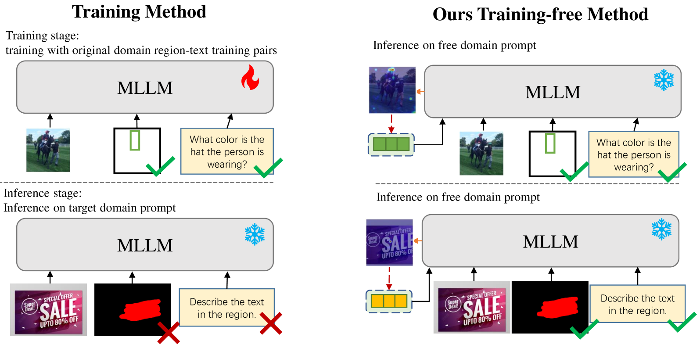

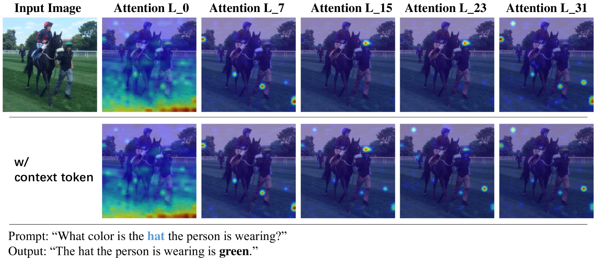

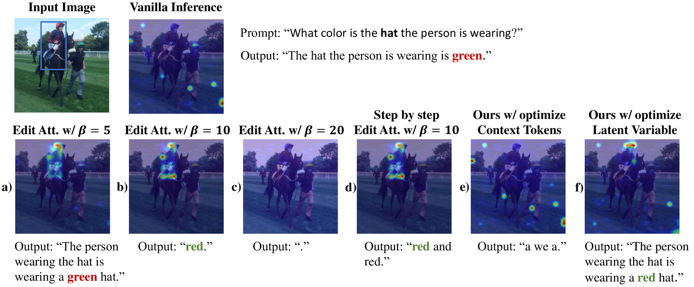

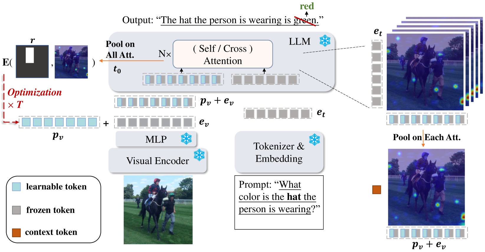

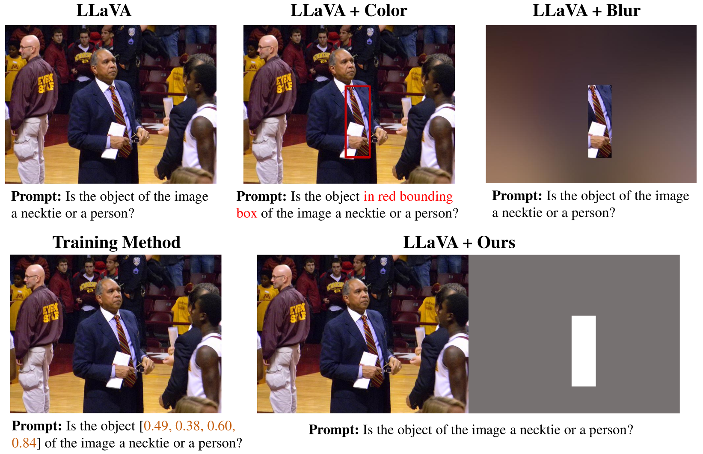

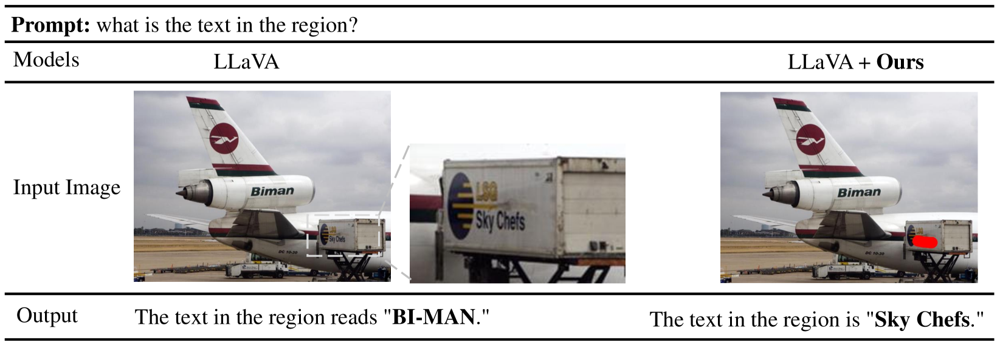

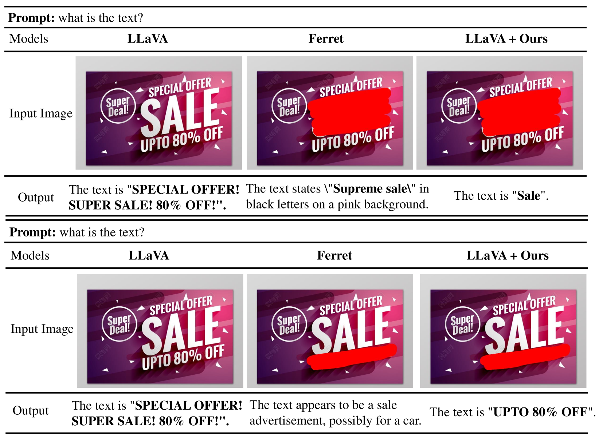

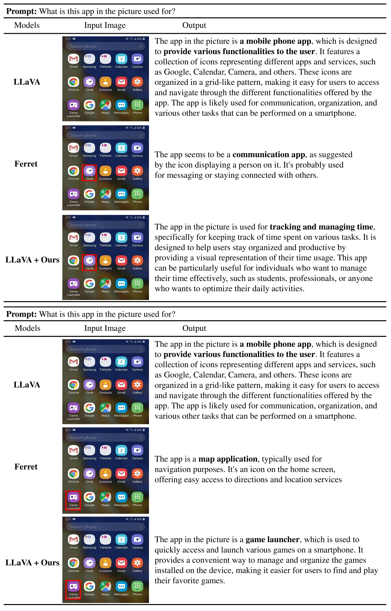

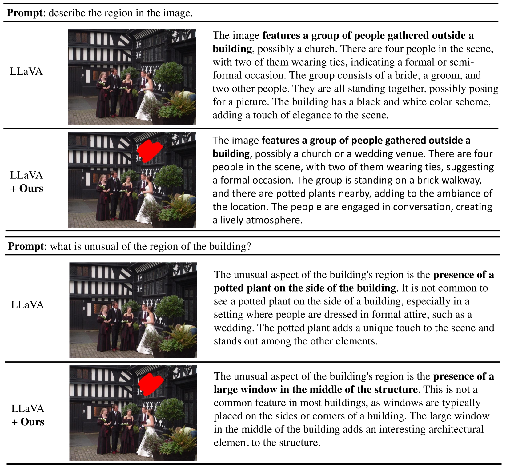

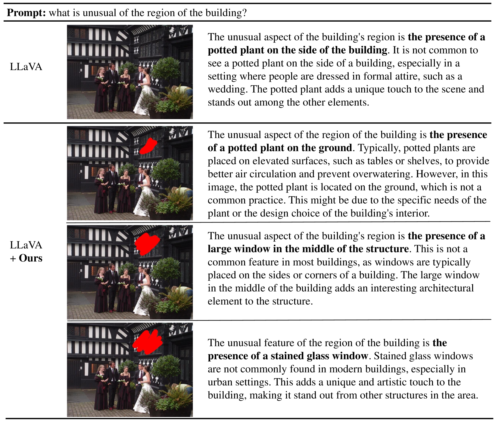

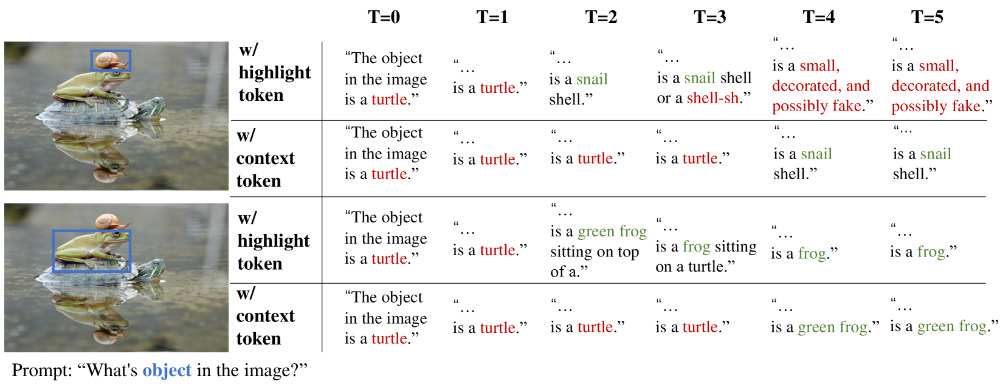

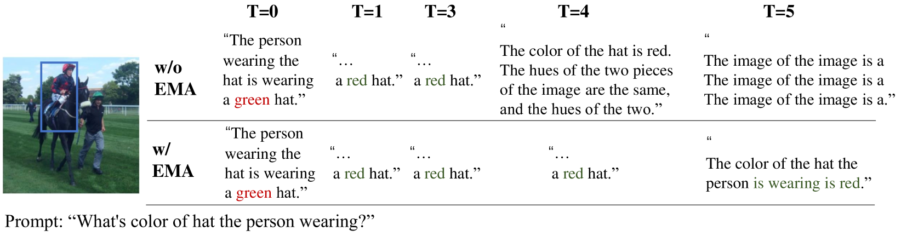

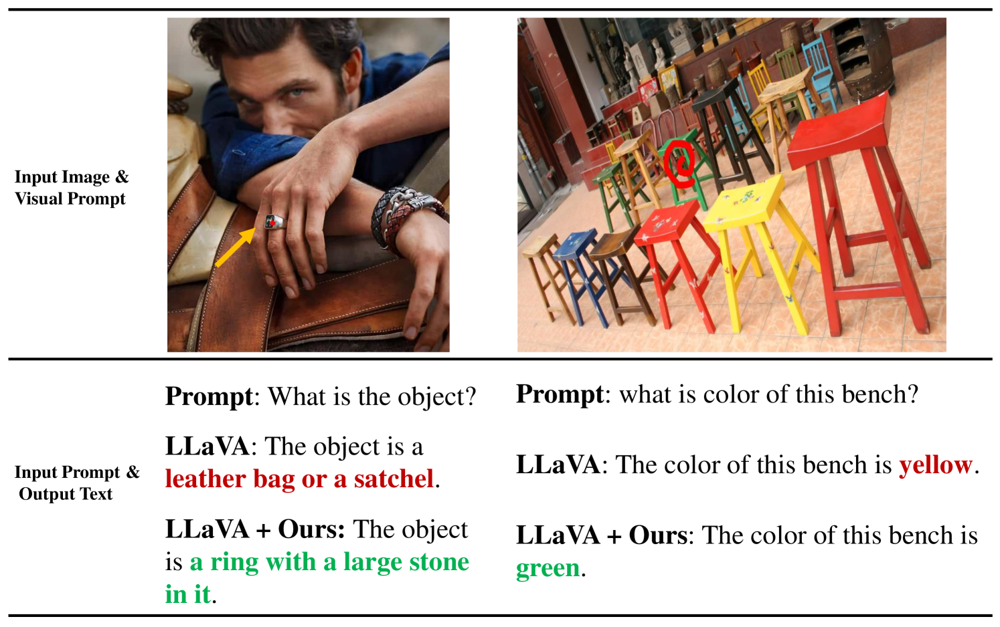

[Arxiv](https://arxiv.org/abs/2407.21534)