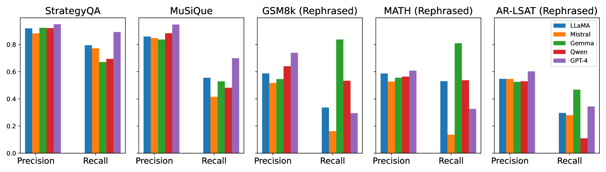
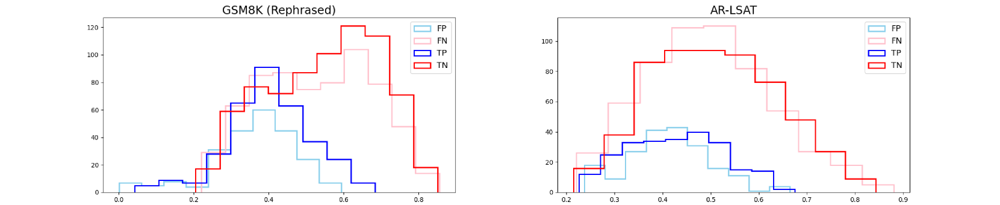
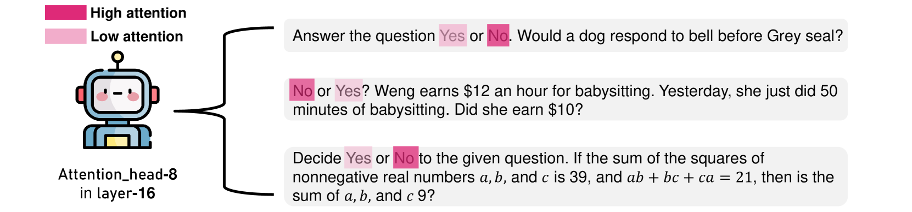
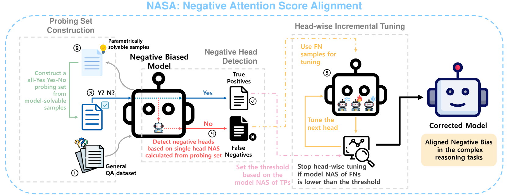
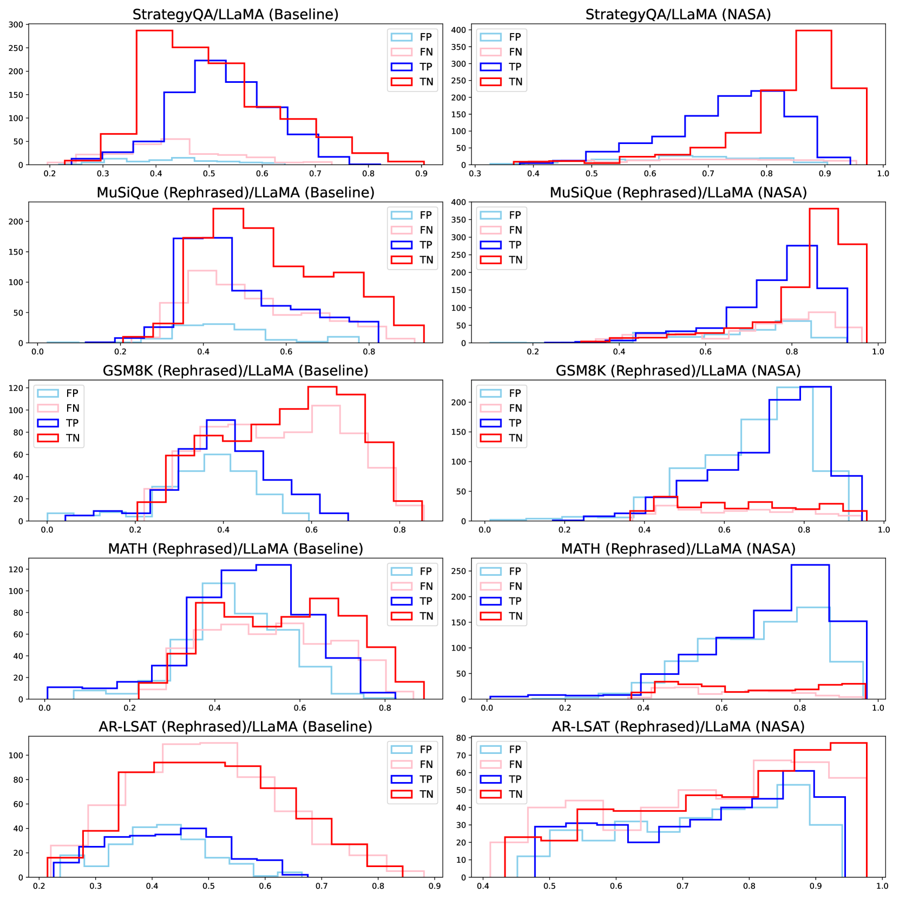
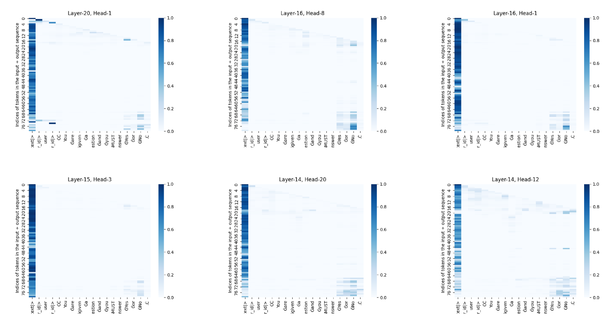
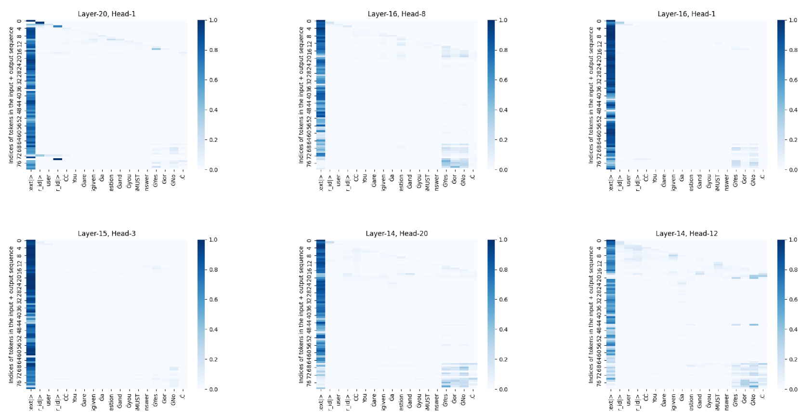

# 通过调整负注意力分数，我们旨在纠正大型语言模型中的负偏差。

发布时间：2024年07月31日

`LLM应用` `人工智能`

> Correcting Negative Bias in Large Language Models through Negative Attention Score Alignment

# 摘要

> 在二元决策任务中，如是非问题或答案验证，语言模型在复杂推理任务中显示出负面偏见。为此，我们提出了负面注意力分数（NAS）来量化这一偏见，并识别出在指令中提供负面标记的注意力头。为解决这一问题，我们开发了NASA方法，通过参数高效的微调技术，显著减少了精确度和召回率之间的差距，同时保持了模型的泛化能力。实验结果证实了NASA的有效性。代码已公开在\url{https://github.com/ysw1021/NASA}。

> A binary decision task, like yes-no questions or answer verification, reflects a significant real-world scenario such as where users look for confirmation about the correctness of their decisions on specific issues. In this work, we observe that language models exhibit a negative bias in the binary decisions of complex reasoning tasks. Based on our observations and the rationale about attention-based model dynamics, we propose a negative attention score (NAS) to systematically and quantitatively formulate negative bias. Based on NAS, we identify attention heads that attend to negative tokens provided in the instructions as answer candidate of binary decisions, regardless of the question in the prompt, and validate their association with the negative bias. Additionally, we propose the negative attention score alignment (NASA) method, which is a parameter-efficient fine-tuning technique to address the extracted negatively biased attention heads. Experimental results from various domains of reasoning tasks and large model search space demonstrate that NASA significantly reduces the gap between precision and recall caused by negative bias while preserving their generalization abilities. Our codes are available at \url{https://github.com/ysw1021/NASA}.

[Arxiv](https://arxiv.org/abs/2408.00137)