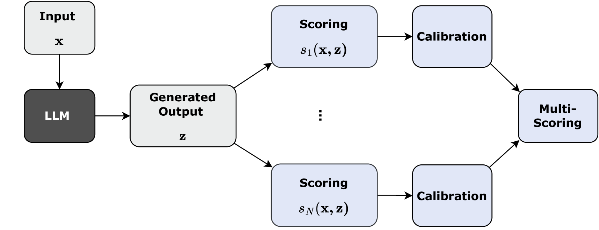
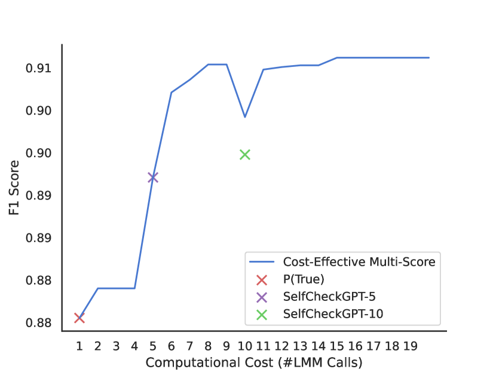
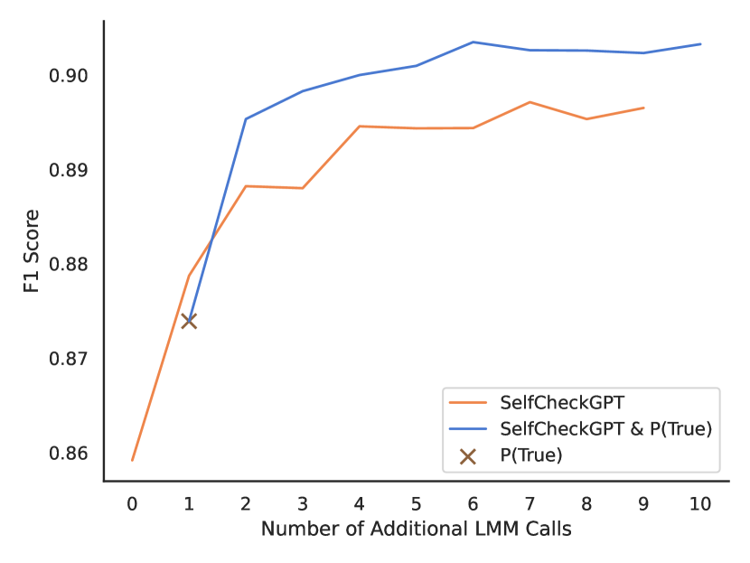
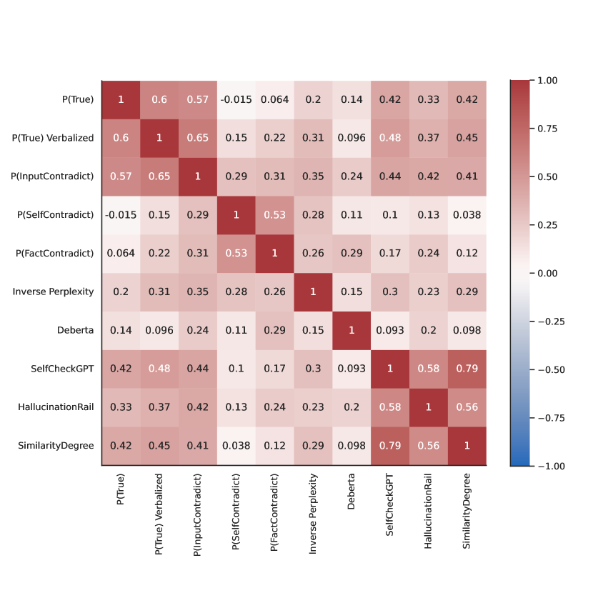

# 大型语言模型的成本效益幻觉检测

发布时间：2024年07月31日

`LLM应用` `人工智能` `数据分析`

> Cost-Effective Hallucination Detection for LLMs

# 摘要

> 大型语言模型（LLM）易产生幻觉，即生成与输入、外部事实或内部逻辑不符的不可靠输出。为此，我们针对生产环境中的事后幻觉检测提出了一系列解决方案。首先，我们设计了一个流程：先计算一个置信度分数，评估答案是否为幻觉；然后，根据输入和候选响应的特性校准该分数；最后，通过设定阈值进行检测。我们在问答、事实核查和摘要等多个任务的数据集上，采用多种最先进的评分方法进行测试，并使用多样化的LLM确保全面评估。我们发现，校准单个评分方法对风险敏感的下游决策至关重要。鉴于单一评分在所有场景中并非最佳，我们提出了一种多评分框架，整合不同评分方法，实现了跨数据集的卓越性能。此外，我们还引入了成本效益高的多评分方法，不仅性能媲美甚至超越更昂贵的检测方法，还大幅降低了计算负担。

> Large language models (LLMs) can be prone to hallucinations - generating unreliable outputs that are unfaithful to their inputs, external facts or internally inconsistent. In this work, we address several challenges for post-hoc hallucination detection in production settings. Our pipeline for hallucination detection entails: first, producing a confidence score representing the likelihood that a generated answer is a hallucination; second, calibrating the score conditional on attributes of the inputs and candidate response; finally, performing detection by thresholding the calibrated score. We benchmark a variety of state-of-the-art scoring methods on different datasets, encompassing question answering, fact checking, and summarization tasks. We employ diverse LLMs to ensure a comprehensive assessment of performance. We show that calibrating individual scoring methods is critical for ensuring risk-aware downstream decision making. Based on findings that no individual score performs best in all situations, we propose a multi-scoring framework, which combines different scores and achieves top performance across all datasets. We further introduce cost-effective multi-scoring, which can match or even outperform more expensive detection methods, while significantly reducing computational overhead.

[Arxiv](https://arxiv.org/abs/2407.21424)