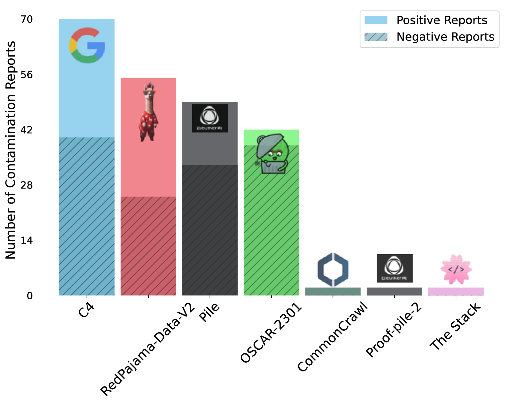
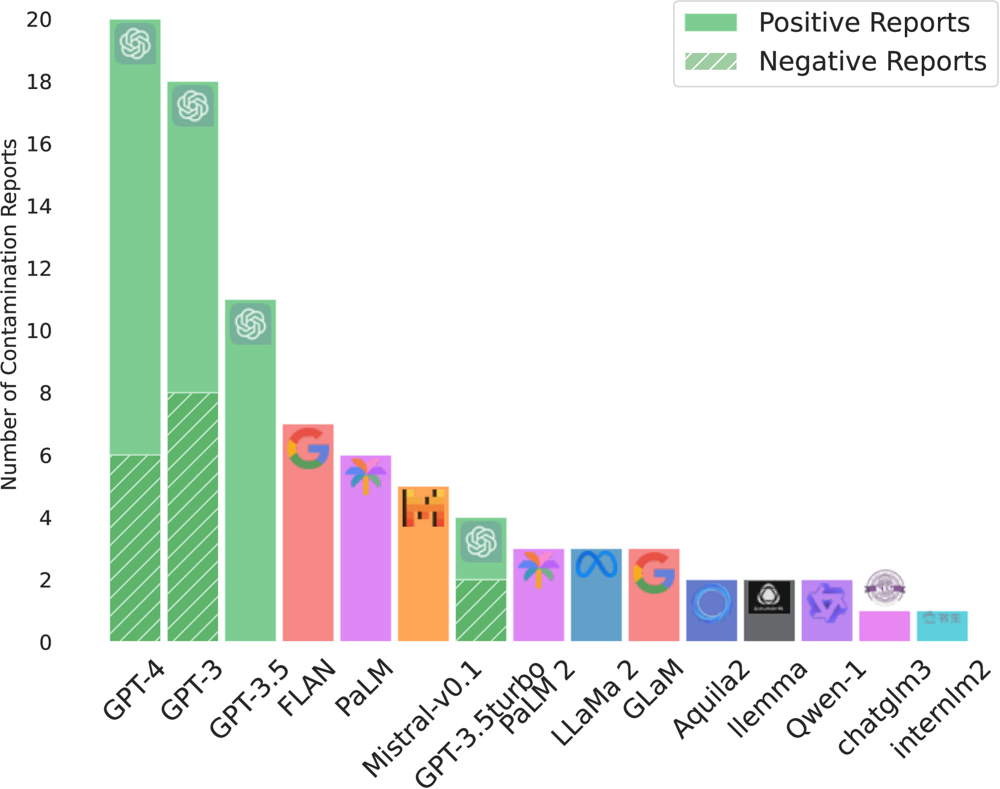
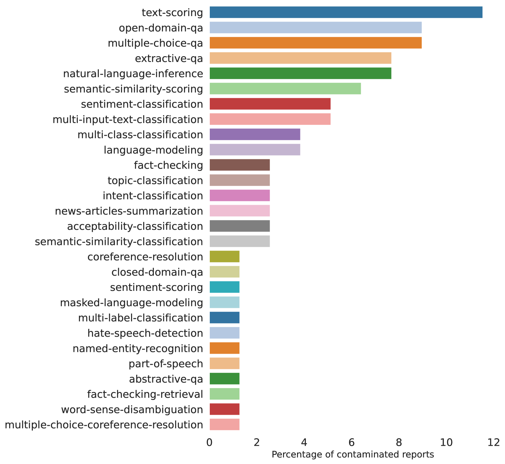
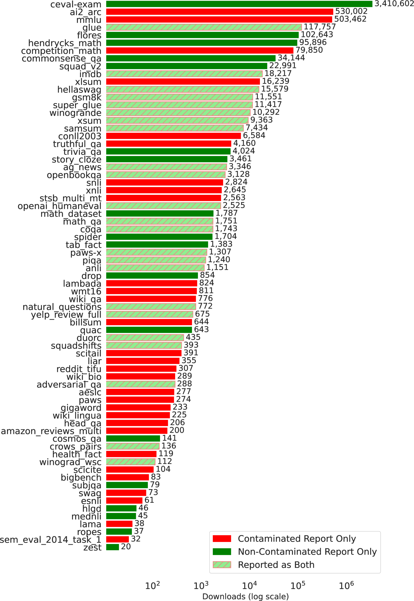
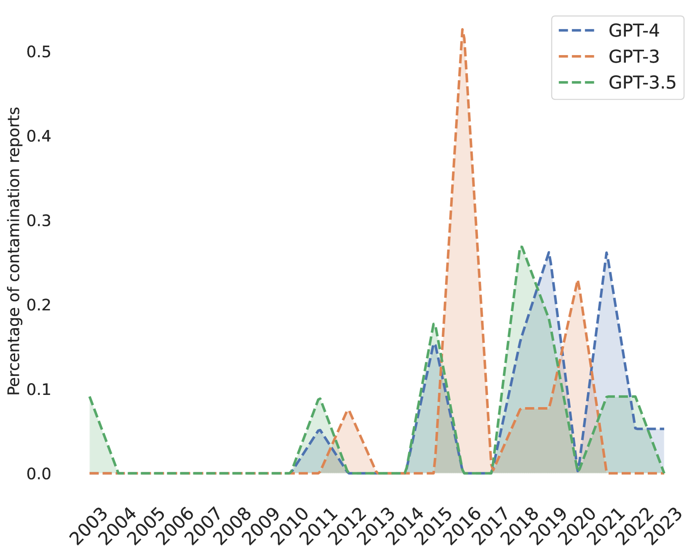
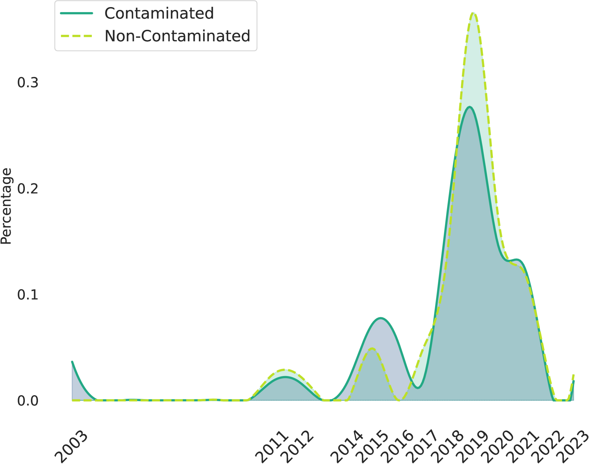

# 2024年CONDA共享任务数据污染报告

发布时间：2024年07月31日

`LLM应用` `数据管理`

> Data Contamination Report from the 2024 CONDA Shared Task

# 摘要

> 第一届数据污染研讨会 (CONDA 2024) 深入探讨了自然语言处理中的数据污染问题，即评估数据意外包含在预训练语料库中，影响模型评估的公正性。为此，研讨会发起了一项共享任务，旨在揭示当前数据集和模型中的污染情况。该任务及其数据库旨在提升社区对问题的认识，并指导研究者避开已知污染源。共享任务建立了一个开放的、集中的数据库，欢迎社区通过 GitHub 提交污染证据。首份报告汇总了 23 位贡献者的 91 个污染源，共 566 条记录。详细污染事件信息可在平台上查阅，该平台持续开放，鼓励社区参与。

> The 1st Workshop on Data Contamination (CONDA 2024) focuses on all relevant aspects of data contamination in natural language processing, where data contamination is understood as situations where evaluation data is included in pre-training corpora used to train large scale models, compromising evaluation results. The workshop fostered a shared task to collect evidence on data contamination in current available datasets and models. The goal of the shared task and associated database is to assist the community in understanding the extent of the problem and to assist researchers in avoiding reporting evaluation results on known contaminated resources. The shared task provides a structured, centralized public database for the collection of contamination evidence, open to contributions from the community via GitHub pool requests. This first compilation paper is based on 566 reported entries over 91 contaminated sources from a total of 23 contributors. The details of the individual contamination events are available in the platform. The platform continues to be online, open to contributions from the community.

[Arxiv](https://arxiv.org/abs/2407.21530)