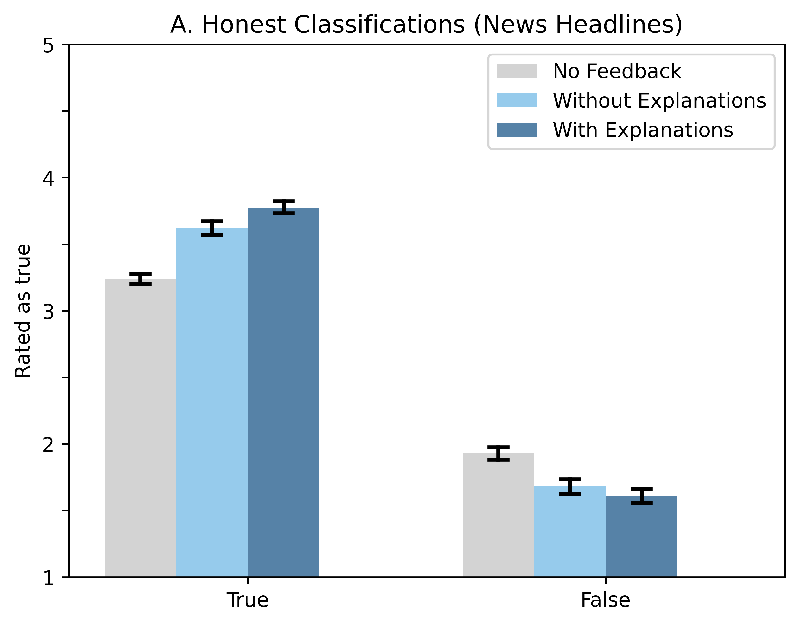

# 提供解释的欺骗性AI系统不仅比诚实的AI更具说服力，还能加剧人们对错误信息的信任。

发布时间：2024年07月31日

`LLM应用`

> Deceptive AI systems that give explanations are more convincing than honest AI systems and can amplify belief in misinformation

# 摘要

> 先进AI系统，尤其是大型语言模型，不仅能制造错误信息，还能编织欺骗性解释，这些解释既能合理化虚假信息，又能侵蚀对真相的信任。我们在一项大规模在线实验中发现，AI生成的欺骗性解释比真实解释更具说服力，能显著加深对假新闻的信任，同时削弱对真新闻的信任。个人认知能力和对AI的信任并不能完全抵御这些欺骗性解释的影响。关键在于，AI解释的逻辑有效性决定了其可信度，无效解释更易被识破。因此，培养逻辑推理和批判性思维能力，对于抵御AI诱导的错误信息至关重要。

> Advanced Artificial Intelligence (AI) systems, specifically large language models (LLMs), have the capability to generate not just misinformation, but also deceptive explanations that can justify and propagate false information and erode trust in the truth. We examined the impact of deceptive AI generated explanations on individuals' beliefs in a pre-registered online experiment with 23,840 observations from 1,192 participants. We found that in addition to being more persuasive than accurate and honest explanations, AI-generated deceptive explanations can significantly amplify belief in false news headlines and undermine true ones as compared to AI systems that simply classify the headline incorrectly as being true/false. Moreover, our results show that personal factors such as cognitive reflection and trust in AI do not necessarily protect individuals from these effects caused by deceptive AI generated explanations. Instead, our results show that the logical validity of AI generated deceptive explanations, that is whether the explanation has a causal effect on the truthfulness of the AI's classification, plays a critical role in countering their persuasiveness - with logically invalid explanations being deemed less credible. This underscores the importance of teaching logical reasoning and critical thinking skills to identify logically invalid arguments, fostering greater resilience against advanced AI-driven misinformation.

[Arxiv](https://arxiv.org/abs/2408.00024)