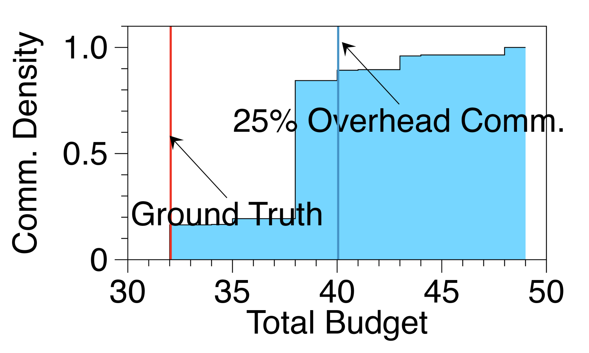

# 非独立同分布环境下客户端间的分布式上下文学习

发布时间：2024年07月31日

`LLM应用` `人工智能` `数据分析`

> Distributed In-Context Learning under Non-IID Among Clients

# 摘要

> 大型语言模型 (LLM) 在复杂自然语言推理任务中的表现卓越，但如何高效适应新任务仍是一大挑战。In-context learning (ICL) 通过检索相关数据点（ICE）提供了一种少样本适应的解决方案。然而，现实中的数据集常分散在多个客户端，且远程检索成本高昂。特别是当数据非独立同分布 (non-IID) 时，从各客户端获取合适的 ICE 变得尤为困难。本文首先指出，由于 non-IID 特性，测试查询在不同客户端间存在偏好差异，等量贡献往往导致性能不佳。为此，我们提出了一种新方法，根据每个查询的偏好为各客户端定制数据使用预算，以数据驱动的方式优化分配。实证研究表明，我们的框架在多样化数据集上表现优异，超越了现有基线。

> Advancements in large language models (LLMs) have shown their effectiveness in multiple complicated natural language reasoning tasks. A key challenge remains in adapting these models efficiently to new or unfamiliar tasks. In-context learning (ICL) provides a promising solution for few-shot adaptation by retrieving a set of data points relevant to a query, called in-context examples (ICE), from a training dataset and providing them during the inference as context. Most existing studies utilize a centralized training dataset, yet many real-world datasets may be distributed among multiple clients, and remote data retrieval can be associated with costs. Especially when the client data are non-identical independent distributions (non-IID), retrieving from clients a proper set of ICEs needed for a test query presents critical challenges. In this paper, we first show that in this challenging setting, test queries will have different preferences among clients because of non-IIDness, and equal contribution often leads to suboptimal performance. We then introduce a novel approach to tackle the distributed non-IID ICL problem when a data usage budget is present. The principle is that each client's proper contribution (budget) should be designed according to the preference of each query for that client. Our approach uses a data-driven manner to allocate a budget for each client, tailored to each test query. Through extensive empirical studies on diverse datasets, our framework demonstrates superior performance relative to competing baselines.

[Arxiv](https://arxiv.org/abs/2408.00144)