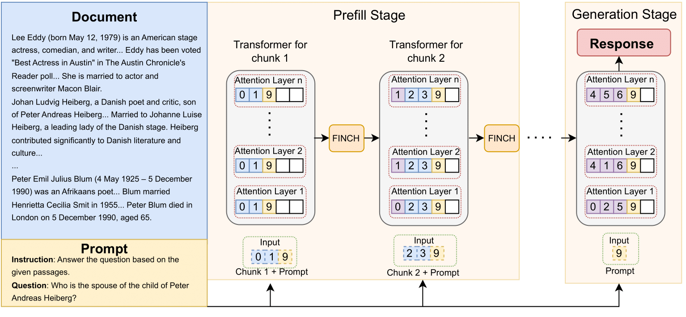
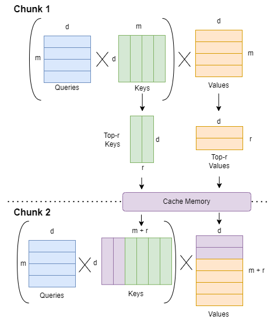
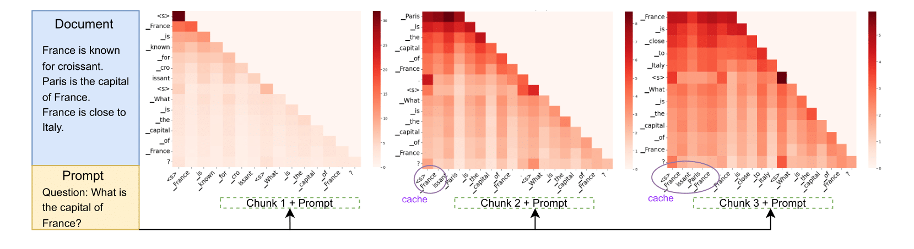
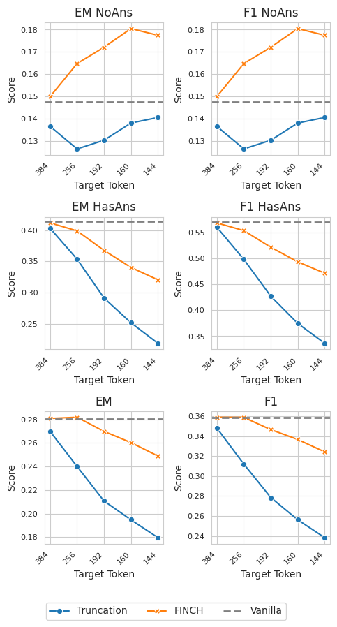
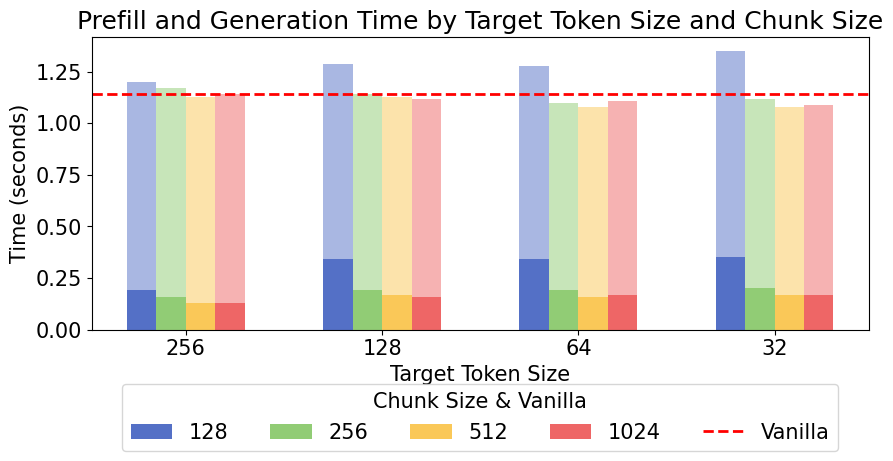
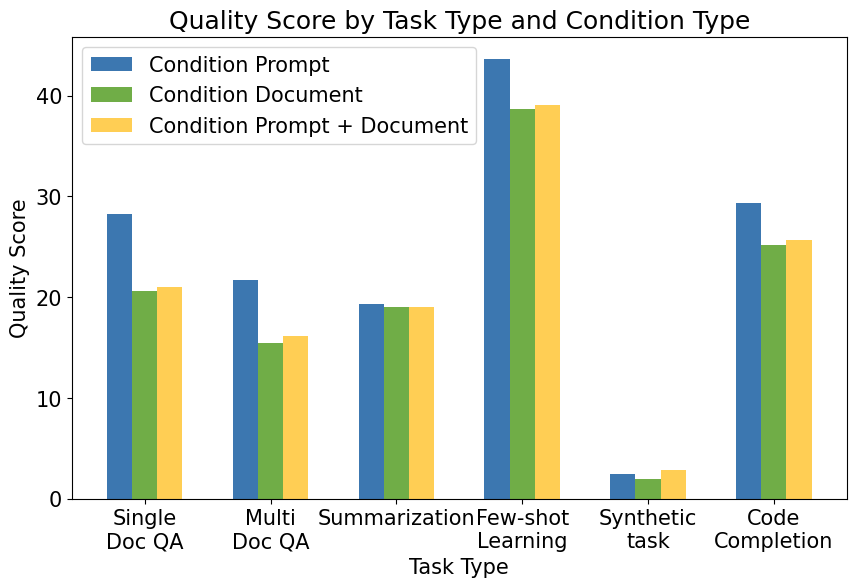
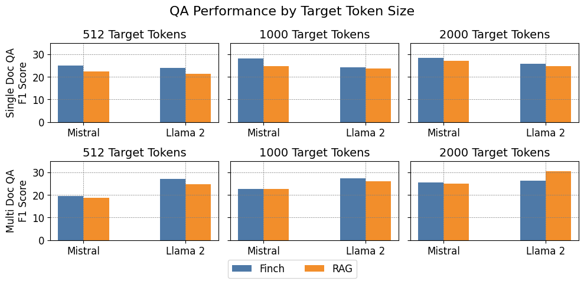
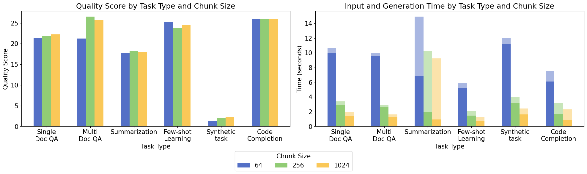

# Finch：基于提示的键值缓存压缩技术

发布时间：2024年07月31日

`RAG` `金融科技` `人工智能`

> Finch: Prompt-guided Key-Value Cache Compression

# 摘要

> 随着检索增强生成和聊天机器人等大型语言模型应用的兴起，处理更长输入上下文的需求日益增长。然而，这一需求受到模型架构和GPU内存需求的限制。为此，我们创新性地提出了Finch方法，通过利用自注意力机制的预训练权重，高效压缩输入上下文。Finch针对给定提示和长文本，迭代筛选出最相关的键值对，并将其精简存储于KV缓存中，从而在有限的上下文窗口内实现长文本的高效压缩。这一创新方法不仅支持模型在高压缩比（最高达93倍）下处理大型输入，还能保持语义的完整性，且无需进行繁琐的微调。

> Recent large language model applications, such as Retrieval-Augmented Generation and chatbots, have led to an increased need to process longer input contexts. However, this requirement is hampered by inherent limitations. Architecturally, models are constrained by a context window defined during training. Additionally, processing extensive texts requires substantial GPU memory. We propose a novel approach, Finch, to compress the input context by leveraging the pre-trained model weights of the self-attention. Given a prompt and a long text, Finch iteratively identifies the most relevant Key (K) and Value (V) pairs over chunks of the text conditioned on the prompt. Only such pairs are stored in the KV cache, which, within the space constrained by the context window, ultimately contains a compressed version of the long text. Our proposal enables models to consume large inputs even with high compression (up to 93x) while preserving semantic integrity without the need for fine-tuning.

[Arxiv](https://arxiv.org/abs/2408.00167)