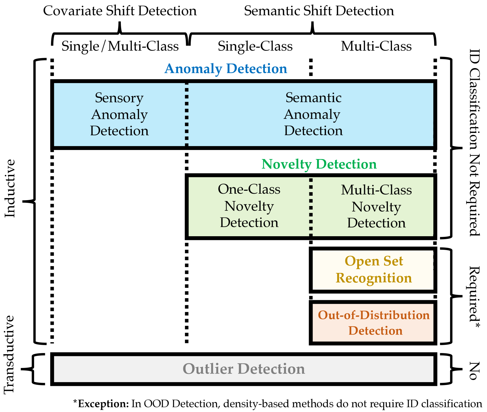

# 在视觉语言模型时代，广义分布外检测及其超越：全面调查

发布时间：2024年07月31日

`LLM应用` `机器学习` `计算机视觉`

> Generalized Out-of-Distribution Detection and Beyond in Vision Language Model Era: A Survey

# 摘要

> 确保机器学习系统的安全，关键在于检测分布外样本，这一需求推动了OOD检测领域的发展。与此同时，异常检测、新颖性检测、开放集识别及离群点检测等，均与OOD检测紧密相连。为整合这些领域，我们提出了一个广义的OOD检测框架，对相关问题进行了系统分类。然而，随着CLIP等视觉语言模型的兴起，传统界限变得模糊，研究者们再次陷入困惑。本次调查中，我们更新了广义OOD检测框架，展现了VLM时代下各领域的演变与融合，指出当前的挑战主要集中在OOD检测与异常检测上。此外，我们还关注到定义、问题设定及基准的重大变化，并全面梳理了OOD检测方法，探讨了其与相关任务的关联。最后，我们展望了如GPT-4V等大规模视觉语言模型时代的新进展，并指出了未来的研究方向与挑战。

> Detecting out-of-distribution (OOD) samples is crucial for ensuring the safety of machine learning systems and has shaped the field of OOD detection. Meanwhile, several other problems are closely related to OOD detection, including anomaly detection (AD), novelty detection (ND), open set recognition (OSR), and outlier detection (OD). To unify these problems, a generalized OOD detection framework was proposed, taxonomically categorizing these five problems. However, Vision Language Models (VLMs) such as CLIP have significantly changed the paradigm and blurred the boundaries between these fields, again confusing researchers. In this survey, we first present a generalized OOD detection v2, encapsulating the evolution of AD, ND, OSR, OOD detection, and OD in the VLM era. Our framework reveals that, with some field inactivity and integration, the demanding challenges have become OOD detection and AD. In addition, we also highlight the significant shift in the definition, problem settings, and benchmarks; we thus feature a comprehensive review of the methodology for OOD detection, including the discussion over other related tasks to clarify their relationship to OOD detection. Finally, we explore the advancements in the emerging Large Vision Language Model (LVLM) era, such as GPT-4V. We conclude this survey with open challenges and future directions.

[Arxiv](https://arxiv.org/abs/2407.21794)