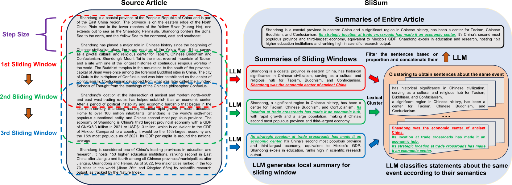
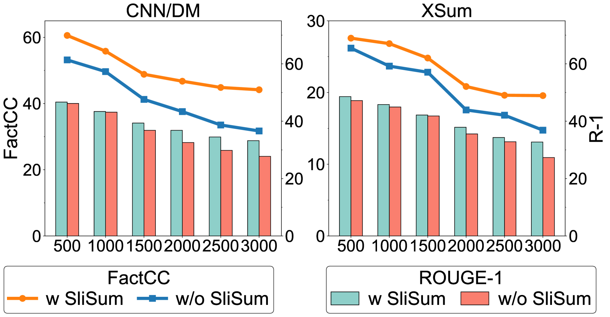
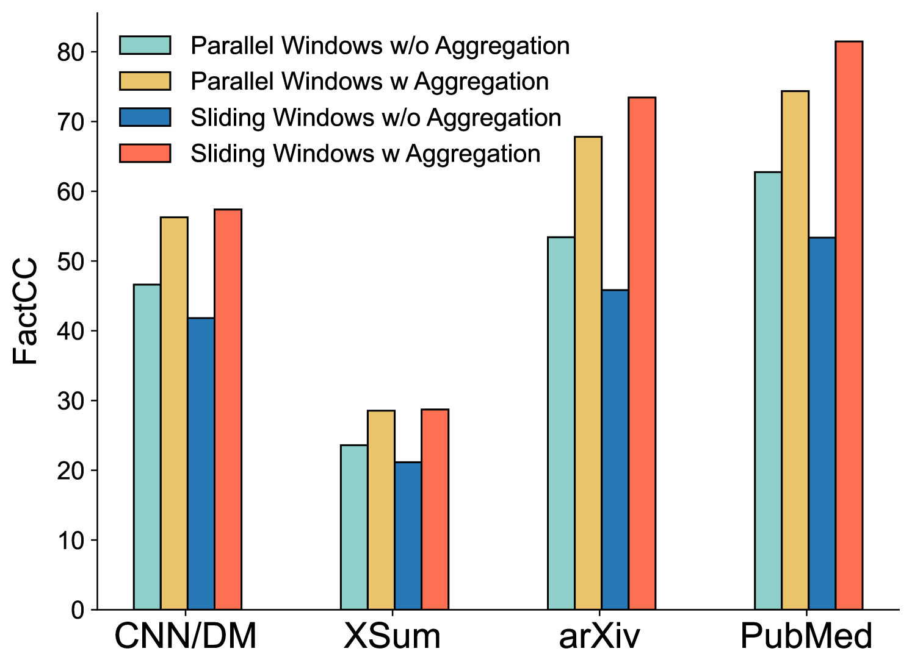
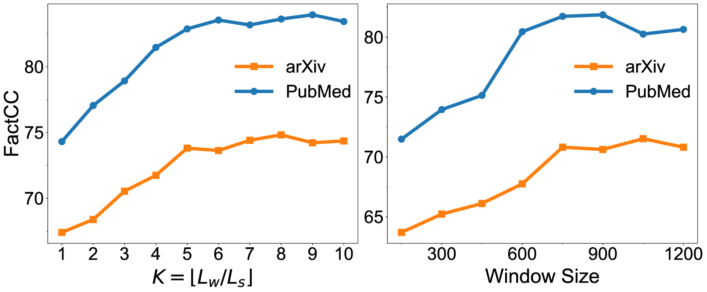

# 利用滑动生成与自一致性技术，提升大型语言模型在摘要任务中的忠实表现。

发布时间：2024年07月31日

`LLM应用` `文本摘要` `人工智能`

> Improving Faithfulness of Large Language Models in Summarization via Sliding Generation and Self-Consistency

# 摘要

> 尽管 LLMs 在多项任务中表现出色，但仍面临事实不一致的“幻觉”问题。例如，在长文档摘要中，LLMs 有时会偏离原文，更偏爱提取首尾信息。为此，我们提出 SliSum 策略，通过滑动窗口和自一致性原则，促使 LLMs 更公正地处理全文，生成局部摘要后，利用聚类和多数投票算法整合，产出更忠实的全文摘要。实验证明，SliSum 有效提升 LLaMA-2、Claude-2 和 GPT-3.5 等模型在长短文本摘要中的忠实度，同时保持流畅与信息量，无需额外微调或资源。此外，我们还通过定性和定量研究，深入分析了 SliSum 的有效性及其超参数的影响。

> Despite large language models (LLMs) have demonstrated impressive performance in various tasks, they are still suffering from the factual inconsistency problem called hallucinations. For instance, LLMs occasionally generate content that diverges from source article, and prefer to extract information that appears at the beginning and end of the context, especially in long document summarization. Inspired by these findings, we propose to improve the faithfulness of LLMs in summarization by impelling them to process the entire article more fairly and faithfully. We present a novel summary generation strategy, namely SliSum, which exploits the ideas of sliding windows and self-consistency. Specifically, SliSum divides the source article into overlapping windows, and utilizes LLM to generate local summaries for the content in the windows. Finally, SliSum aggregates all local summaries using clustering and majority voting algorithm to produce more faithful summary of entire article. Extensive experiments demonstrate that SliSum significantly improves the faithfulness of diverse LLMs including LLaMA-2, Claude-2 and GPT-3.5 in both short and long text summarization, while maintaining their fluency and informativeness and without additional fine-tuning and resources. We further conduct qualitative and quantitative studies to investigate why SliSum works and impacts of hyperparameters in SliSum on performance.

[Arxiv](https://arxiv.org/abs/2407.21443)