# 针对类似图像的量子物质数据，我们提出了一个可解释的相关器Transformer模型。

发布时间：2024年07月31日

`LLM应用` `物理学` `机器学习`

> Interpretable correlator Transformer for image-like quantum matter data

# 摘要

> Transformer神经网络因其捕捉非局部依赖的能力，已成为大型语言模型和图像处理的核心架构。此外，机器学习方法在分析量子物质相的图像类数据方面也展现出广泛应用，如通过超冷原子实验获取的许多体波函数快照。尽管检测物理系统图像中的局部相关结构已相当可靠，但识别由全局、非局部结构定义的物质相仍具挑战。为此，我们引入了相关器Transformer（CoTra），它不仅能分类物质相，还能通过物理相关函数提供完全可解释性。CoTra的核心是一种定制的注意力机制，能有效衡量局部与非局部相关性以实现精确分类。我们展示了CoTra在检测海森堡反铁磁体局部有序性及识别一维和二维晶格规范理论中的局部规范约束方面的能力。同时，CoTra还能可靠区分动量空间中相关费米子图像的非局部结构（库珀对），并区分渗透与非渗透图像。

> Due to their inherent capabilities of capturing non-local dependencies, Transformer neural networks have quickly been established as the paradigmatic architecture for large language models and image processing. Next to these traditional applications, machine learning methods have also been demonstrated to be versatile tools in the analysis of image-like data of quantum phases of matter, e.g. given snapshots of many-body wave functions obtained in ultracold atom experiments. While local correlation structures in image-like data of physical systems can reliably be detected, identifying phases of matter characterized by global, non-local structures with interpretable machine learning methods remains a challenge. Here, we introduce the correlator Transformer (CoTra), which classifies different phases of matter while at the same time yielding full interpretability in terms of physical correlation functions. The network's underlying structure is a tailored attention mechanism, which learns efficient ways to weigh local and non-local correlations for a successful classification. We demonstrate the versatility of the CoTra by detecting local order in the Heisenberg antiferromagnet, and show that local gauge constraints in one- and two-dimensional lattice gauge theories can be identified. Furthermore, we establish that the CoTra reliably detects non-local structures in images of correlated fermions in momentum space (Cooper pairs) and that it can distinguish percolating from non-percolating images.

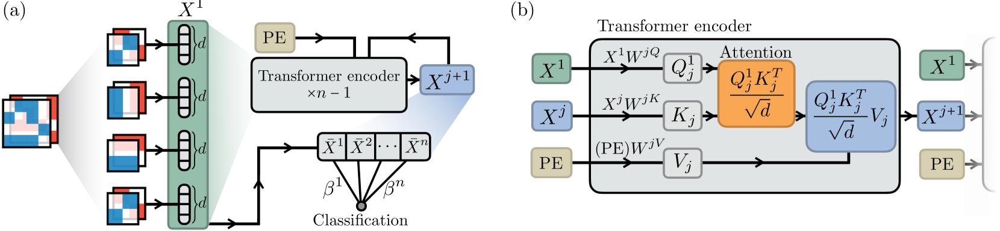

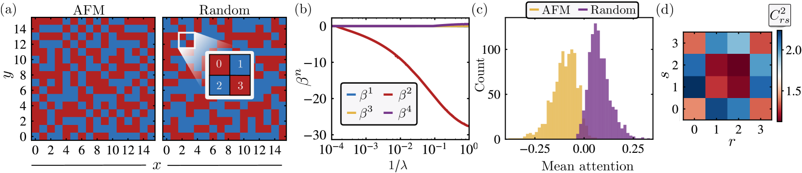

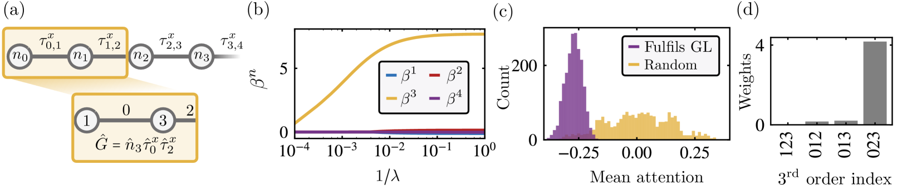

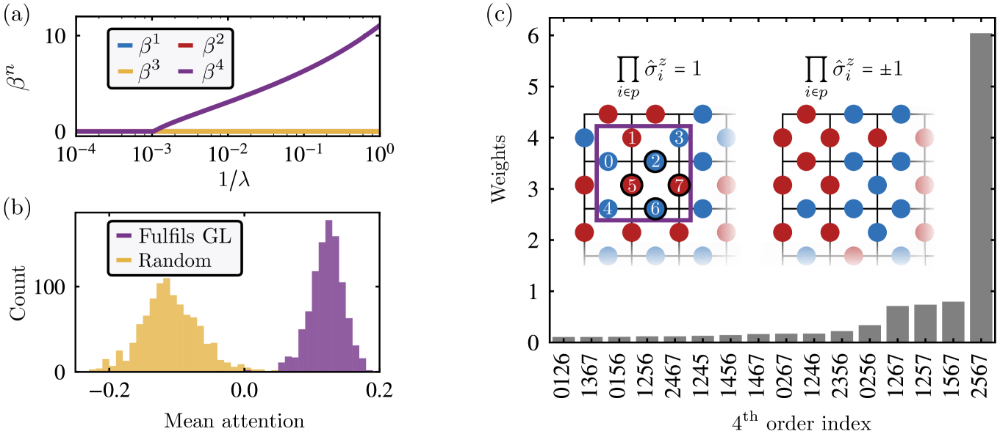

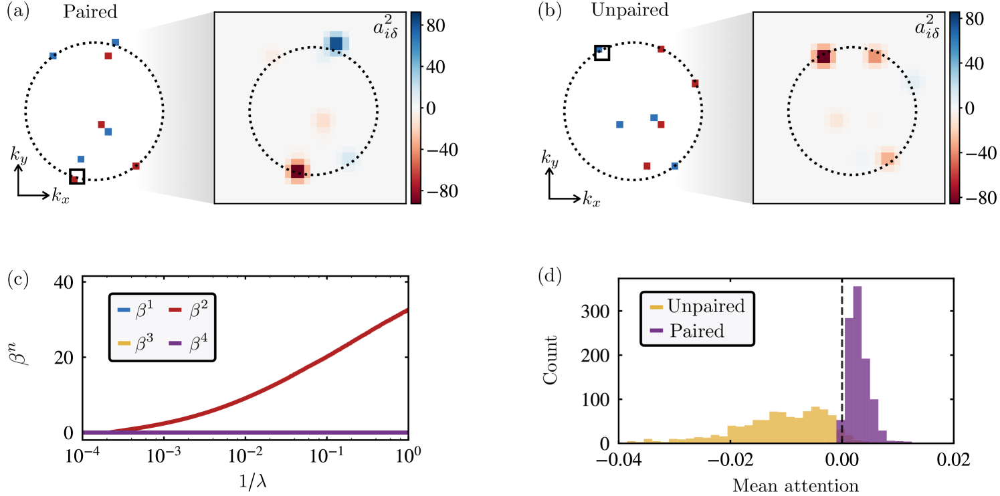

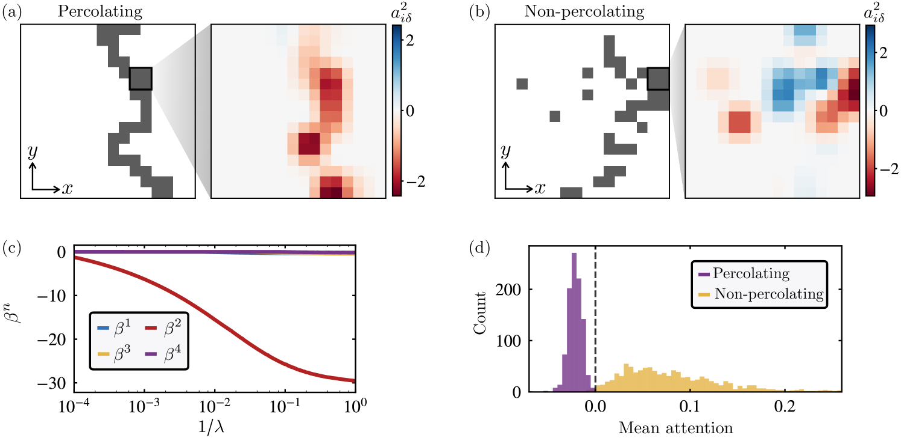

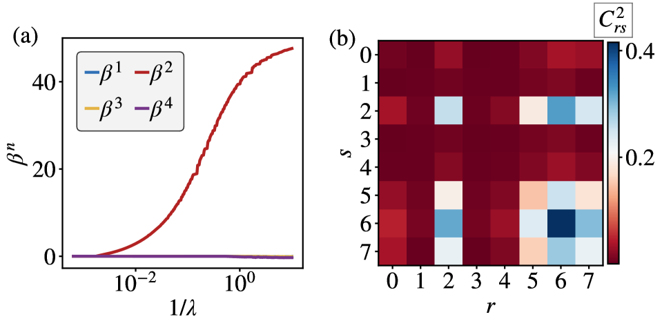

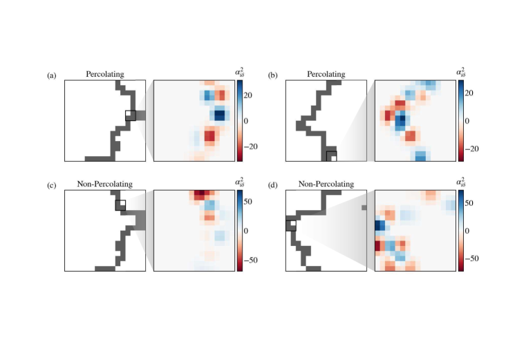

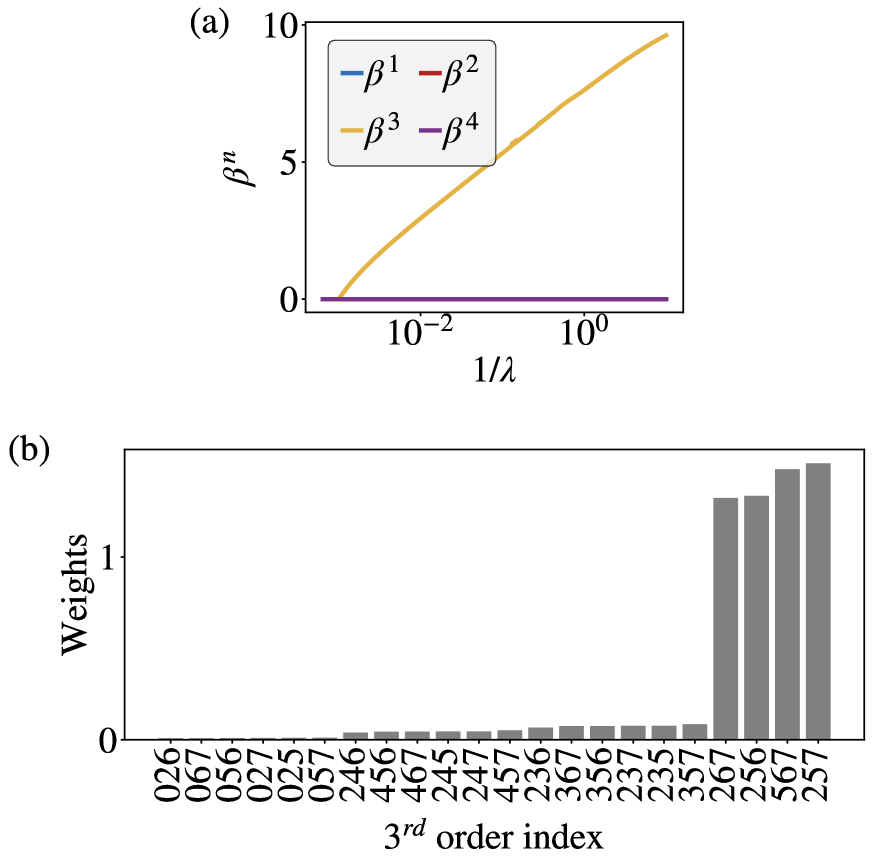

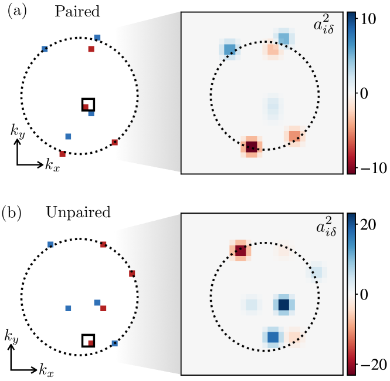

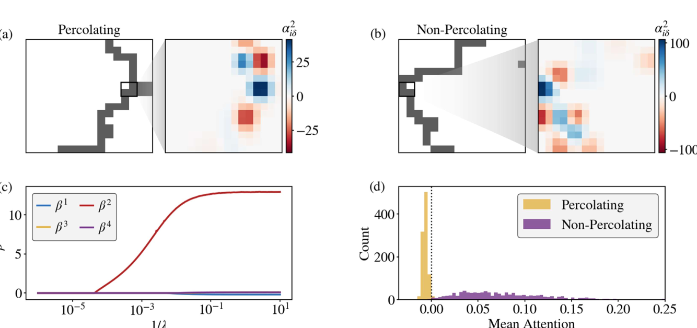

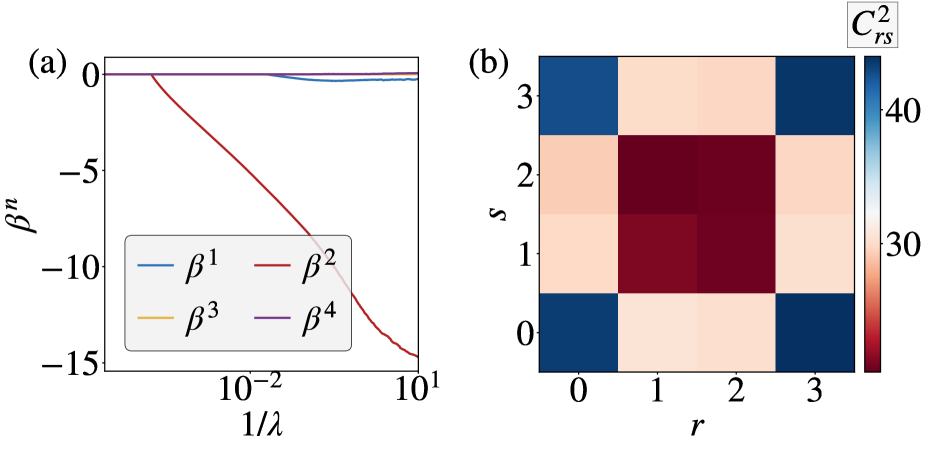

[Arxiv](https://arxiv.org/abs/2407.21502)