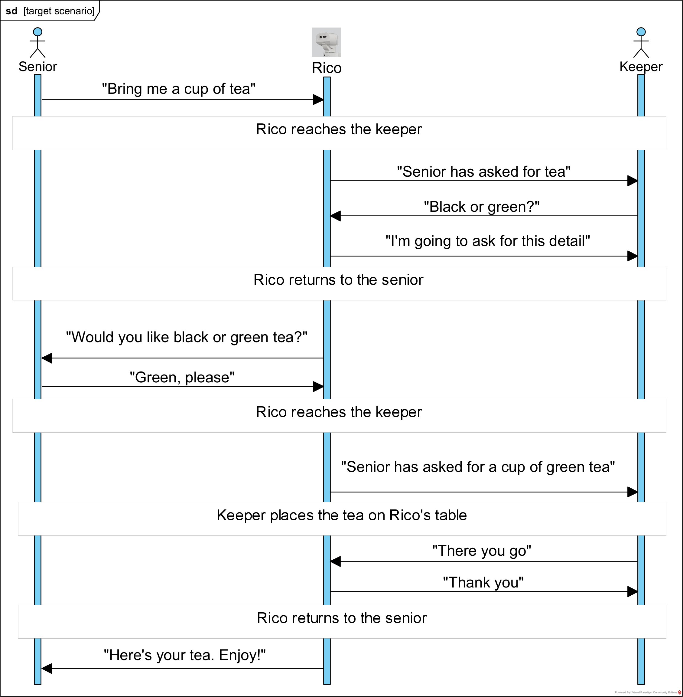
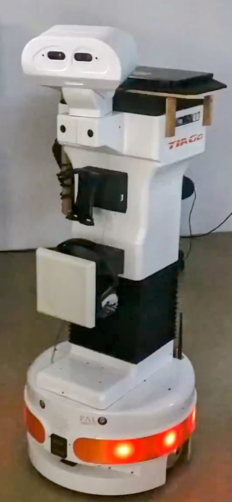
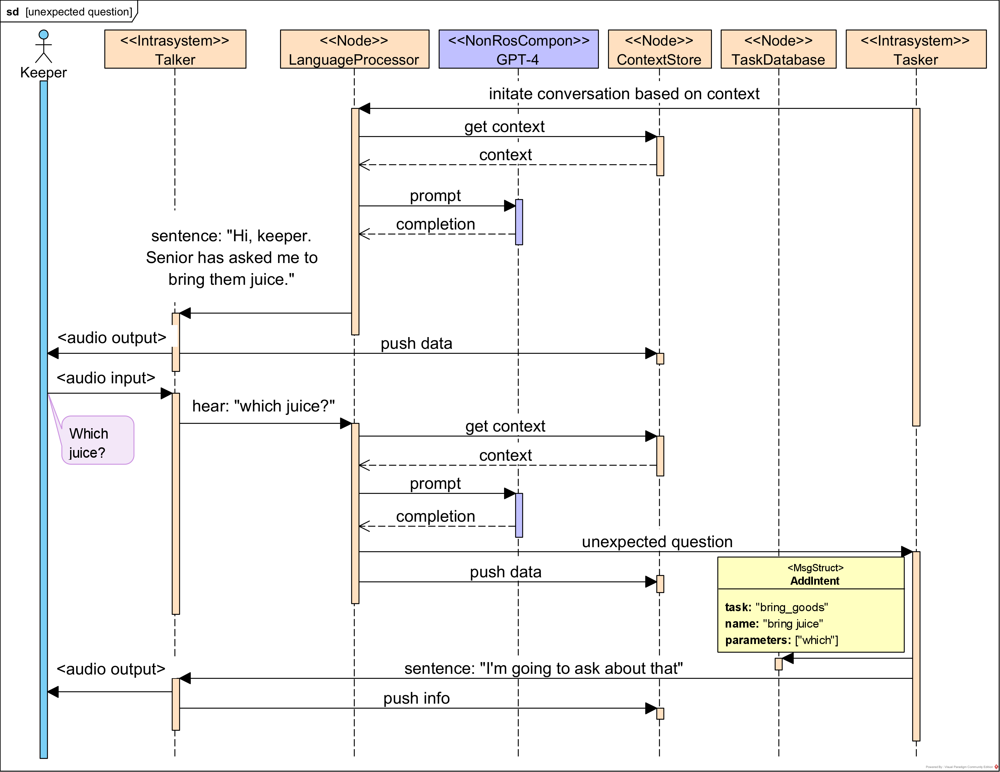

# 利用大型语言模型，我们致力于理解和学习机器人系统的语音指令。

发布时间：2024年07月31日

`LLM应用` `机器人技术` `养老服务`

> Interpreting and learning voice commands with a Large Language Model for a robot system

# 摘要

> 随着机器人在工业和日常生活中的普及，如养老院中的辅助工作，开发直观界面成为关键挑战。借助 GPT-4 等大型语言模型 (LLM)，机器人实现了实时交互与决策，提升了其适应性与功能。本项目致力于将 LLM 与数据库融合，以优化决策过程，并增强机器人对请求的理解能力。

> Robots are increasingly common in industry and daily life, such as in nursing homes where they can assist staff. A key challenge is developing intuitive interfaces for easy communication. The use of Large Language Models (LLMs) like GPT-4 has enhanced robot capabilities, allowing for real-time interaction and decision-making. This integration improves robots' adaptability and functionality. This project focuses on merging LLMs with databases to improve decision-making and enable knowledge acquisition for request interpretation problems.

[Arxiv](https://arxiv.org/abs/2407.21512)