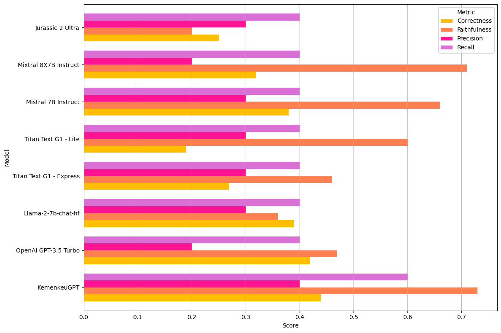

# KemenkeuGPT：借助大型语言模型，优化印度尼西亚政府财务数据与法规，提升决策质量

发布时间：2024年07月31日

`RAG`

> KemenkeuGPT: Leveraging a Large Language Model on Indonesia's Government Financial Data and Regulations to Enhance Decision Making

# 摘要

> 数据是推动基于证据的决策和提升公共服务的关键，特别是在印度尼西亚财政部。然而，政府财务数据和法规的复杂多变，常使决策过程受阻。本研究利用大型语言模型（LLM）探索解决这些难题，特别聚焦于印度尼西亚的财务数据和法规。尽管LLM在金融领域表现出色，但在印度尼西亚公共部门的应用尚属空白。我们通过迭代开发过程，结合LangChain、检索增强生成（RAG）、提示工程和微调技术，成功研发了KemenkeuGPT。数据集涵盖2003至2023年，来源于财政部、印度尼西亚统计局及国际货币基金组织。通过与部委官员的深入交流，我们不断优化和微调模型。评估结果显示，模型准确性从35%跃升至61%，正确性也从48%提升至64%。RAGAS框架评估表明，KemenkeuGPT在多个维度上超越了其他基础模型。与财政部专家的对话进一步证实，KemenkeuGPT有望成为决策支持的重要工具。随着持续的人类反馈，我们期待这些成果能持续精进。

> Data is crucial for evidence-based policymaking and enhancing public services, including those at the Ministry of Finance of the Republic of Indonesia. However, the complexity and dynamic nature of governmental financial data and regulations can hinder decision-making. This study investigates the potential of Large Language Models (LLMs) to address these challenges, focusing on Indonesia's financial data and regulations. While LLMs are effective in the financial sector, their use in the public sector in Indonesia is unexplored. This study undertakes an iterative process to develop KemenkeuGPT using the LangChain with Retrieval-Augmented Generation (RAG), prompt engineering and fine-tuning. The dataset from 2003 to 2023 was collected from the Ministry of Finance, Statistics Indonesia and the International Monetary Fund (IMF). Surveys and interviews with Ministry officials informed, enhanced and fine-tuned the model. We evaluated the model using human feedback, LLM-based evaluation and benchmarking. The model's accuracy improved from 35% to 61%, with correctness increasing from 48% to 64%. The Retrieval-Augmented Generation Assessment (RAGAS) framework showed that KemenkeuGPT achieved 44% correctness with 73% faithfulness, 40% precision and 60% recall, outperforming several other base models. An interview with an expert from the Ministry of Finance indicated that KemenkeuGPT has the potential to become an essential tool for decision-making. These results are expected to improve with continuous human feedback.

[Arxiv](https://arxiv.org/abs/2407.21459)