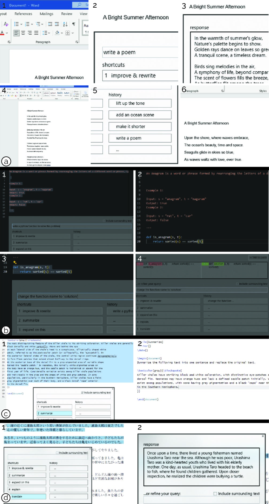

# LLM-for-X：大型语言模型的应用无关集成，助力个人写作流程

发布时间：2024年07月31日

`LLM应用` `软件开发` `办公自动化`

> LLM-for-X: Application-agnostic Integration of Large Language Models to Support Personal Writing Workflows

# 摘要

> 为了提升效率和简化操作流程，越来越多的应用开始集成大型语言模型（LLM）功能，涵盖从网页浏览器到个人电脑上的原生应用。我们推出的LLM-for-X系统，通过一个轻巧的弹窗对话框，为各类应用无缝接入LLM服务，实现快捷操作。该系统能将前端应用与ChatGPT、Gemini等热门LLM后端无缝对接，利用统一的聊天界面或定制API进行交互。我们在Microsoft Office、VSCode、Adobe Acrobat及Overleaf等众多应用中验证了LLM-for-X的实用价值。评估结果显示，相较于ChatGPT的网页界面，LLM-for-X能在不切换应用的情况下，为用户提供迅捷、高效且易用的LLM支持，助力各类写作与阅读任务。

> To enhance productivity and to streamline workflows, there is a growing trend to embed large language model (LLM) functionality into applications, from browser-based web apps to native apps that run on personal computers. Here, we introduce LLM-for-X, a system-wide shortcut layer that seamlessly augments any application with LLM services through a lightweight popup dialog. Our native layer seamlessly connects front-end applications to popular LLM backends, such as ChatGPT and Gemini, using their uniform chat front-ends as the programming interface or their custom API calls. We demonstrate the benefits of LLM-for-X across a wide variety of applications, including Microsoft Office, VSCode, and Adobe Acrobat as well as popular web apps such as Overleaf. In our evaluation, we compared LLM-for-X with ChatGPT's web interface in a series of tasks, showing that our approach can provide users with quick, efficient, and easy-to-use LLM assistance without context switching to support writing and reading tasks that is agnostic of the specific application.

[Arxiv](https://arxiv.org/abs/2407.21593)