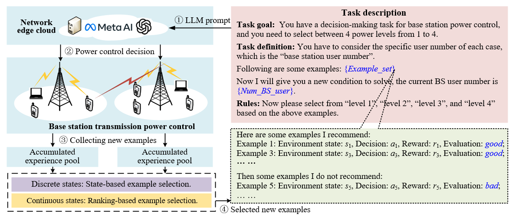
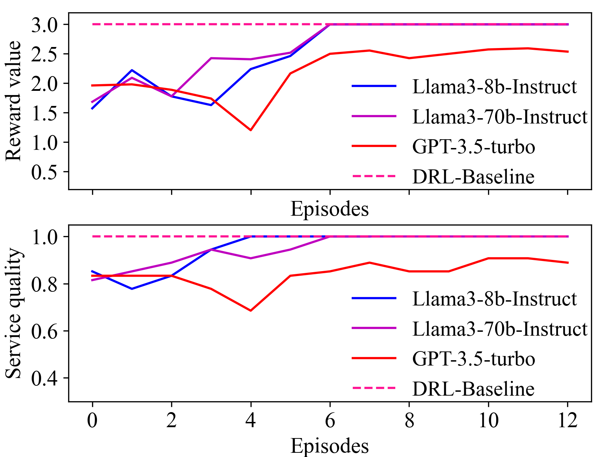
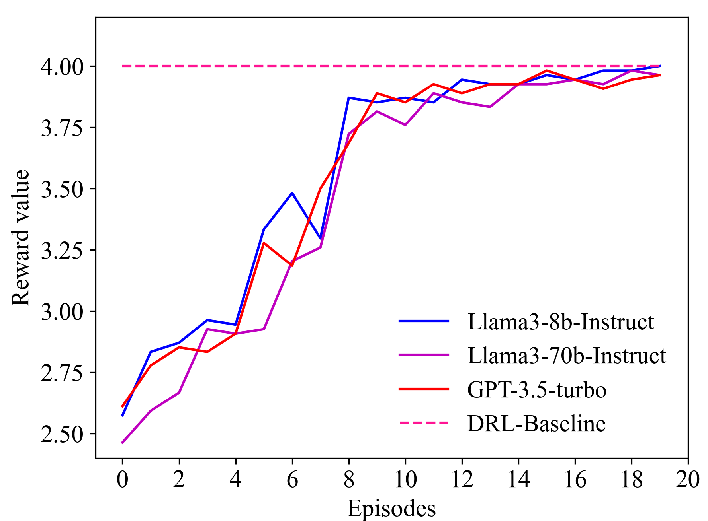
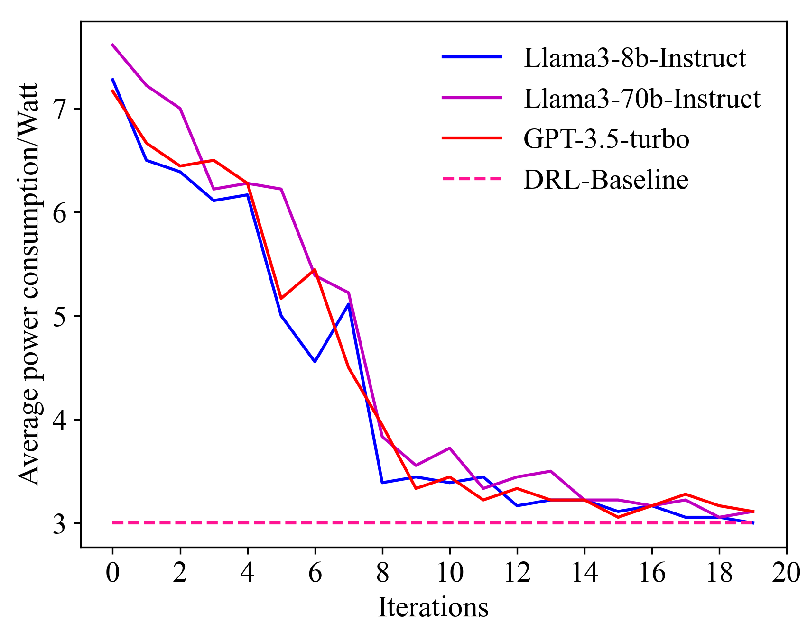
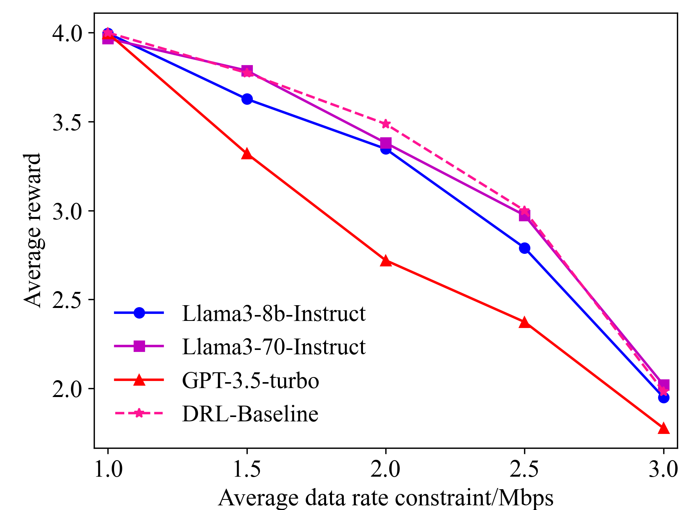
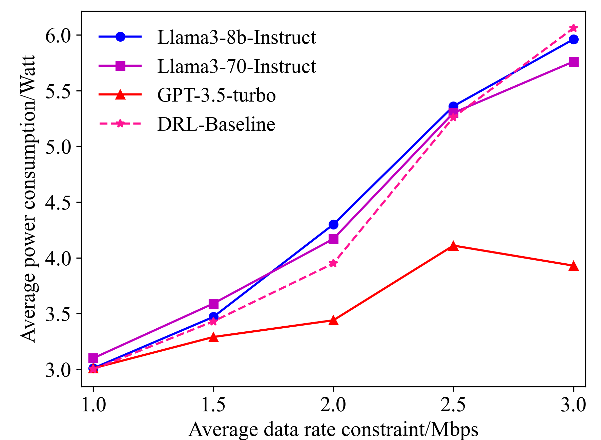
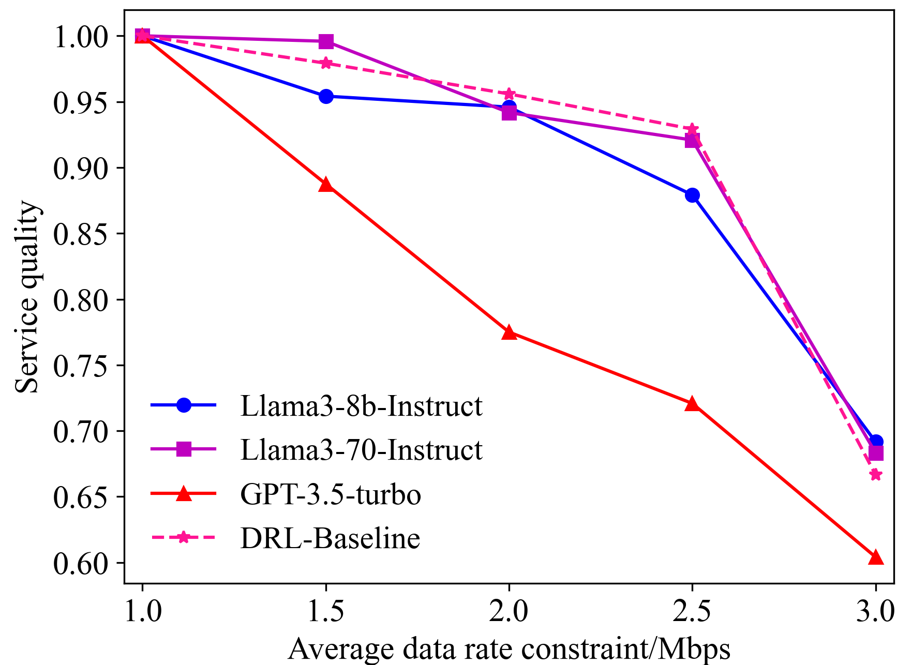

# 基于 LLM 的 In-context Learning 在无线网络优化中的应用：功率控制实证研究

发布时间：2024年07月31日

`LLM应用` `无线网络`

> Large Language Model (LLM)-enabled In-context Learning for Wireless Network Optimization: A Case Study of Power Control

# 摘要

> 大型语言模型 (LLM) 近期备受瞩目，被视为多领域的创新技术。本研究聚焦于利用 in-context learning 进行基于 LLM 的无线网络优化，以基站功率控制为例，深入探讨这一基础且关键的技术。与传统机器学习方法不同，我们的 in-context learning 算法巧妙利用 LLM 的推理能力，规避了模型训练和超参数调整的复杂性。具体来说，算法首先用自然语言精准描述任务，随后构建 in-context learning 框架并设计演示示例。针对离散与连续状态问题，分别采用基于状态和基于排名的方法精选示例。仿真结果显示，该算法无需繁复训练或微调，即可媲美深度强化学习技术，为未来无线网络优化开辟了高效低复杂度的新路径。

> Large language model (LLM) has recently been considered a promising technique for many fields. This work explores LLM-based wireless network optimization via in-context learning. To showcase the potential of LLM technologies, we consider the base station (BS) power control as a case study, a fundamental but crucial technique that is widely investigated in wireless networks. Different from existing machine learning (ML) methods, our proposed in-context learning algorithm relies on LLM's inference capabilities. It avoids the complexity of tedious model training and hyper-parameter fine-tuning, which is a well-known bottleneck of many ML algorithms. Specifically, the proposed algorithm first describes the target task via formatted natural language, and then designs the in-context learning framework and demonstration examples. After that, it considers two cases, namely discrete-state and continuous-state problems, and proposes state-based and ranking-based methods to select appropriate examples for these two cases, respectively. Finally, the simulations demonstrate that the proposed algorithm can achieve comparable performance as conventional deep reinforcement learning (DRL) techniques without dedicated model training or fine-tuning. Such an efficient and low-complexity approach has great potential for future wireless network optimization.

[Arxiv](https://arxiv.org/abs/2408.00214)