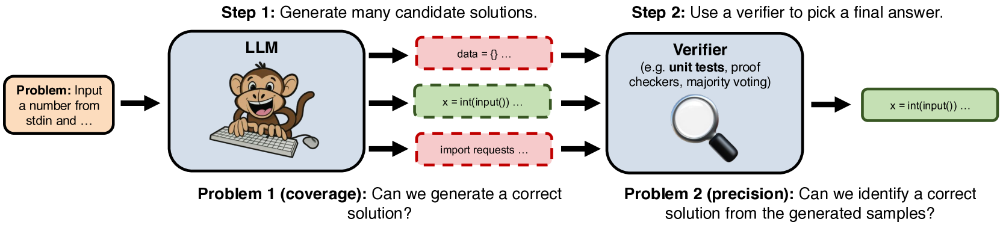
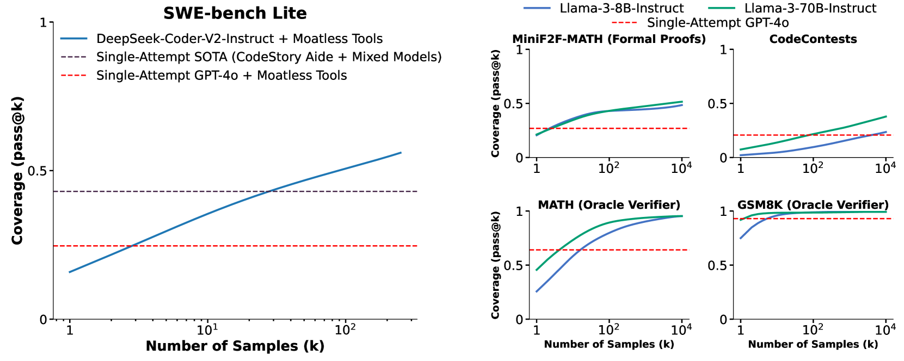
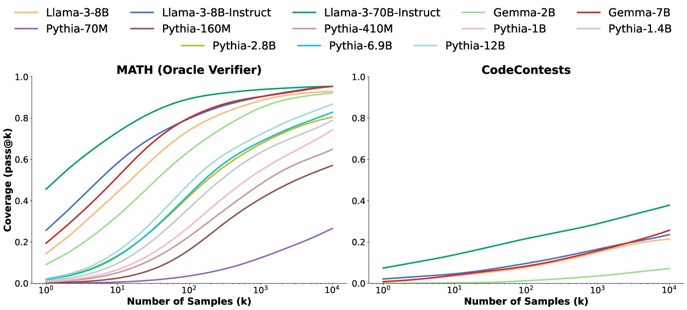
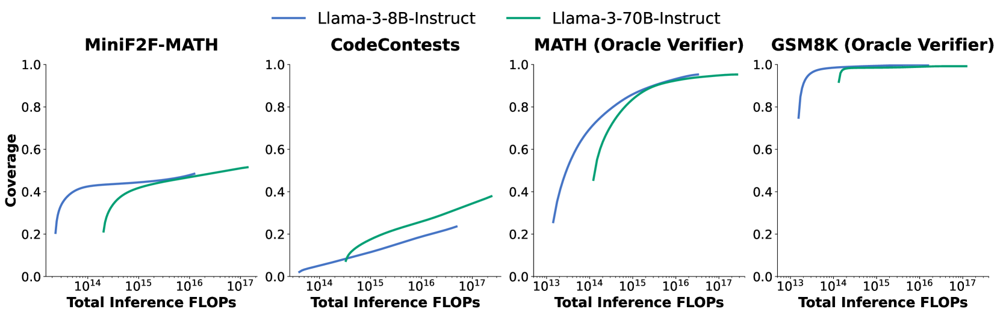
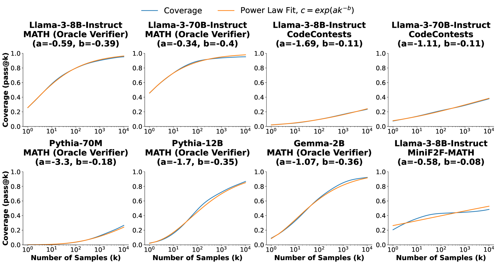
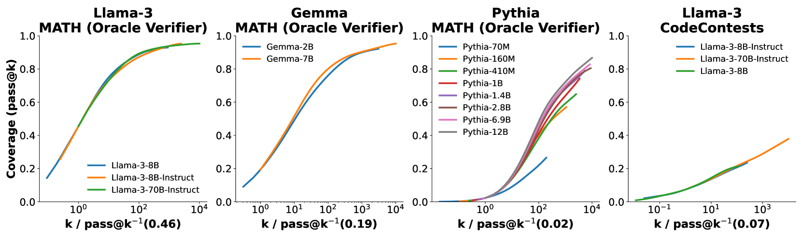
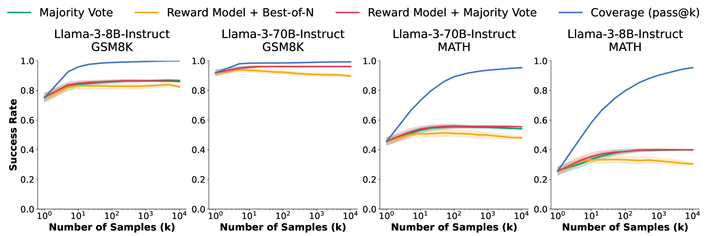
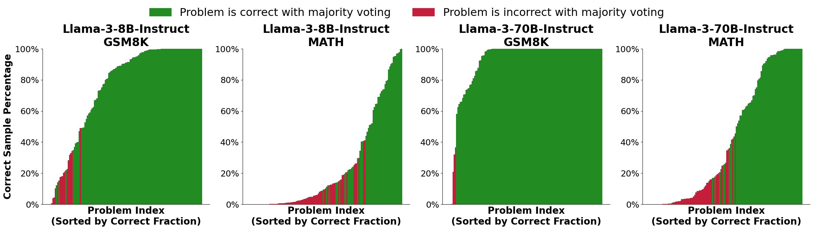
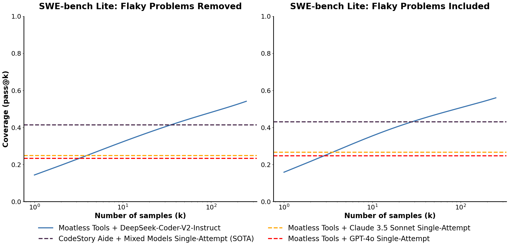
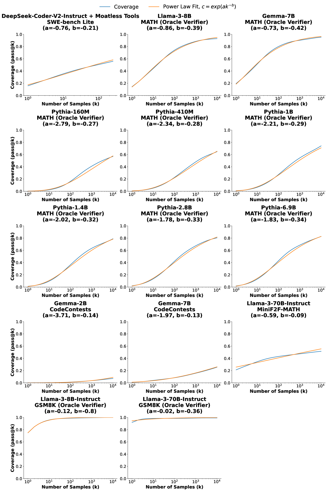

# 大型语言模型：借助重复采样提升推理计算规模

发布时间：2024年07月31日

`LLM应用` `软件工程`

> Large Language Monkeys: Scaling Inference Compute with Repeated Sampling

# 摘要

> 通过增加训练语言模型的计算量，其能力得到了显著提升。但在推理时，我们往往限制计算量，每个问题仅尝试一次。我们探索了通过增加生成样本数量来扩展推理计算的可能性。在多个任务和模型中，我们发现覆盖率——即任何尝试解决的问题的比例——随着样本数量的增加而显著提升，跨越四个数量级。在编码和形式证明等可自动验证答案的领域，这种覆盖率的提升直接转化为性能的提高。例如，在SWE-bench Lite任务中，通过重复采样，DeepSeek-V2-Coder-Instruct的解决率从单样本的15.9%跃升至250样本的56%，超越了使用更先进模型的单次尝试的43%的最新水平。此外，通过五个样本来增强成本较低的DeepSeek模型，比为GPT-4o或Claude 3.5 Sonnet的单个样本支付高价更经济高效，且能解决更多问题。覆盖率与样本数量之间的关系通常呈对数线性，可用指数幂律模型描述，暗示存在推理时间的扩展定律。然而，在没有自动验证器的领域，从多次生成中识别正确样本仍是未来研究的重要方向。在解决GSM8K和MATH的数学应用题时，Llama-3模型的覆盖率在10,000个样本下达到95%以上，但选择正确解决方案的常见方法在几百个样本后达到瓶颈，无法完全随样本预算扩展。

> Scaling the amount of compute used to train language models has dramatically improved their capabilities. However, when it comes to inference, we often limit the amount of compute to only one attempt per problem. Here, we explore inference compute as another axis for scaling by increasing the number of generated samples. Across multiple tasks and models, we observe that coverage - the fraction of problems solved by any attempt - scales with the number of samples over four orders of magnitude. In domains like coding and formal proofs, where all answers can be automatically verified, these increases in coverage directly translate into improved performance. When we apply repeated sampling to SWE-bench Lite, the fraction of issues solved with DeepSeek-V2-Coder-Instruct increases from 15.9% with one sample to 56% with 250 samples, outperforming the single-attempt state-of-the-art of 43% which uses more capable frontier models. Moreover, using current API pricing, amplifying the cheaper DeepSeek model with five samples is more cost-effective and solves more issues than paying a premium for one sample from GPT-4o or Claude 3.5 Sonnet. Interestingly, the relationship between coverage and the number of samples is often log-linear and can be modelled with an exponentiated power law, suggesting the existence of inference-time scaling laws. Finally, we find that identifying correct samples out of many generations remains an important direction for future research in domains without automatic verifiers. When solving math word problems from GSM8K and MATH, coverage with Llama-3 models grows to over 95% with 10,000 samples. However, common methods to pick correct solutions from a sample collection, such as majority voting or reward models, plateau beyond several hundred samples and fail to fully scale with the sample budget.

[Arxiv](https://arxiv.org/abs/2407.21787)