# 文本到图像扩散模型中的潜在概念错位问题

发布时间：2024年07月31日

`LLM应用` `人工智能` `图像处理`

> Lost in Translation: Latent Concept Misalignment in Text-to-Image Diffusion Models

# 摘要

> 文本到图像扩散模型的进步虽然拓宽了实际应用，但常面临文本与图像不匹配的问题。例如，提示“一杯冰可乐的茶杯”时，模型常生成玻璃杯而非茶杯。这种现象源于潜在语义空间的混淆，我们称之为潜在概念不匹配（LC-Mis）。通过利用大型语言模型（LLM），我们深入研究了LC-Mis，并开发了自动化流程以对齐潜在语义。实证评估显示，我们的方法有效减少了LC-Mis错误，提升了模型的鲁棒性和多功能性。相关代码和数据集已在线公开。

> Advancements in text-to-image diffusion models have broadened extensive downstream practical applications, but such models often encounter misalignment issues between text and image. Taking the generation of a combination of two disentangled concepts as an example, say given the prompt "a tea cup of iced coke", existing models usually generate a glass cup of iced coke because the iced coke usually co-occurs with the glass cup instead of the tea one during model training. The root of such misalignment is attributed to the confusion in the latent semantic space of text-to-image diffusion models, and hence we refer to the "a tea cup of iced coke" phenomenon as Latent Concept Misalignment (LC-Mis). We leverage large language models (LLMs) to thoroughly investigate the scope of LC-Mis, and develop an automated pipeline for aligning the latent semantics of diffusion models to text prompts. Empirical assessments confirm the effectiveness of our approach, substantially reducing LC-Mis errors and enhancing the robustness and versatility of text-to-image diffusion models. Our code and dataset have been available online for reference.

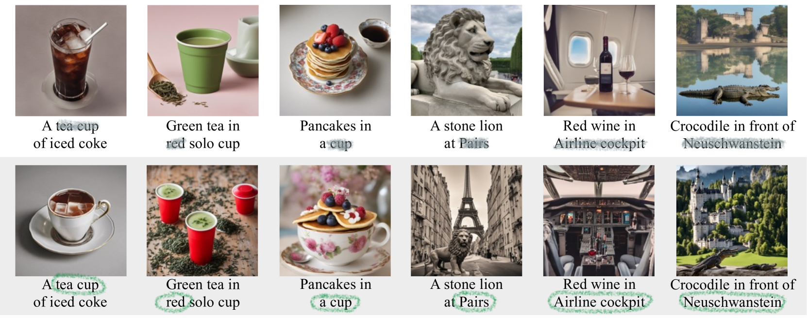

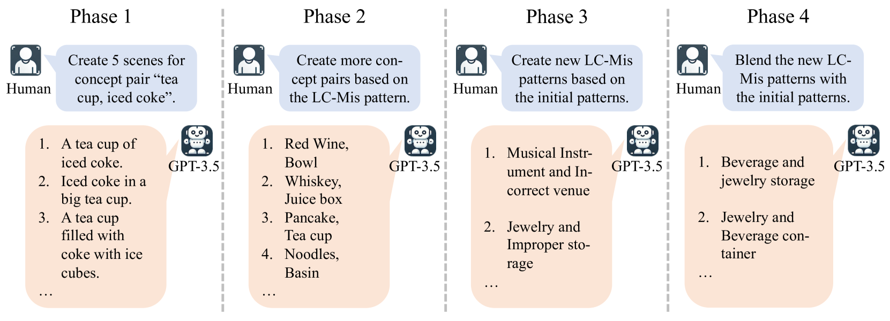

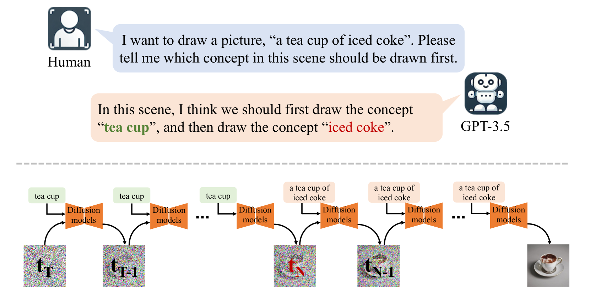

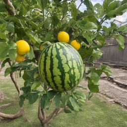

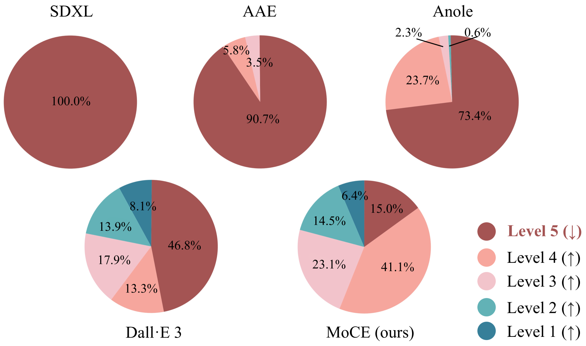

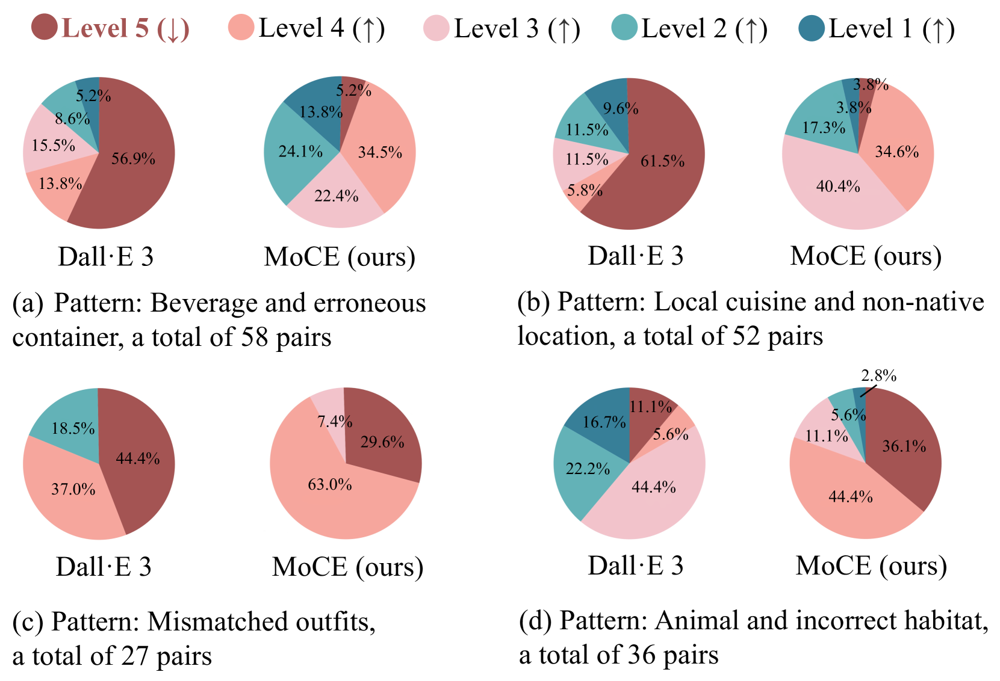

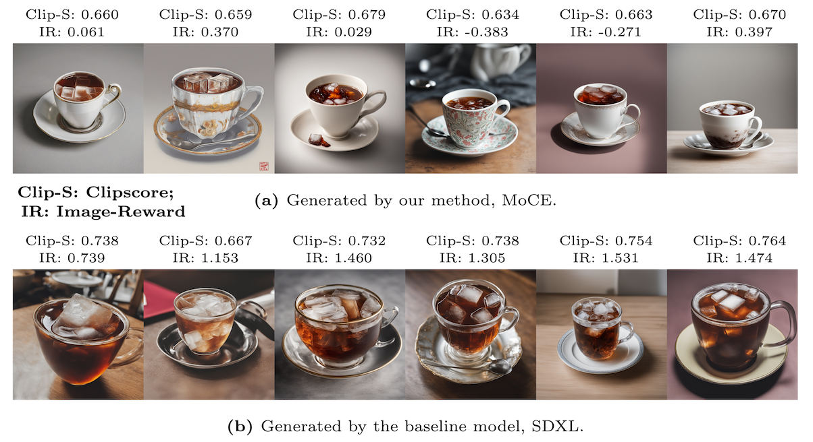

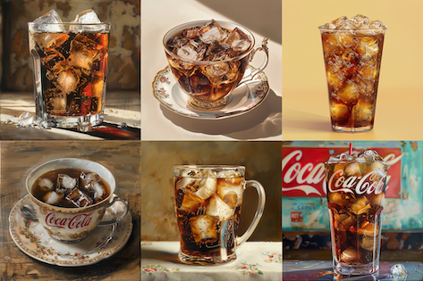

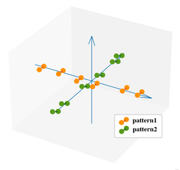

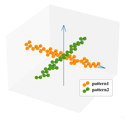

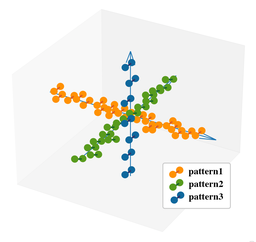

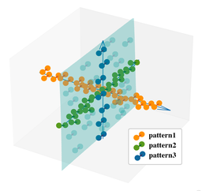

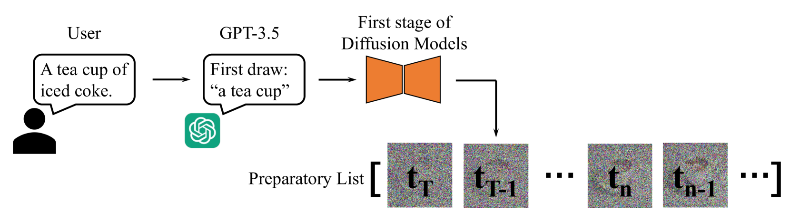

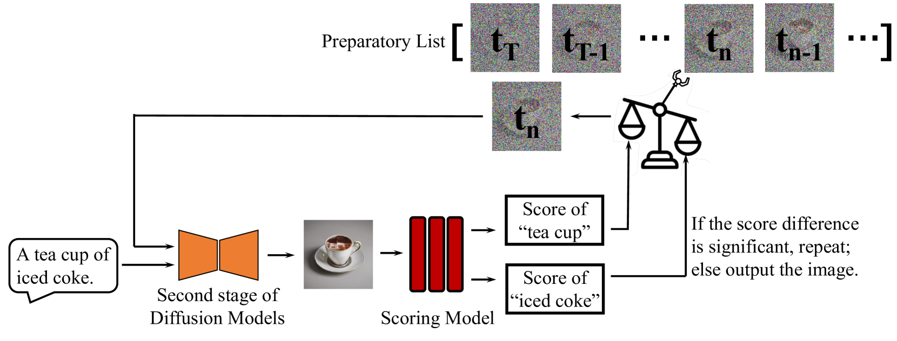

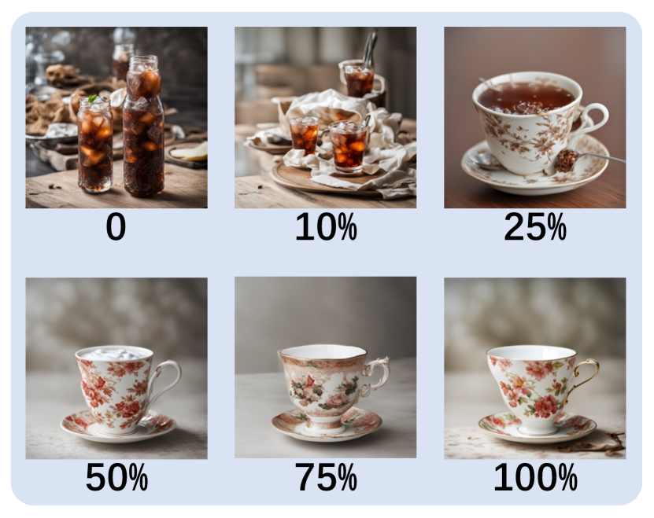

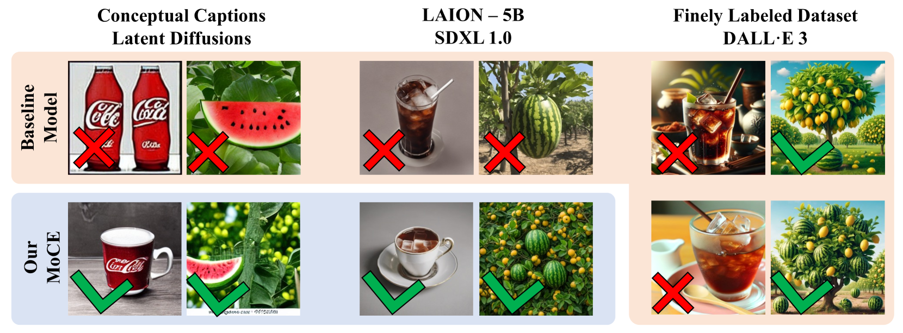

[Arxiv](https://arxiv.org/abs/2408.00230)