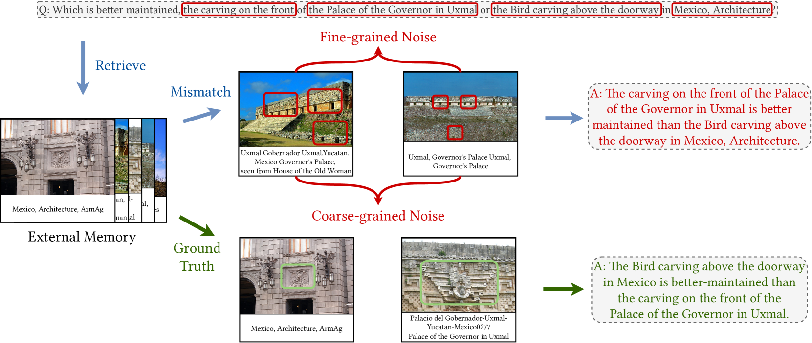
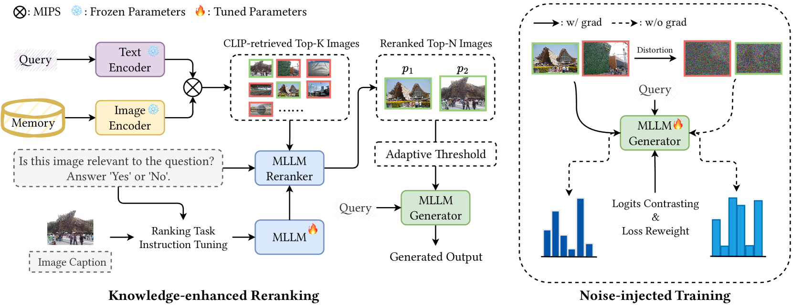
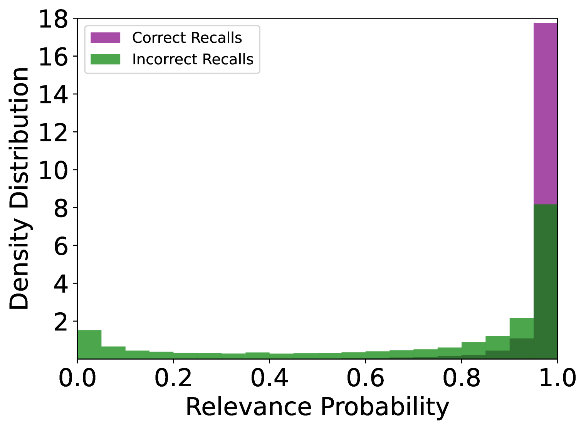
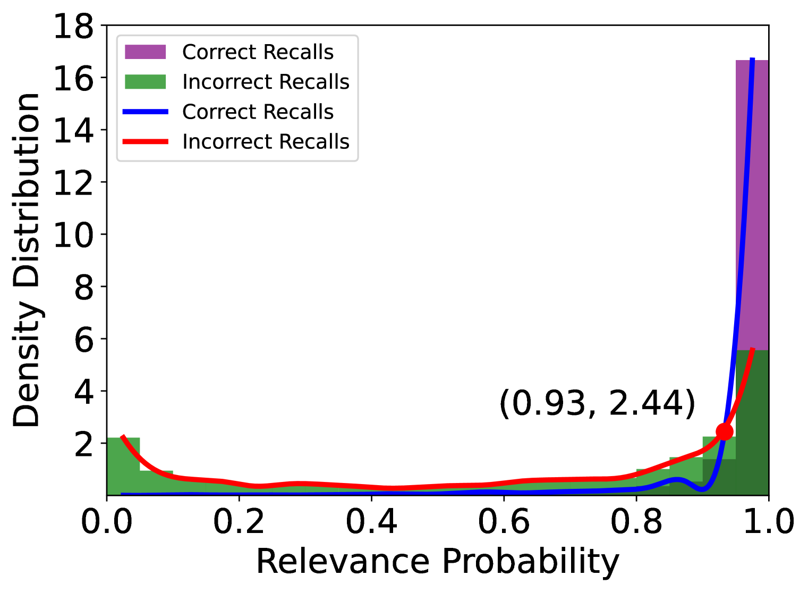
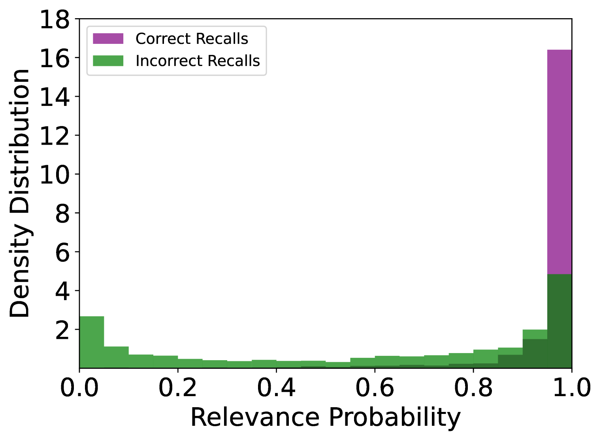

# MLLM 作为强力重排序器，通过知识增强重排序与噪声注入训练，助力多模态检索增强生成技术的进步。

发布时间：2024年07月31日

`RAG` `人工智能` `多媒体`

> MLLM Is a Strong Reranker: Advancing Multimodal Retrieval-augmented Generation via Knowledge-enhanced Reranking and Noise-injected Training

# 摘要

> 多模态大型语言模型 (MLLMs) 在跨多种数据模态（如文本、图像、音频和视频）的内容处理和生成方面表现出色。然而，这些模型依赖静态训练数据，导致信息陈旧和上下文意识不足，尤其在动态或快速变化的环境中难以提供准确、及时的响应。为此，我们提出 **RagLLaVA** 框架，通过知识增强重排序和噪声注入训练，有效解决这些问题。我们通过简单有效的指令模板对 MLLM 进行调优，提升其排序能力，并精确筛选检索图像。同时，在训练中注入视觉噪声，增强生成器的鲁棒性。实验结果表明，RagLLaVA 在图像检索和内容生成方面表现卓越。相关代码和模型已公开，详情请访问 https://github.com/IDEA-FinAI/RagLLaVA。

> Multimodal Large Language Models (MLLMs) have demonstrated remarkable capabilities in processing and generating content across multiple data modalities, including text, images, audio, and video. However, a significant drawback of MLLMs is their reliance on static training data, leading to outdated information and limited contextual awareness. This static nature hampers their ability to provide accurate, up-to-date responses, particularly in dynamic or rapidly evolving contexts. Integrating Multimodal Retrieval-augmented Generation (Multimodal RAG) offers a promising solution, but the system would inevitably encounter the multi-granularity noisy correspondence (MNC) problem, which involves two types of noise: coarse-grained (query-caption) and fine-grained (query-image). This noise hinders accurate retrieval and generation. In this work, we propose \textbf{RagLLaVA}, a novel framework with knowledge-enhanced reranking and noise-injected training, to address these limitations. We instruction-tune the MLLM with a simple yet effective instruction template to induce its ranking ability and serve it as a reranker to precisely filter the top-k retrieved images. For generation, we inject visual noise during training at the data and token levels to enhance the generator's robustness. Extensive experiments are conducted on the subsets of two datasets that require retrieving and reasoning over images to answer a given query. Our results demonstrate the superiority of RagLLaVA in retrieving accurately and generating robustly. Code and models are available at https://github.com/IDEA-FinAI/RagLLaVA.

[Arxiv](https://arxiv.org/abs/2407.21439)