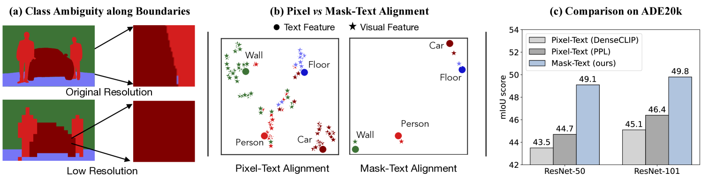
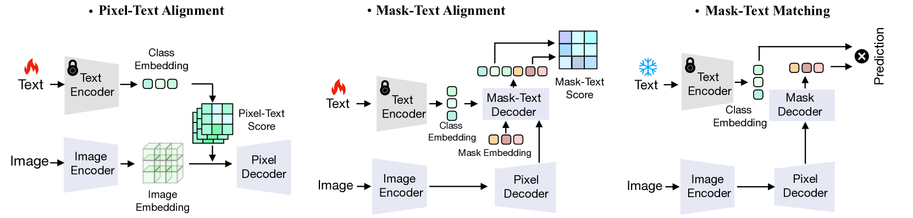
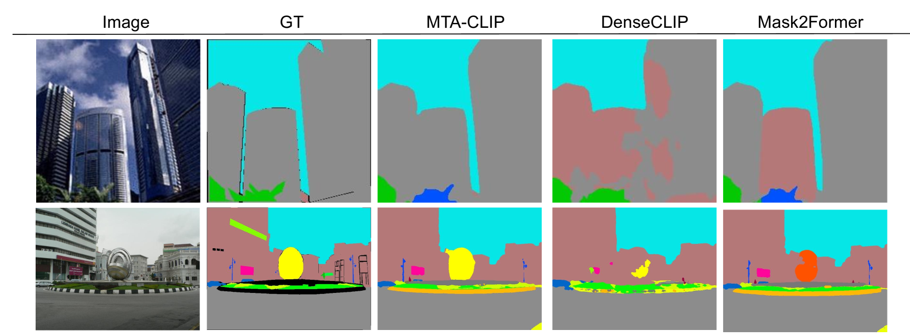

# MTA-CLIP：借助掩码-文本对齐技术，实现语言引导的精准语义分割

发布时间：2024年07月31日

`LLM应用` `计算机视觉` `自动驾驶`

> MTA-CLIP: Language-Guided Semantic Segmentation with Mask-Text Alignment

# 摘要

> 近期研究显示，如 CLIP 这类大规模视觉-语言模型能显著提升语义分割效果。然而，现有方法虽力求像素级对齐，却常因依赖 CLIP 的低分辨率特征而产生边界类别混淆。同时，CLIP 文本嵌入的全局场景描述与局部细节特征脱节，加大了对齐难度。为此，我们创新提出 MTA-CLIP 框架，聚焦掩码级视觉-语言对齐。该框架首先通过 Mask-Text Decoder 结合 CLIP 语言模型丰富文本数据，强化掩码表示；进而运用 Mask-to-Text 对比学习实现掩码与文本嵌入精准对齐。此外，引入 MaskText 提示学习机制，通过多重上下文特定提示，捕捉掩码间多样类别特征。实验表明，MTA-CLIP 在 ADE20k 和 Cityscapes 数据集上分别以 2.8% 和 1.3% 的平均优势超越现有技术，稳居行业前沿。

> Recent approaches have shown that large-scale vision-language models such as CLIP can improve semantic segmentation performance. These methods typically aim for pixel-level vision-language alignment, but often rely on low resolution image features from CLIP, resulting in class ambiguities along boundaries. Moreover, the global scene representations in CLIP text embeddings do not directly correlate with the local and detailed pixel-level features, making meaningful alignment more difficult. To address these limitations, we introduce MTA-CLIP, a novel framework employing mask-level vision-language alignment. Specifically, we first propose Mask-Text Decoder that enhances the mask representations using rich textual data with the CLIP language model. Subsequently, it aligns mask representations with text embeddings using Mask-to-Text Contrastive Learning. Furthermore, we introduce MaskText Prompt Learning, utilizing multiple context-specific prompts for text embeddings to capture diverse class representations across masks. Overall, MTA-CLIP achieves state-of-the-art, surpassing prior works by an average of 2.8% and 1.3% on on standard benchmark datasets, ADE20k and Cityscapes, respectively.

[Arxiv](https://arxiv.org/abs/2407.21654)