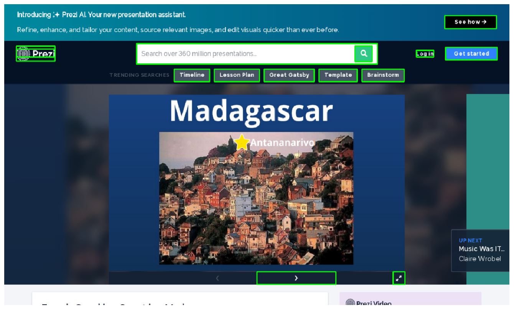

# OmniParser：专为纯视觉GUI代理设计

发布时间：2024年07月31日

`Agent` `用户界面` `人工智能`

> OmniParser for Pure Vision Based GUI Agent

# 摘要

> 大型视觉语言模型的最新进展，在推动用户界面代理系统方面展现出巨大潜力。然而，我们认为，由于缺乏强大的屏幕解析技术，GPT-4V等多模态模型的通用代理能力被低估。这种技术需能可靠识别界面图标并理解截图元素语义，精准关联操作与屏幕区域。为此，我们推出了\textsc{OmniParser}，它将界面截图转化为结构化元素，大幅提升GPT-4V的精准操作生成能力。我们通过流行网页和图标描述数据集，构建了交互图标检测集，用于微调检测和描述模型，分别解析交互区域和提取元素功能语义。\textsc{OmniParser}在ScreenSpot、Mind2Web和AITW基准测试中，仅凭截图输入即超越了需额外信息的GPT-4V基线。

> The recent success of large vision language models shows great potential in driving the agent system operating on user interfaces. However, we argue that the power multimodal models like GPT-4V as a general agent on multiple operating systems across different applications is largely underestimated due to the lack of a robust screen parsing technique capable of: 1) reliably identifying interactable icons within the user interface, and 2) understanding the semantics of various elements in a screenshot and accurately associate the intended action with the corresponding region on the screen. To fill these gaps, we introduce \textsc{OmniParser}, a comprehensive method for parsing user interface screenshots into structured elements, which significantly enhances the ability of GPT-4V to generate actions that can be accurately grounded in the corresponding regions of the interface. We first curated an interactable icon detection dataset using popular webpages and an icon description dataset. These datasets were utilized to fine-tune specialized models: a detection model to parse interactable regions on the screen and a caption model to extract the functional semantics of the detected elements. \textsc{OmniParser} significantly improves GPT-4V's performance on ScreenSpot benchmark. And on Mind2Web and AITW benchmark, \textsc{OmniParser} with screenshot only input outperforms the GPT-4V baselines requiring additional information outside of screenshot.

[Arxiv](https://arxiv.org/abs/2408.00203)