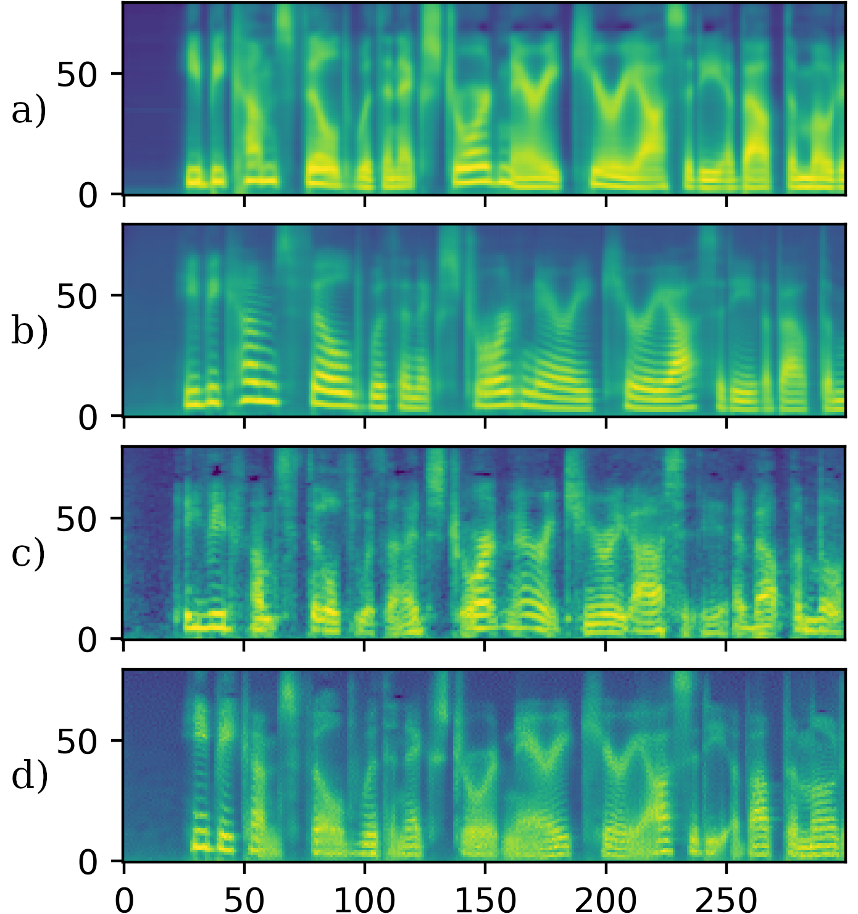

# 探讨自动语音识别中合成数据生成的文本到语音模型选择问题

发布时间：2024年07月31日

`LLM应用` `语音技术`

> On the Problem of Text-To-Speech Model Selection for Synthetic Data Generation in Automatic Speech Recognition

# 摘要

> 随着神经TTS技术的飞速进步，它已渗透到ASR和SLT等NLP领域。然而，面对众多TTS架构，选择合适的系统进行数据合成颇具挑战。我们通过对比五种TTS解码器架构，揭示了它们在CTC语音识别训练中的影响。尽管识别结果与NISQA MOS等指标存在差异，但与ASR性能的关联并不明确。此外，我们发现自回归解码在数据生成上更胜一筹，并提出了一种评估TTS泛化能力的新方法。

> The rapid development of neural text-to-speech (TTS) systems enabled its usage in other areas of natural language processing such as automatic speech recognition (ASR) or spoken language translation (SLT). Due to the large number of different TTS architectures and their extensions, selecting which TTS systems to use for synthetic data creation is not an easy task. We use the comparison of five different TTS decoder architectures in the scope of synthetic data generation to show the impact on CTC-based speech recognition training. We compare the recognition results to computable metrics like NISQA MOS and intelligibility, finding that there are no clear relations to the ASR performance. We also observe that for data generation auto-regressive decoding performs better than non-autoregressive decoding, and propose an approach to quantify TTS generalization capabilities.

[Arxiv](https://arxiv.org/abs/2407.21476)