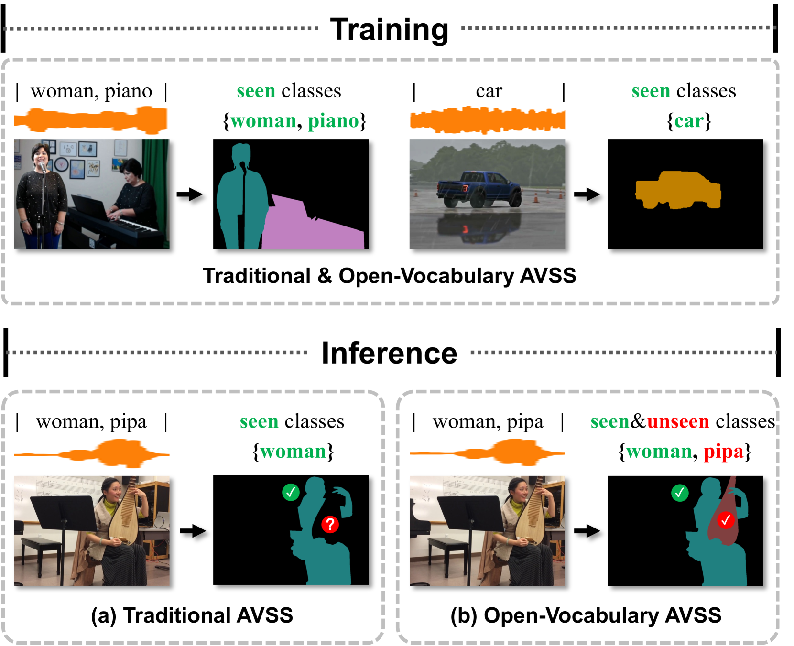

# 开放词汇音频-视觉语义分割技术

发布时间：2024年07月31日

`LLM应用` `视频分析` `音频处理`

> Open-Vocabulary Audio-Visual Semantic Segmentation

# 摘要

> 音频-视觉语义分割（AVSS）旨在通过声学线索对视频中的发声物体进行精准分割与分类。然而，现有方法多基于封闭集假设，仅能识别预设类别，难以在实际应用中识别新类别。为此，我们提出了一项新任务：开放词汇音频-视觉语义分割，将AVSS任务扩展至开放世界场景，要求识别所有类别，包括训练中未见的新类别。我们设计了首个开放词汇AVSS框架OV-AVSS，包含通用声源定位模块和开放词汇分类模块，后者利用预训练视觉-语言模型的先验知识进行类别预测。基于AVSBench-semantic基准，我们创建了AVSBench-OV数据集，用于评估零-shot训练与测试。实验显示，OV-AVSS在基础与新类别上分别取得了55.43%和29.14%的mIoU，显著超越现有零-shot及开放词汇方法。代码已公开于https://github.com/ruohaoguo/ovavss。

> Audio-visual semantic segmentation (AVSS) aims to segment and classify sounding objects in videos with acoustic cues. However, most approaches operate on the close-set assumption and only identify pre-defined categories from training data, lacking the generalization ability to detect novel categories in practical applications. In this paper, we introduce a new task: open-vocabulary audio-visual semantic segmentation, extending AVSS task to open-world scenarios beyond the annotated label space. This is a more challenging task that requires recognizing all categories, even those that have never been seen nor heard during training. Moreover, we propose the first open-vocabulary AVSS framework, OV-AVSS, which mainly consists of two parts: 1) a universal sound source localization module to perform audio-visual fusion and locate all potential sounding objects and 2) an open-vocabulary classification module to predict categories with the help of the prior knowledge from large-scale pre-trained vision-language models. To properly evaluate the open-vocabulary AVSS, we split zero-shot training and testing subsets based on the AVSBench-semantic benchmark, namely AVSBench-OV. Extensive experiments demonstrate the strong segmentation and zero-shot generalization ability of our model on all categories. On the AVSBench-OV dataset, OV-AVSS achieves 55.43% mIoU on base categories and 29.14% mIoU on novel categories, exceeding the state-of-the-art zero-shot method by 41.88%/20.61% and open-vocabulary method by 10.2%/11.6%. The code is available at https://github.com/ruohaoguo/ovavss.

[Arxiv](https://arxiv.org/abs/2407.21721)