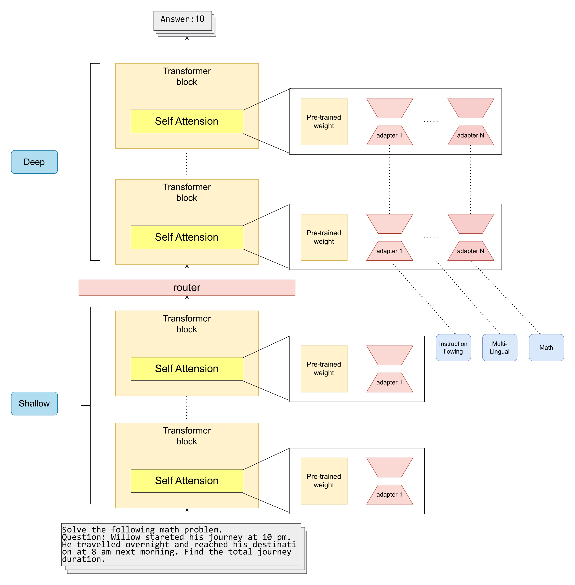
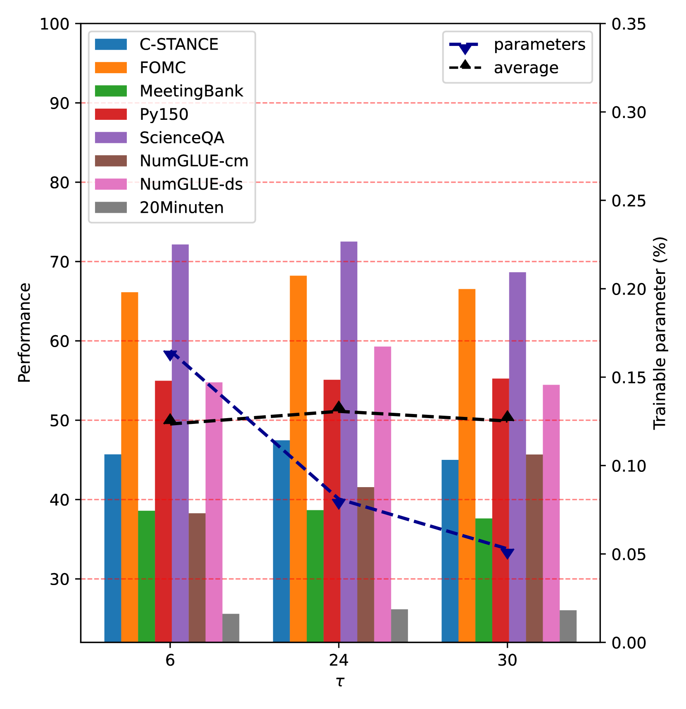
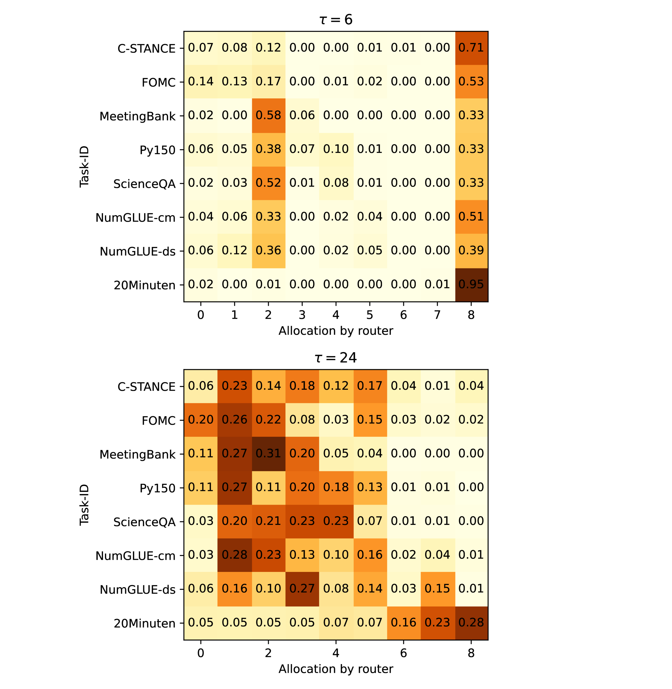
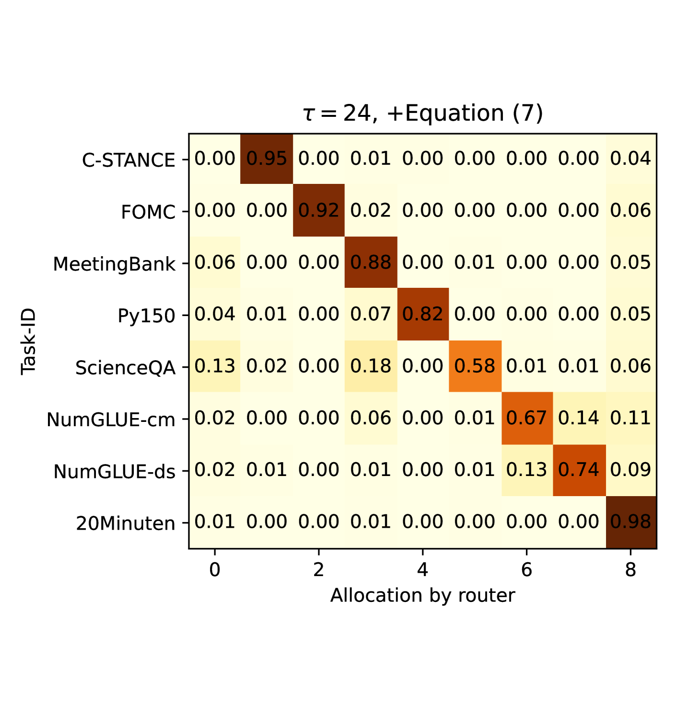
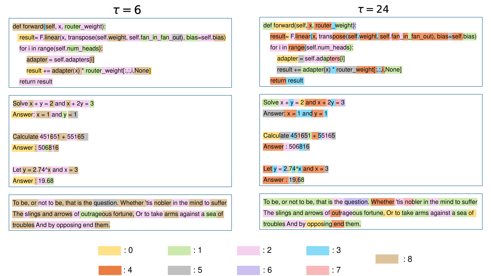

# PMoE：结合非对称Transformer的渐进式专家混合模型，专为持续学习设计。

发布时间：2024年07月31日

`LLM理论` `人工智能`

> PMoE: Progressive Mixture of Experts with Asymmetric Transformer for Continual Learning

# 摘要

> 大型语言模型在持续学习中面临灾难性遗忘的挑战，导致新知识覆盖旧知识，造成资源浪费。为此，我们提出 PMoE，一种渐进式专家混合模型，通过非对称结构减少遗忘：浅层处理通用知识，深层专注新知识。PMoE 动态添加专家并优化路由器，确保新知识高效分配至合适专家。实验证明，PMoE 在多个数据集上超越现有技术，有效提升模型持续学习能力。

> Large Language Models (LLMs) encounter significant challenges in continual learning due to catastrophic forgetting, where new information overwrites previously acquired knowledge. This limitation leads to substantial environmental and economic waste. In this study, we introduce the PMoE, Progressive Mixture of Experts with Asymmetric Transformer, which aims to minimize forgetting by utilizing an asymmetric design with shallow layers dedicated to general knowledge and deep layers for new knowledge. PMoE incorporates progressively added experts in deep layers and a router that allocates new knowledge to the appropriate experts efficiently. The router, positioned adjacent to the deep layers, utilizes deep features aggregating consolidated information. This enables the router to perform efficiently, allocating new knowledge to the appropriate experts, which progressively increase in the deep layers. Extensive experiments on TRACE datasets and general language understanding datasets demonstrate that the proposed PMoE outperforms previous state-of-the-art approaches.

[Arxiv](https://arxiv.org/abs/2407.21571)