# 聚焦图像：一种无需额外训练的方法，有效减轻 LVLMs 中的幻觉问题

发布时间：2024年07月31日

`LLM应用` `计算机视觉`

> Paying More Attention to Image: A Training-Free Method for Alleviating Hallucination in LVLMs

# 摘要

> 现有的 LVLMs 主要通过将视觉特征与 LLMs 对齐，以利用其强大的文本生成能力。然而，视觉与语言模型间的规模差异可能导致 LLMs 在多模态理解中占主导地位，引发幻觉现象。具体来说，LVLMs 可能生成与视觉输入无关的一致描述，这种现象我们称之为“文本惯性”。为解决这一问题，我们提出了一种无需训练的算法，旨在平衡图像理解与语言推理。通过自适应调整图像标记的注意力权重，并从纯文本输入中减去多模态输入的 logits，我们使 LVLMs 更专注于图像，从而减少幻觉并缓解文本惯性。实验证明，这种方法在不同指标下显著降低了幻觉输出的频率。项目详情请访问 https://lalbj.github.io/projects/PAI/。

> Existing Large Vision-Language Models (LVLMs) primarily align image features of vision encoder with Large Language Models (LLMs) to leverage their superior text generation capabilities. However, the scale disparity between vision encoder and language model may led to LLMs assuming a predominant role in multi-modal comprehension. This imbalance in LVLMs may result in the instances of hallucinatory. Concretely, LVLMs may generate consistent descriptions with or without visual input, indicating that certain outputs are influenced solely by context text. We refer to this phenomenon as "text inertia." To counteract this issue, we introduce a training-free algorithm to find an equilibrium point between image comprehension and language inference. Specifically, we adaptively involve adjusting and amplifying the attention weights assigned to image tokens, thereby granting greater prominence to visual elements. Meanwhile, we subtract the logits of multi-modal inputs from ones of pure text input, which can help LVLMs be not biased towards LLMs. By enhancing images tokens and reducing the stubborn output of LLM, we can let LVLM pay more attention to images, towards alleviating text inertia and reducing the hallucination in LVLMs. Our extensive experiments shows that this method substantially reduces the frequency of hallucinatory outputs in various LVLMs in terms of different metrics. Project page is available at https://lalbj.github.io/projects/PAI/.

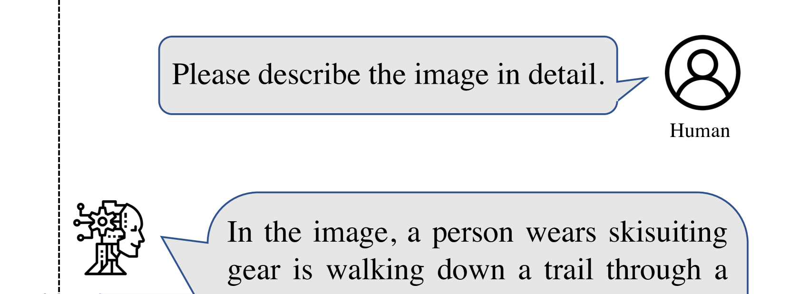

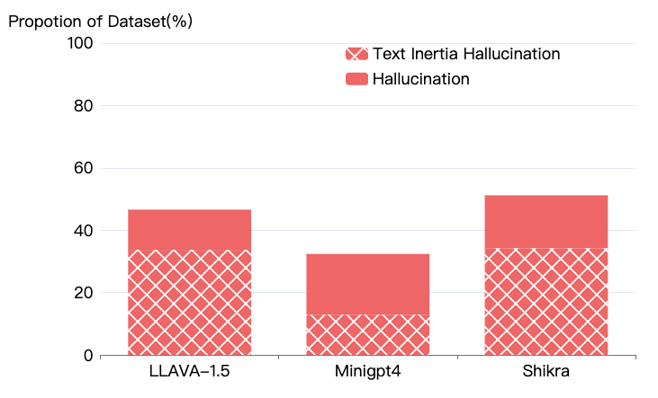

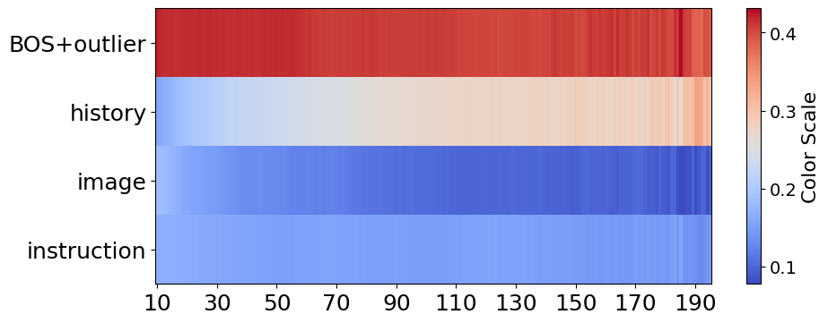

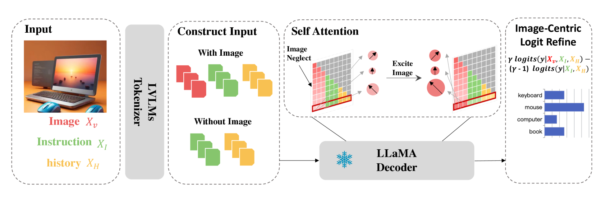

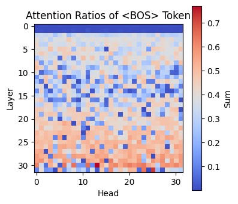

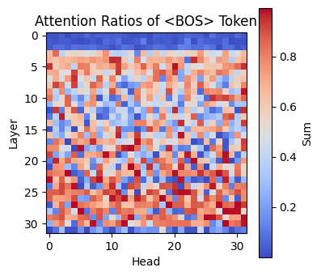

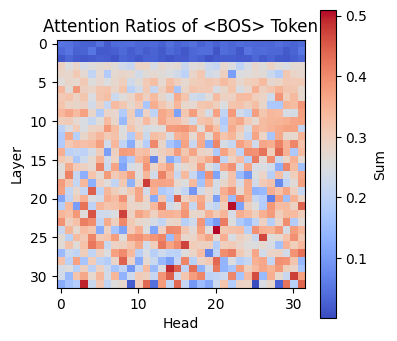

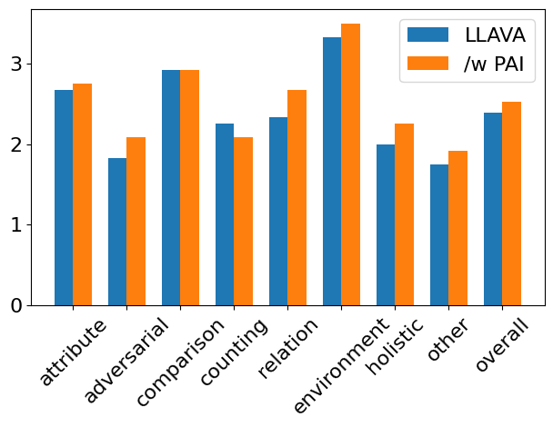

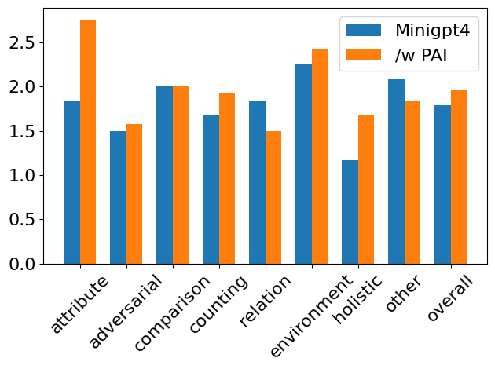

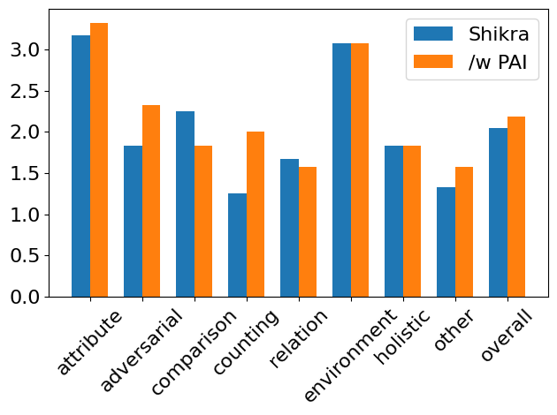

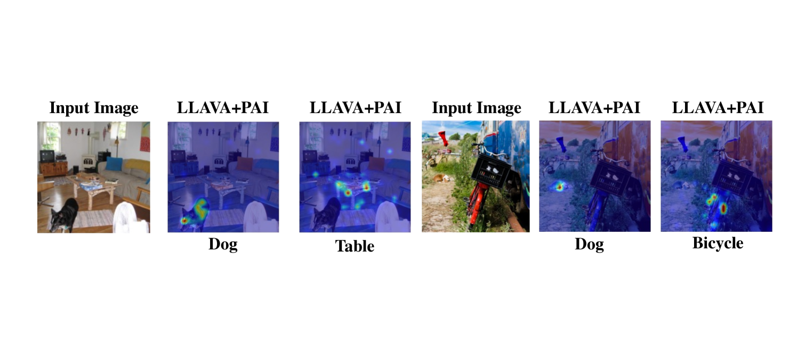

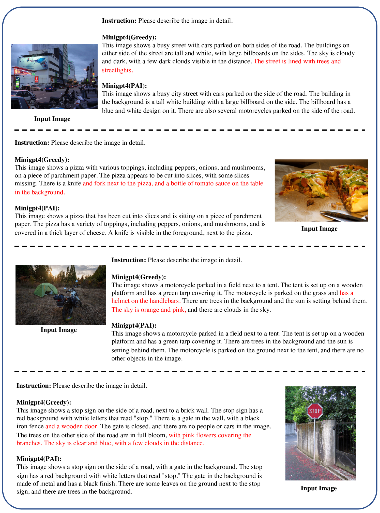

[Arxiv](https://arxiv.org/abs/2407.21771)