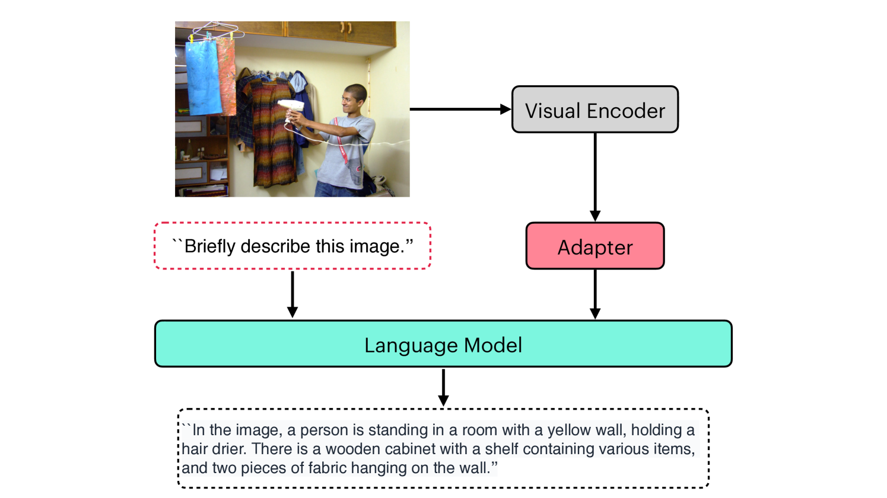
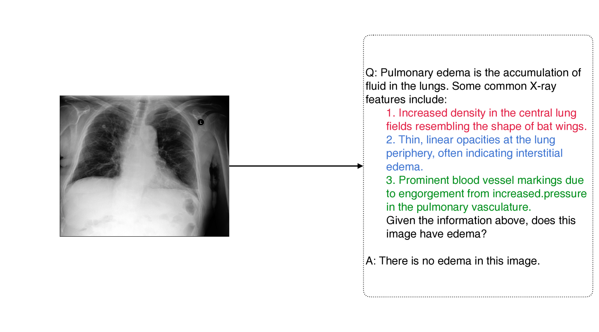
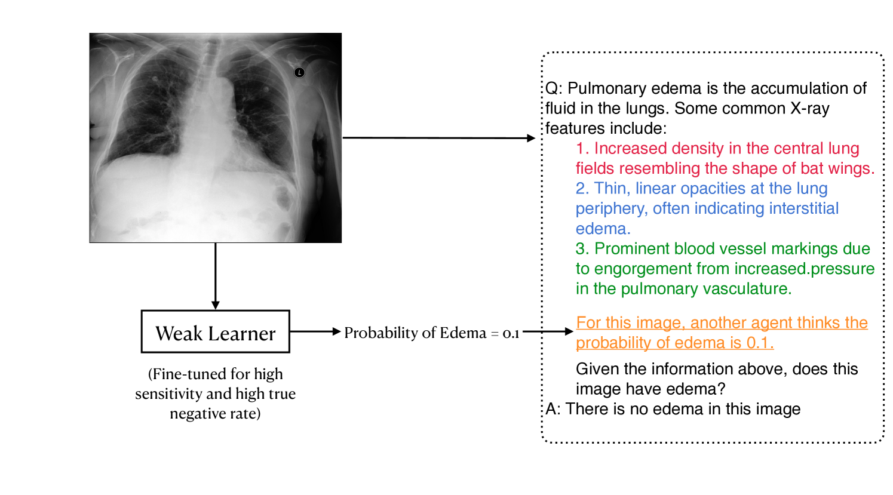

# 利用视觉问答技术，引导医学大型视觉-语言模型进行病理诊断

发布时间：2024年07月31日

`LLM应用` `人工智能`

> Prompting Medical Large Vision-Language Models to Diagnose Pathologies by Visual Question Answering

# 摘要

> 近年来，大型视觉-语言模型（LVLMs）在医疗领域取得了显著成就。然而，医疗LVLMs在处理复杂病理时存在幻觉问题，且因数据不平衡难以识别少数病理。为此，我们提出了两种提示策略：一是提供详细病理解释，二是微调一个高效但简单的学习器，以提升特定指标的表现。实验表明，这些策略在MIMIC-CXR-JPG和Chexpert数据集上大幅提升了诊断准确性，最高F1分数提升了0.27。此外，这些策略还能广泛应用于其他LVLM领域，有效减少误诊，提高召回率约0.07。

> Large Vision-Language Models (LVLMs) have achieved significant success in recent years, and they have been extended to the medical domain. Although demonstrating satisfactory performance on medical Visual Question Answering (VQA) tasks, Medical LVLMs (MLVLMs) suffer from the hallucination problem, which makes them fail to diagnose complex pathologies. Moreover, they readily fail to learn minority pathologies due to imbalanced training data. We propose two prompting strategies for MLVLMs that reduce hallucination and improve VQA performance. In the first strategy, we provide a detailed explanation of the queried pathology. In the second strategy, we fine-tune a cheap, weak learner to achieve high performance on a specific metric, and textually provide its judgment to the MLVLM. Tested on the MIMIC-CXR-JPG and Chexpert datasets, our methods significantly improve the diagnostic F1 score, with the highest increase being 0.27. We also demonstrate that our prompting strategies can be extended to general LVLM domains. Based on POPE metrics, it effectively suppresses the false negative predictions of existing LVLMs and improves Recall by approximately 0.07.

[Arxiv](https://arxiv.org/abs/2407.21368)