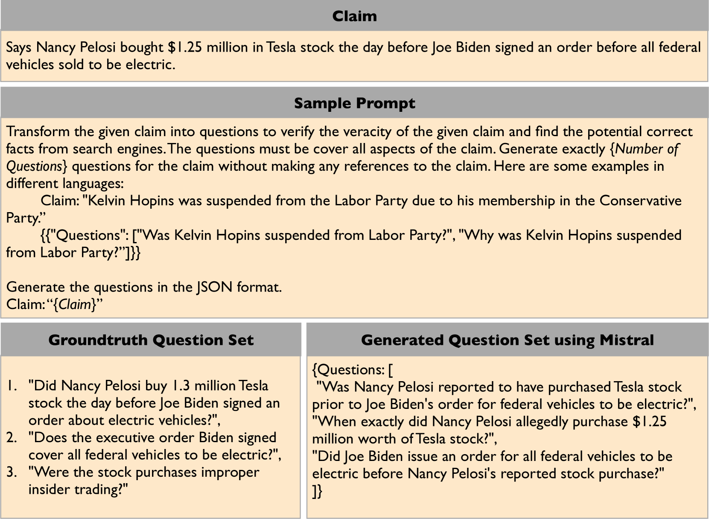

# QuestGen：探究问题生成技术在事实核查应用中的实际效能

发布时间：2024年07月31日

`LLM应用` `新闻媒体` `信息技术`

> QuestGen: Effectiveness of Question Generation Methods for Fact-Checking Applications

# 摘要

> 事实核查声明的验证对人类而言本就是一大难题。最新研究显示，将声明细分为相关问题以搜集证据，能显著提升核查效率。本文通过实证，证实了这一细分过程的自动化可行性。我们发现，经过数据增强训练的小型生成模型，在问题生成任务上，竟能超越大型语言模型，性能提升高达8%。更令人意外的是，机器生成的问题在某些情况下，其检索的证据在事实核查中比人类编写的问题更为有效。此外，我们还对生成的问题进行了人工质量评估。

> Verifying fact-checking claims poses a significant challenge, even for humans. Recent approaches have demonstrated that decomposing claims into relevant questions to gather evidence enhances the efficiency of the fact-checking process. In this paper, we provide empirical evidence showing that this question decomposition can be effectively automated. We demonstrate that smaller generative models, fine-tuned for the question generation task using data augmentation from various datasets, outperform large language models by up to 8%. Surprisingly, in some cases, the evidence retrieved using machine-generated questions proves to be significantly more effective for fact-checking than that obtained from human-written questions. We also perform manual evaluation of the decomposed questions to assess the quality of the questions generated.

[Arxiv](https://arxiv.org/abs/2407.21441)