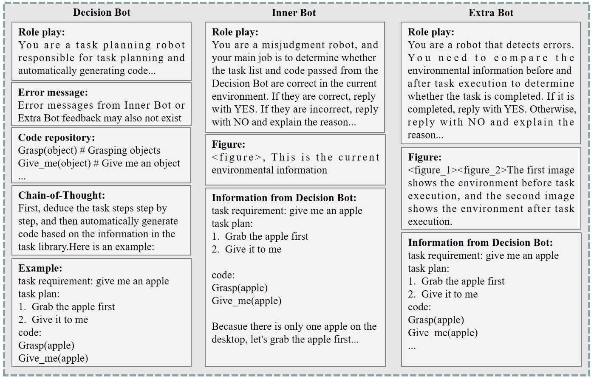

# ReplanVLM：借助视觉语言模型，重新规划机器人任务

发布时间：2024年07月31日

`LLM应用` `机器人` `人工智能`

> ReplanVLM: Replanning Robotic Tasks with Visual Language Models

# 摘要

> 大型语言模型（LLM）因其出色的文本处理和广泛的知识库，在机器人任务规划领域日益受到青睐。但它们在视觉信息解读上存在短板。LLM 对现实世界的感知有限，导致对当前环境的理解不足。视觉语言模型（VLM）通过融合视觉感知模块，弥补了这一缺陷，提升了机器人任务规划的自主性。尽管如此，VLM 在执行任务时仍可能出现错误，即便指令准确无误。为此，本文提出 ReplanVLM 框架，专注于错误纠正。我们设计了内外部错误纠正机制，并在任务执行失败时采用重新规划策略。实验表明，该框架在开放世界任务中表现出色，成功率高且纠错能力强。实验视频链接：https://youtu.be/NPk2pWKazJc。

> Large language models (LLMs) have gained increasing popularity in robotic task planning due to their exceptional abilities in text analytics and generation, as well as their broad knowledge of the world. However, they fall short in decoding visual cues. LLMs have limited direct perception of the world, which leads to a deficient grasp of the current state of the world. By contrast, the emergence of visual language models (VLMs) fills this gap by integrating visual perception modules, which can enhance the autonomy of robotic task planning. Despite these advancements, VLMs still face challenges, such as the potential for task execution errors, even when provided with accurate instructions. To address such issues, this paper proposes a ReplanVLM framework for robotic task planning. In this study, we focus on error correction interventions. An internal error correction mechanism and an external error correction mechanism are presented to correct errors under corresponding phases. A replan strategy is developed to replan tasks or correct error codes when task execution fails. Experimental results on real robots and in simulation environments have demonstrated the superiority of the proposed framework, with higher success rates and robust error correction capabilities in open-world tasks. Videos of our experiments are available at https://youtu.be/NPk2pWKazJc.

[Arxiv](https://arxiv.org/abs/2407.21762)